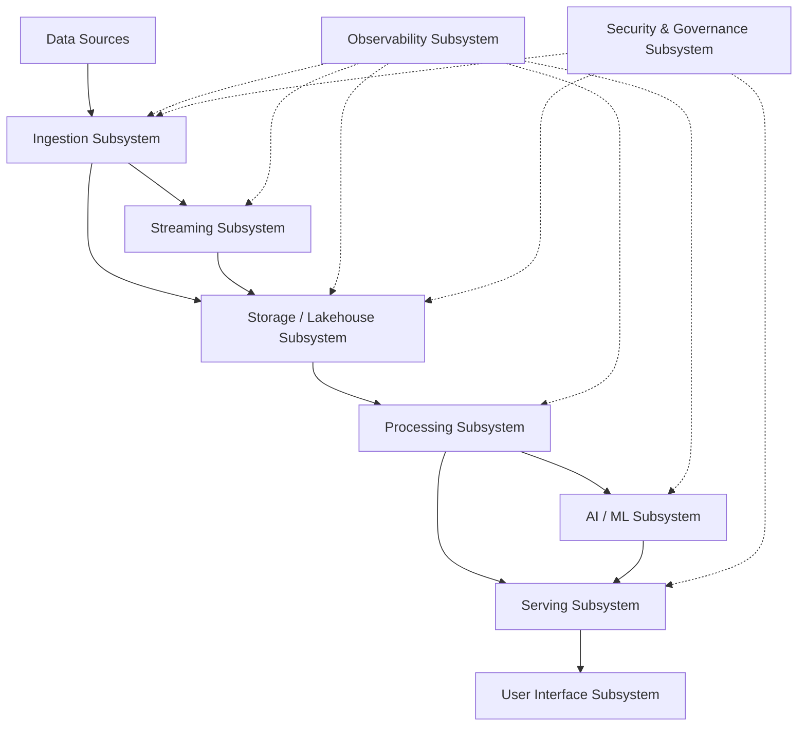

# 01 System Overview

> **Phase 3 - Solution Architecture & System Design**
> Document 01 of 15

## Purpose

This document provides the high-level overview of the Space Mission Data & AI Platform. It establishes the system purpose, capabilities, major subsystems, data flow principles, and the real-time versus batch processing strategy that govern the rest of the architecture.

The platform is an enterprise-style, portfolio-grade simulation inspired by NASA mission systems, ESA Earth observation systems, MBRSC space analytics, Space42 geospatial AI, Bayanat geospatial intelligence, and Yahsat satellite communication systems. It is constrained to open-source tooling and a 16 GB RAM local Docker environment.

## System Purpose

The platform provides a governed, end-to-end path from raw satellite, Earth observation, weather, and maritime inputs to operational mission-support insight. It enables analysts and mission-support teams to detect high-impact events, prioritize response, investigate evidence, and measure operational outcomes.

The scope aligns with the Phase 1 Earth Observation Operations Intelligence MVP: wildfire monitoring, flood assessment, illegal fishing detection, disaster damage prioritization, change detection, and image catalog quality.

## Key Capabilities

| Capability | Description |
| --- | --- |
| Multi-source ingestion | Collect satellite telemetry-adjacent, EO imagery, AIS/maritime, weather, and metadata feeds. |
| Medallion curation | Organize data into Bronze, Silver, and Gold layers with quality enforcement. |
| Streaming + batch analytics | Support near-real-time monitoring and large-scale historical reprocessing. |
| Geospatial analytics | Perform change detection, event localization, and spatial prioritization. |
| Predictive analytics | Train and serve models for anomaly detection and alert ranking. |
| LLM + RAG assistance | Provide retrieval-augmented analyst assistance over curated mission data. |
| Observability | Track pipeline health, data quality, and model behavior. |
| Governance | Maintain metadata, lineage, and access control across the platform. |

## Major Subsystems

| Subsystem | Responsibility |
| --- | --- |
| Ingestion | Pull and validate data from external APIs, files, and feeds. |
| Streaming | Propagate incremental events and decouple producers from consumers. |
| Storage / Lakehouse | Persist raw and curated data in object storage and table formats. |
| Processing | Transform, enrich, and aggregate data across medallion layers. |
| AI / ML | Engineer features, train models, serve predictions, and run RAG. |
| Serving | Expose data, models, and search through APIs and dashboards. |
| User Interface | Present dashboards, alerts, and analyst tools. |
| Observability | Collect logs, metrics, and traces across all subsystems. |
| Security & Governance | Enforce access control, encryption, metadata, and lineage. |

## Data Flow Principles

The platform is pipeline-oriented and metadata-driven:

1. **Collect** raw data from external sources into an immutable landing zone.
2. **Normalize and validate** data into a trusted, standardized form.
3. **Enrich** data through transformation, joins, and quality checks.
4. **Publish** curated datasets for analytics, dashboards, and AI.
5. **Serve** insights through APIs, alerts, and dashboards.

Every stage emits metadata and lineage so that data is auditable and reproducible.

## Real-Time vs Batch Strategy

The platform uses a deliberate hybrid model rather than committing to a single paradigm.

| Workload | Mode | Rationale |
| --- | --- | --- |
| Historical archives and image backfills | Batch | Large volume, latency-tolerant, periodic reprocessing. |
| Incremental telemetry and event feeds | Streaming | Timely operational awareness with low per-event overhead. |
| Near-real-time monitoring windows | Micro-batch / streaming | Balance freshness with laptop-scale resource limits. |
| Model training | Batch | Reproducible, scheduled, resource-bounded. |
| Model inference and RAG | On-demand | Triggered by analyst or API requests. |

## Assumptions

- Open datasets and public APIs are the only data sources.
- Deployment is local, single-node, and containerized with Docker.
- Only one heavy analytical workload runs at a time during demonstrations.
- Security is production-oriented but simplified for laptop-scale operation.

## Cross References

- Phase 1 MVP definition: [../docs/business/05-mvp-definition.md](../docs/business/05-mvp-definition.md)
- Phase 2 data ecosystem overview: [../docs/domain-research/01-space-data-ecosystem-overview.md](../docs/domain-research/01-space-data-ecosystem-overview.md)
- Architecture patterns: [02-architecture-patterns.md](./02-architecture-patterns.md)
