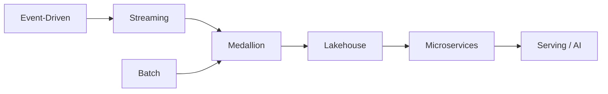

# 02 Architecture Patterns

> **Phase 3 - Solution Architecture & System Design**
> Document 02 of 15

## Purpose

This document defines the architecture styles used by the platform and explains why each is applied. The platform deliberately blends several patterns to balance operational realism, modularity, and laptop-scale feasibility.

## Pattern Summary

| Pattern | Where Applied | Primary Benefit |
| --- | --- | --- |
| Data Lakehouse | Storage and analytics | Open storage with warehouse-grade querying |
| Event-Driven | Ingestion and processing | Loose coupling and incremental reaction |
| Lambda-inspired hybrid | Batch + streaming paths | Historical correctness plus timeliness |
| Microservices | Service decomposition | Modularity and independent evolution |
| Medallion | Data curation | Progressive quality enforcement |
| Streaming | Event backbone | Near-real-time propagation |

## Data Lakehouse Architecture

The platform stores raw geospatial and event data cheaply in object storage while exposing structured, query-ready tables for analytics and reporting.

- **Why:** Earth observation data is large and semi-structured, but business reporting needs structured tables. A lakehouse avoids maintaining a separate lake and warehouse.
- **Alternatives considered:** pure data warehouse (too rigid and costly for imagery), pure data lake (weak governance and query semantics).
- **Trade-off:** slightly more setup complexity than a single store, in exchange for flexibility and governance.

## Event-Driven Architecture

Ingestion triggers, anomaly notifications, and downstream processing are propagated as events.

- **Why:** components can react to incremental data without tight coupling, which improves resilience and extensibility.
- **Alternatives considered:** synchronous request chains (brittle, hard to scale).
- **Trade-off:** added operational complexity from a message backbone.

## Lambda-Inspired Hybrid Pattern

A simplified lambda approach runs batch pipelines for historical correctness and streaming paths for timely updates.

- **Why:** mission monitoring needs both accurate historical context and timely alerts.
- **Alternatives considered:** pure streaming (kappa) which is harder to operate at laptop scale for large backfills.
- **Trade-off:** some duplicated logic between batch and streaming paths.

## Microservices Architecture

The platform is decomposed into logical services: ingestion, transformation, API, vector indexing, model serving, and monitoring.

- **Why:** modular services keep the design explainable and independently deployable.
- **Alternatives considered:** a monolith (simpler to start, harder to evolve and demonstrate).
- **Trade-off:** more inter-service coordination, mitigated by keeping service count modest.

## Medallion Architecture

Data flows through Bronze, Silver, and Gold layers.

- **Why:** progressive refinement enforces quality and separates raw landing from business-ready outputs.
- **Alternatives considered:** single-stage transformation (poor traceability and reuse).
- **Trade-off:** more storage and pipeline stages, justified by governance and reproducibility.

## Streaming Architecture

A streaming backbone supports event propagation, incremental ingestion, and near-real-time monitoring.

- **Why:** mission-support workflows benefit from timely event flow.
- **Alternatives considered:** polling-only batch ingestion (higher latency).
- **Trade-off:** running a broker locally consumes memory, managed via conservative configuration.

## Pattern Interaction

## Cross References

- System overview: [01-system-overview.md](./01-system-overview.md)
- High-level architecture: [03-high-level-architecture.md](./03-high-level-architecture.md)
- Data architecture: [06-data-architecture.md](./06-data-architecture.md)
