# 03 High-Level Architecture

> **Phase 3 - Solution Architecture & System Design**
> Document 03 of 15

## Purpose

This document presents the full end-to-end system architecture as a single Mermaid diagram, then describes each layer from data sources through the user interface and observability.

## Full System Diagram

```mermaid
flowchart LR
    subgraph Sources["1. Data Sources"]
        Sat["Satellite / telemetry-adjacent feeds"]
        EO["Earth observation imagery"]
        AIS["AIS / maritime data"]
        Weather["Weather & alerts"]
        Meta["Catalogs / metadata"]
    end

    subgraph Ingest["2. Ingestion Layer"]
        Conn["API connectors / file pullers"]
        Val["Initial validation"]
    end

    subgraph Streamx["3. Streaming Layer"]
        Kafka["Kafka topics"]
        DLQ["Dead-letter topics"]
    end

    subgraph Storage["4. Storage Layer"]
        MinIO["MinIO object storage"]
        Iceberg["Iceberg tables (Bronze/Silver/Gold)"]
        PG["PostgreSQL (metadata + warehouse)"]
    end

    subgraph Process["5. Processing Layer"]
        Spark["Spark batch jobs"]
        Duck["DuckDB analytics"]
        Air["Airflow orchestration"]
    end

    subgraph Serve["6. Serving Layer"]
        API["FastAPI services"]
        Warehouse["Gold serving tables"]
    end

    subgraph AIML["7. AI / ML Layer"]
        Feat["Feature store"]
        MLflow["MLflow registry"]
        Model["Model serving"]
        Qdrant["Qdrant vector DB"]
        Ollama["Ollama local LLM"]
    end

    subgraph APIL["8. API Layer"]
        REST["REST endpoints"]
        Search["Search / RAG endpoint"]
    end

    subgraph Obs["9. Observability Layer"]
        Prom["Prometheus"]
        Graf["Grafana"]
        OTEL["OpenTelemetry"]
    end

    subgraph UI["10. User Interface Layer"]
        Superset["Superset dashboards"]
        Alerts["Alert views"]
    end

    Sources --> Conn --> Val --> Kafka
    Val --> MinIO
    Kafka --> MinIO
    Kafka --> DLQ
    MinIO --> Iceberg
    Iceberg --> Spark
    Iceberg --> Duck
    Air --> Spark
    Spark --> Iceberg
    Spark --> Feat
    Duck --> Warehouse
    Iceberg --> PG
    Feat --> MLflow --> Model --> API
    Qdrant --> Ollama --> Search
    Model --> REST
    API --> REST
    REST --> Superset
    Search --> Superset
    Warehouse --> Superset
    REST --> Alerts
    OTEL --> Prom --> Graf
```

## Layer Descriptions

| # | Layer | Responsibility |
| --- | --- | --- |
| 1 | Data Sources | External open datasets and APIs feeding the platform. |
| 2 | Ingestion | Pull, decode, and perform first-pass validation of incoming data. |
| 3 | Streaming | Buffer and propagate events, isolate failures via dead-letter topics. |
| 4 | Storage | Persist raw and curated data in object storage, table format, and metadata DB. |
| 5 | Processing | Run batch transforms, analytics, and orchestrated workflows. |
| 6 | Serving | Expose curated Gold data and service endpoints. |
| 7 | AI / ML | Provide features, model registry, serving, vector search, and LLM. |
| 8 | API | Present REST and search/RAG interfaces to consumers. |
| 9 | Observability | Collect metrics, logs, and traces across all layers. |
| 10 | User Interface | Deliver dashboards, alerts, and analyst tooling. |

## Design Notes

- The streaming and batch paths converge on the same Iceberg-backed medallion layers to keep a single source of truth.
- AI/ML consumes curated features rather than raw data to preserve quality and reproducibility.
- Observability and security span every layer rather than existing as isolated add-ons.

## Cross References

- Container-level breakdown: [04-container-architecture.md](./04-container-architecture.md)
- Technology mapping: [05-technology-mapping.md](./05-technology-mapping.md)
