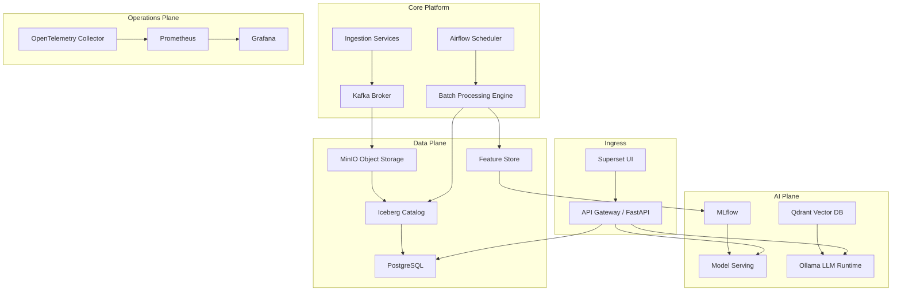

# 04 Container Architecture

> **Phase 3 - Solution Architecture & System Design**
> Document 04 of 15

## Purpose

This document decomposes the platform into logical containers (deployable services) and defines the responsibility, inputs, and outputs of each. "Container" here means a logical service unit that would map to one or more Docker containers.

## Container Diagram

## Container Responsibilities

### Data Ingestion Services
- **Responsibility:** pull data from public APIs and files, decode formats, attach source metadata, perform first-pass validation, and publish to Kafka or land to MinIO.
- **Inputs:** external datasets and APIs.
- **Outputs:** raw events to Kafka, raw objects to MinIO Bronze.

### Streaming Infrastructure (Kafka)
- **Responsibility:** durable event buffering, producer/consumer decoupling, fan-out, and dead-letter handling.
- **Inputs:** events from ingestion services.
- **Outputs:** event streams consumed by storage and processing.

### Batch Processing Engine (Spark / DuckDB)
- **Responsibility:** transform and enrich data across medallion layers, run aggregations, build features, and reprocess history.
- **Inputs:** Bronze and Silver data.
- **Outputs:** Silver and Gold tables, feature sets.

### Data Lakehouse Storage (MinIO + Iceberg)
- **Responsibility:** store raw and curated data with schema evolution, partitioning, and snapshotting.
- **Inputs:** raw objects and processed outputs.
- **Outputs:** queryable Iceberg tables.

### Data Warehouse Layer (PostgreSQL / Gold serving)
- **Responsibility:** expose business-ready curated datasets for reporting and BI.
- **Inputs:** Gold tables.
- **Outputs:** structured query results for dashboards and APIs.

### Feature Store
- **Responsibility:** manage reusable, versioned features for training and inference.
- **Inputs:** curated Silver/Gold data.
- **Outputs:** feature vectors for ML.

### Vector Database (Qdrant)
- **Responsibility:** store embeddings and enable semantic retrieval over documents and imagery metadata.
- **Inputs:** embeddings from the embedding pipeline.
- **Outputs:** top-k context for RAG.

### ML Platform (MLflow + Model Serving)
- **Responsibility:** track experiments, version models, and serve approved models.
- **Inputs:** features and training runs.
- **Outputs:** registered models and prediction endpoints.

### API Layer (FastAPI)
- **Responsibility:** expose data, model, and search endpoints with authentication and validation.
- **Inputs:** requests from UI and external consumers.
- **Outputs:** JSON responses, predictions, and RAG answers.

### BI Layer (Superset)
- **Responsibility:** provide dashboards, analytical views, and alert displays.
- **Inputs:** Gold data and API responses.
- **Outputs:** visualizations for analysts and leadership.

### Monitoring Layer (Prometheus / Grafana / OpenTelemetry)
- **Responsibility:** collect metrics, logs, and traces; evaluate alert conditions.
- **Inputs:** telemetry from all services.
- **Outputs:** dashboards and alerts.

## Container Interaction Summary

| Source | Target | Interaction |
| --- | --- | --- |
| Ingestion | Kafka | publish events |
| Kafka | MinIO | persist raw payloads |
| Airflow | Spark | trigger batch jobs |
| Spark | Iceberg | write curated tables |
| Spark | Feature Store | publish features |
| Feature Store | MLflow | training data |
| API | Model Serving | inference requests |
| API | Qdrant + Ollama | RAG retrieval and generation |
| Superset | API / Gold | dashboard queries |
| OpenTelemetry | Prometheus | metrics export |

## Cross References

- High-level architecture: [03-high-level-architecture.md](./03-high-level-architecture.md)
- Deployment architecture: [10-deployment-architecture.md](./10-deployment-architecture.md)
