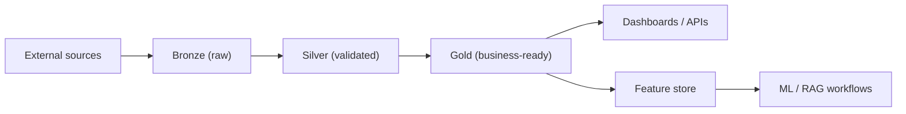
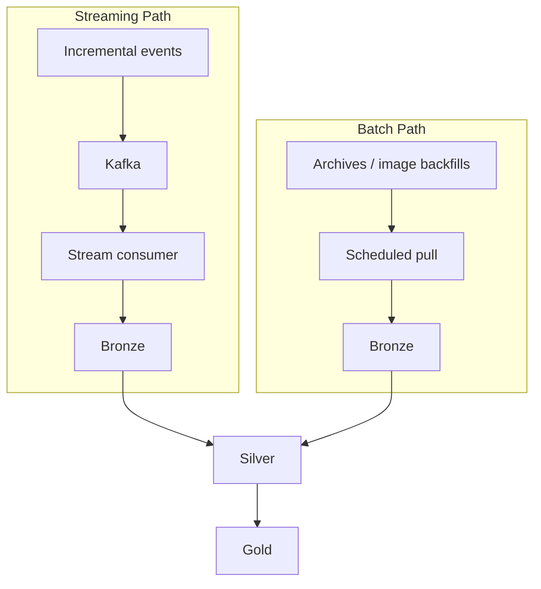
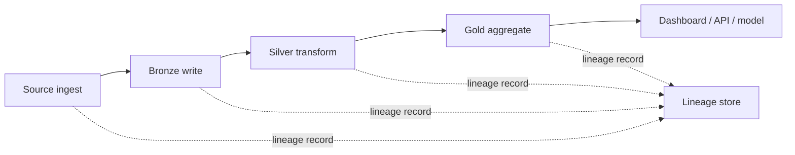

# 06 Data Architecture

> **Phase 3 - Solution Architecture & System Design**
> Document 06 of 15

## Purpose

This document defines the data architecture: the medallion layers, the flow between them, batch versus streaming ingestion, schema evolution, metadata management, and data lineage.

## Medallion Layers

| Layer | Content | Format | Consumers |
| --- | --- | --- | --- |
| Bronze | Raw, immutable ingested data with source metadata | Files / Iceberg | Reprocessing, audit |
| Silver | Validated, standardized, deduplicated, quality-checked data | Iceberg | Analytics, feature engineering |
| Gold | Business-ready aggregates and curated marts | Iceberg / PostgreSQL | Dashboards, APIs, ML |

## Layer Flow Diagram

## Batch vs Streaming Ingestion Strategy

| Aspect | Streaming | Batch |
| --- | --- | --- |
| Use cases | telemetry, alerts, AIS updates | imagery archives, historical loads |
| Latency | seconds to minutes | minutes to hours |
| Trigger | event arrival | schedule (Airflow) |
| Engine | Kafka consumer | Spark / DuckDB |

Both paths land into the same Bronze layer and converge through Silver and Gold to maintain a single source of truth.

## Schema Evolution Strategy

- Iceberg manages additive, safe schema changes (add/rename/reorder columns).
- Critical tables carry explicit version markers.
- Compatibility checks gate promotion from Bronze to Silver and Silver to Gold.
- Additive changes are preferred; deprecated fields are retained then phased out.

## Metadata Management Strategy

A metadata service backed by PostgreSQL tracks:

| Metadata | Purpose |
| --- | --- |
| Dataset inventory | discoverability |
| Source provenance | trust and audit |
| Quality scores | promotion decisions |
| Freshness / cadence | SLA monitoring |
| Ownership | governance |
| Lineage references | impact analysis |

Metadata is exposed through APIs and surfaced in dashboards.

## Data Lineage Approach

Lineage is captured at each transition so any Gold output can be traced to its source. This supports debugging, auditability, and trust in reporting.

## Data Quality Controls

- schema and type validation at Bronze ingestion
- completeness, range, and freshness checks before Silver promotion
- referential and aggregation checks before Gold promotion
- quality metrics emitted to the observability stack

## Cross References

- Architecture patterns: [02-architecture-patterns.md](./02-architecture-patterns.md)
- AI/ML architecture: [07-ai-ml-architecture.md](./07-ai-ml-architecture.md)
- Phase 2 data quality assessment: [../docs/domain-research/05-data-quality-assessment.md](../docs/domain-research/05-data-quality-assessment.md)
