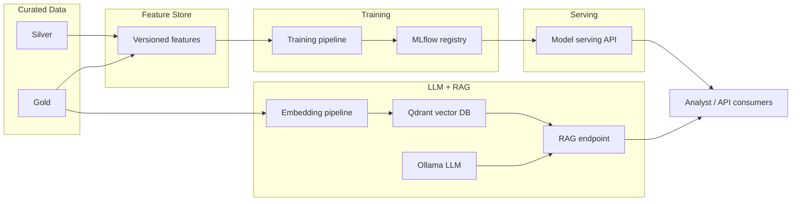
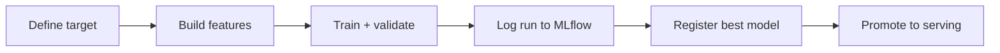
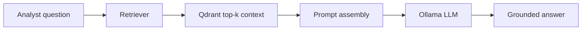

# 07 AI / ML Architecture

> **Phase 3 - Solution Architecture & System Design**
> Document 07 of 15

## Purpose

This document designs the AI/ML subsystem: the feature store, model training pipeline, model serving, the LLM + RAG architecture, vector database usage, embedding pipeline, and the MLflow model registry. It also explains how telemetry becomes features, how predictions are served, and how the LLM interacts with space data.

## AI/ML Overview Diagram

## Feature Store Architecture

- Features are computed from curated Silver and Gold data, not raw inputs.
- Feature computation is decoupled from model code so features are reusable across models.
- Features are versioned to ensure training/serving consistency.

### How Telemetry Becomes Features

| Raw signal | Derived feature |
| --- | --- |
| Event timestamps | update frequency, recency |
| Anomaly history | rolling anomaly score |
| Geospatial points | spatial concentration / clustering |
| Event attributes | severity trend |
| Sequential observations | temporal change indicators |

## Model Training Pipeline

1. Define the prediction target from operational data (e.g., event escalation likelihood).
2. Build features from the feature store.
3. Train and validate models reproducibly.
4. Log parameters, metrics, and artifacts to MLflow.
5. Register the best model version.
6. Promote approved models to the serving path.

Training is a batch, scheduled, resource-bounded workload.

## Model Serving Architecture

- Models are served behind a lightweight FastAPI wrapper exposing prediction endpoints.
- Serving is decoupled from training for independent lifecycle management.
- The serving layer reads the approved model version from MLflow.

### How Predictions Are Served

1. A consumer (analyst tool, dashboard, or API) requests a prediction.
2. The serving API loads the registered model and required features.
3. The model returns a score or classification.
4. The result is surfaced in alerts or dashboards.

## LLM + RAG Architecture

- A local LLM (Ollama) is paired with a vector index (Qdrant) over curated documents and imagery metadata.
- The assistant retrieves relevant context and combines it with prompt-based reasoning to answer analyst questions.

### How the LLM Interacts with Space Data

1. Curated Gold documents and metadata are chunked and embedded.
2. Embeddings are stored in Qdrant.
3. An analyst question is embedded and used to retrieve top-k context.
4. Retrieved context is assembled into a grounded prompt.
5. The LLM produces an answer cited to retrieved sources.

## Embedding Pipeline

| Step | Action |
| --- | --- |
| Chunk | split documents and metadata into segments |
| Embed | generate embeddings in a repeatable batch process |
| Store | persist embeddings and references in Qdrant |
| Retrieve | fetch top-k relevant context for RAG |

## Model Registry (MLflow)

- tracks experiments, parameters, metrics, and artifacts
- versions models and manages stage transitions (staging, production, archived)
- provides the single source of truth for which model the serving layer loads

## ML Monitoring Hooks

- prediction latency and throughput
- input feature drift detection
- output distribution monitoring
- data quality of incoming features

These signals feed the observability stack described in document 08.

## Cross References

- Data architecture: [06-data-architecture.md](./06-data-architecture.md)
- Observability: [08-observability-architecture.md](./08-observability-architecture.md)
- Vector DB ADR and trade-offs: [13-trade-offs.md](./13-trade-offs.md)
