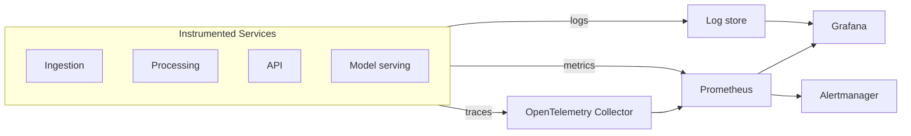
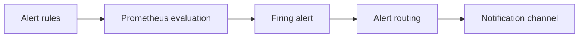

# 08 Observability Architecture

> **Phase 3 - Solution Architecture & System Design**
> Document 08 of 15

## Purpose

This document designs the full observability system: logging, metrics, distributed tracing, pipeline monitoring, ML model monitoring, and alerting. The stack is built on Prometheus, Grafana, and OpenTelemetry.

## Observability Diagram

## Logging Architecture

- each service emits structured logs (JSON) with correlation identifiers
- logs are collected centrally and queryable for incident investigation
- log levels are standardized across services

## Metrics Collection

- services expose Prometheus-compatible metrics endpoints
- Prometheus scrapes metrics on a fixed interval
- core metrics include throughput, latency, error rates, and queue depth

| Metric domain | Example metrics |
| --- | --- |
| Ingestion | records ingested, validation failures |
| Streaming | consumer lag, dead-letter count |
| Processing | job duration, records processed, failures |
| API | request rate, latency, error rate |
| Storage | object counts, table sizes |

## Distributed Tracing

- OpenTelemetry instruments service-to-service calls
- traces follow a request from API through model serving and data access
- tracing helps diagnose latency and failures across container boundaries

## Pipeline Monitoring

- Airflow exposes task success/failure and run duration
- data quality checks emit pass/fail metrics per layer promotion
- freshness and lag are tracked per dataset

## ML Model Monitoring

| Signal | Purpose |
| --- | --- |
| Prediction latency | serving health |
| Feature drift | detect input distribution shift |
| Output drift | detect prediction distribution shift |
| Data quality | catch degraded inputs |

Drift detection is a first-class concern: significant drift triggers an alert and a retraining review.

## Alerting System

- alert rules cover pipeline failures, high error rates, consumer lag, and model drift
- alerts are routed to a notification channel for analyst or operator action
- severity levels distinguish warnings from critical conditions

## Dashboards

Grafana dashboards present:
- platform health overview
- ingestion and streaming throughput
- pipeline run status and data quality
- API and model serving performance
- ML drift and prediction quality

## Cross References

- AI/ML architecture: [07-ai-ml-architecture.md](./07-ai-ml-architecture.md)
- Failure handling: [12-failure-handling.md](./12-failure-handling.md)
