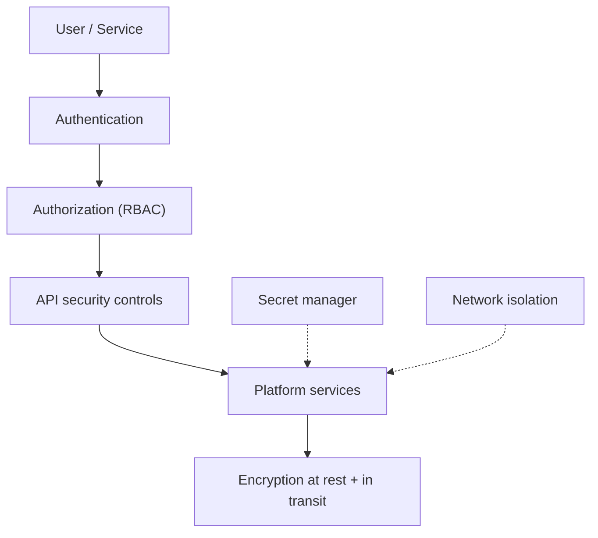

# 09 Security Architecture

> **Phase 3 - Solution Architecture & System Design**
> Document 09 of 15

## Purpose

This document defines the security architecture: authentication, authorization (RBAC), data encryption at rest and in transit, API security, secret management, and container security. Controls are production-oriented but scaled to a local Docker deployment.

## Security Layers Diagram

## Authentication Strategy

- service and user access requires authenticated credentials or tokens
- API access uses tokens or API keys
- administrative interfaces require dedicated credentials

## Authorization (RBAC)

| Role | Permissions |
| --- | --- |
| Analyst | read curated data, run dashboards and search |
| Data steward | manage metadata and data quality, read/write Silver/Gold metadata |
| ML engineer | manage features, training, and model registry |
| Administrator | manage platform configuration and access |

Roles separate read-only and write-enabled access along service boundaries, following least privilege.

## Data Encryption

| State | Control |
| --- | --- |
| At rest | encrypt storage volumes and object storage buckets |
| In transit | enforce TLS for API and inter-service communication where supported |

## API Security

- authentication on all non-public endpoints
- request validation and input sanitization to prevent injection
- rate limiting on exposed endpoints to reduce abuse
- restricted CORS and minimal exposed surface

These controls address common OWASP risks such as broken access control, injection, and security misconfiguration.

## Secret Management

- secrets stored in environment-based configuration or a local secret manager
- no hard-coded credentials in source artifacts or images
- separate secrets per environment and rotation where feasible

## Container Security

- minimal base images to reduce attack surface
- least-privilege container users; avoid running as root where possible
- inter-service traffic isolated on a private Docker network
- only required ports exposed to the host

## Governance Alignment

- access and changes are auditable through logging and metadata lineage
- data classification from Phase 2 informs which datasets require stricter handling

## Cross References

- Deployment architecture: [10-deployment-architecture.md](./10-deployment-architecture.md)
- Phase 2 data classification: [../docs/domain-research/04-data-classification.md](../docs/domain-research/04-data-classification.md)
