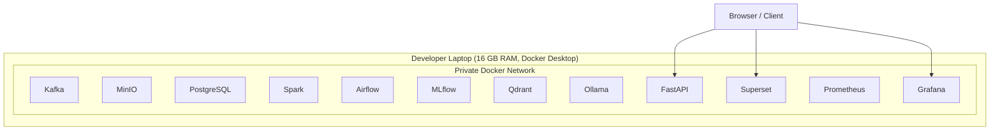

# 10 Deployment Architecture

> **Phase 3 - Solution Architecture & System Design**
> Document 10 of 15

## Purpose

This document designs the local Docker deployment: network design, service communication, port allocation, resource allocation under 16 GB RAM, and volume management. No implementation or Compose files are produced here; this is the deployment design specification.

## Deployment Diagram

## Docker Network Design

- all services join a single private bridge network
- services address each other by container name (internal DNS)
- only API, Superset, and Grafana expose ports to the host
- internal services (Kafka, MinIO, PostgreSQL) are not published externally

## Service Communication Model

| From | To | Protocol |
| --- | --- | --- |
| Ingestion | Kafka | Kafka protocol |
| Services | MinIO | S3 API (HTTP) |
| Services | PostgreSQL | SQL/TCP |
| API | Model serving / Ollama | HTTP |
| Superset | API / PostgreSQL | HTTP / SQL |
| OpenTelemetry | Prometheus | HTTP scrape |

## Port Allocation Strategy

| Service | Exposure | Notes |
| --- | --- | --- |
| FastAPI | host-published | primary external API |
| Superset | host-published | dashboards |
| Grafana | host-published | observability UI |
| Kafka | internal only | broker |
| MinIO | internal (console optional) | object storage |
| PostgreSQL | internal only | metadata + warehouse |
| Prometheus | internal (UI optional) | metrics |
| Qdrant / Ollama / MLflow | internal | AI plane |

Exact port numbers are assigned at implementation; the strategy is to publish only user-facing UIs and keep data-plane services internal.

## Resource Allocation Strategy

Given 16 GB RAM, services run with explicit limits and staged usage.

| Service | Memory posture |
| --- | --- |
| Kafka | bounded heap, few partitions |
| Spark | local mode, bounded executor memory, run one heavy job at a time |
| Ollama | quantized small model only |
| MinIO / PostgreSQL / Qdrant | modest fixed limits |
| Observability stack | lightweight limits |

**Guideline:** not all heavy engines run at peak simultaneously. Demonstrations activate one heavy workload (Spark batch, or LLM inference) at a time.

## Volume Management

| Volume | Purpose |
| --- | --- |
| minio-data | raw and curated objects |
| postgres-data | metadata and warehouse |
| mlflow-artifacts | model artifacts |
| qdrant-data | embeddings |
| grafana/prometheus-data | observability state |

Volumes persist data across container restarts and are the basis for backup snapshots.

## Cross References

- Container architecture: [04-container-architecture.md](./04-container-architecture.md)
- Scalability design: [11-scalability-design.md](./11-scalability-design.md)
- Security architecture: [09-security-architecture.md](./09-security-architecture.md)
