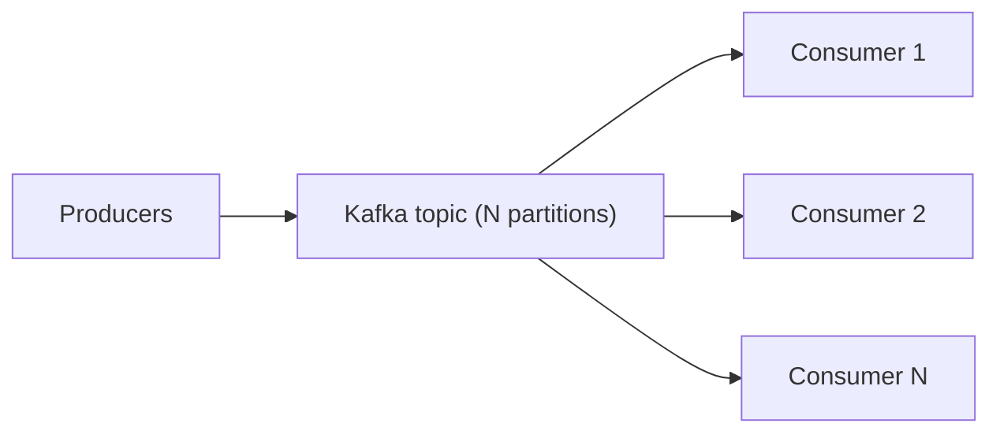

# 11 Scalability Design

> **Phase 3 - Solution Architecture & System Design**
> Document 11 of 15

## Purpose

This document explains how the architecture scales beyond the local MVP toward large satellite fleets, high-frequency telemetry streams, large image datasets, and multi-mission operations, without requiring a fundamental redesign.

## Scaling Dimensions

| Dimension | Local MVP posture | Scale-out path |
| --- | --- | --- |
| Satellite fleets | few sources | add ingestion connectors per source |
| Telemetry frequency | modest event rate | increase Kafka partitions and consumers |
| Image datasets | sampled archives | scale MinIO and partition Iceberg tables |
| Multi-mission ops | single domain | namespace data and isolate per mission |

## Scaling the Ingestion Layer

- new data products are added as independent connectors
- connectors are stateless and horizontally scalable
- schema discovery and validation keep new sources governed

## Scaling the Streaming Layer

- partitions are increased to absorb higher event rates
- consumer groups scale horizontally to match partition count
- backpressure is handled by durable buffering

## Scaling the Storage Layer

- Iceberg partitioning (by time and region) keeps queries efficient as data grows
- object storage scales by adding capacity or migrating to distributed storage later
- table compaction and snapshot expiration manage metadata growth

## Scaling Processing

- batch jobs move from local Spark to a multi-worker cluster when hardware allows
- DuckDB handles smaller analytical loads to reserve Spark for heavy jobs
- workloads are decoupled so they scale independently

## Scaling AI/ML

- training scales by adding compute and parallel runs
- serving scales horizontally behind the API layer
- the vector database scales by sharding collections

## Multi-Mission Operations

- data is namespaced per mission to isolate access and lineage
- shared platform services serve multiple missions while preserving separation
- the same medallion model applies per mission

## Scaling Philosophy

The MVP is intentionally single-node, but the logical architecture (event-driven, lakehouse, medallion, microservices) is the same one used at scale. Growth is achieved by replicating and distributing existing components rather than replacing the design.

## Cross References

- Deployment architecture: [10-deployment-architecture.md](./10-deployment-architecture.md)
- Failure handling: [12-failure-handling.md](./12-failure-handling.md)
