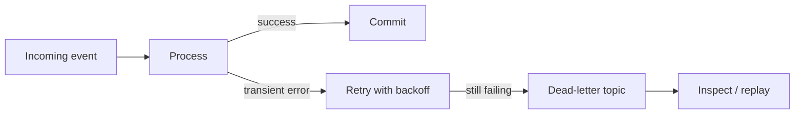

# 12 Failure Handling

> **Phase 3 - Solution Architecture & System Design**
> Document 12 of 15

## Purpose

This document defines fault tolerance, retry mechanisms, dead-letter queues, data recovery strategies, and the backup approach.

## Failure Handling Diagram

## Fault Tolerance Strategy

- services are stateless where practical so they can restart cleanly
- durable state lives in MinIO, Iceberg, and PostgreSQL, not in service memory
- Kafka provides durable buffering so consumers can recover after restart

## Retry Mechanisms

| Failure type | Strategy |
| --- | --- |
| Transient network/API error | retry with exponential backoff and capped attempts |
| Downstream unavailable | buffer in Kafka until recovery |
| Validation failure | route to dead-letter for inspection |

## Dead-Letter Queues

- events that repeatedly fail processing are routed to a dead-letter topic
- dead-letter payloads retain original content and error metadata
- operators inspect, fix, and replay dead-letter events

## Data Recovery Strategies

- raw data in Bronze is immutable and replayable
- pipelines are deterministic so Silver and Gold can be rebuilt from Bronze
- Iceberg snapshots allow rollback to a previous table state
- metadata enables identifying what to reprocess after an incident

## Backup Approach

| Asset | Backup method |
| --- | --- |
| Object storage (MinIO) | periodic volume snapshots / bucket exports |
| Metadata + warehouse (PostgreSQL) | scheduled database dumps |
| Model artifacts (MLflow) | artifact volume snapshots |
| Vector data (Qdrant) | collection snapshots |

## Recovery Objectives (MVP targets)

| Objective | Target posture |
| --- | --- |
| Recovery point | reprocess from last good Bronze snapshot |
| Recovery time | bounded by batch reprocessing duration |
| Data loss tolerance | minimal for curated layers due to replayable Bronze |

## Cross References

- Observability: [08-observability-architecture.md](./08-observability-architecture.md)
- Scalability: [11-scalability-design.md](./11-scalability-design.md)
