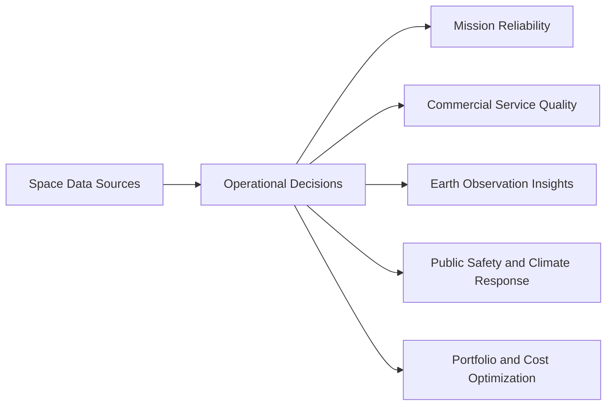

# Business Analysis

## Executive Summary

This phase defines the business scope for an enterprise-grade Space Mission Data & AI Platform before any architecture, infrastructure, or implementation work begins. The analysis focuses on where data engineering and artificial intelligence create measurable operational and commercial value across space operations, Earth observation, satellite communications, climate intelligence, and mission support.

The strongest near-term opportunity for a laptop-constrained, open-source capstone is an Earth Observation Operations Intelligence scope built around wildfire detection, flood monitoring, illegal fishing detection, drought and crop analytics, disaster impact assessment, and image metadata quality. This scope preserves aerospace relevance, uses free datasets, and still demonstrates a credible end-to-end data and AI portfolio.

## Key Findings

1. The modern space industry is no longer driven only by government exploration programs; it is increasingly an operational data industry serving climate, defense, agriculture, maritime, aviation, and communications markets.
2. The highest-value business problems depend on timely data fusion across imagery, orbital context, weather, mission events, customer service data, and external public datasets.
3. AI adoption is strongest where organizations need anomaly detection, forecasting, prioritization, geospatial computer vision, and natural-language access to operational knowledge.
4. Several important aerospace use cases are poor capstone candidates because they require proprietary telemetry, safety-critical certification, or high-fidelity simulation environments that are not realistic on a 16 GB laptop.
5. Earth observation intelligence provides the best balance of business value, data availability, AI potential, and portfolio strength.

## Deliverables

| Document | Purpose |
| --- | --- |
| [01-industry-overview.md](./01-industry-overview.md) | Market context, trends, AI adoption, and operating challenges across the space economy |
| [02-business-problems.md](./02-business-problems.md) | Catalog of 30 priority business problems suitable for data and AI solutions |
| [03-use-case-analysis.md](./03-use-case-analysis.md) | Detailed analysis for each use case including KPIs, data needs, AI opportunities, and risks |
| [04-use-case-ranking.md](./04-use-case-ranking.md) | Weighted scoring model and ranked portfolio of use cases |
| [05-mvp-definition.md](./05-mvp-definition.md) | Recommended capstone scope, exclusions, MVP goals, and success criteria |
| [06-roadmap.md](./06-roadmap.md) | Five-version business roadmap from MVP to advanced platform capabilities |
| [07-stakeholders.md](./07-stakeholders.md) | Stakeholder map, objectives, pain points, and decision responsibilities |
| [08-kpis.md](./08-kpis.md) | KPI catalog aligned to operational, AI, service, and business outcomes |
| [09-risks.md](./09-risks.md) | Business, data, security, operational, and compliance risks |
| [10-interview-questions.md](./10-interview-questions.md) | Likely interview questions and detailed model answers |
| [11-glossary.md](./11-glossary.md) | Business and domain terminology used across the phase |

## Business Scope Logic

## Recommended Scope

The recommended capstone scope is described in [05-mvp-definition.md](./05-mvp-definition.md). It prioritizes use cases that are:

- high-value to aerospace and public-sector stakeholders
- feasible with open datasets
- demonstrable on a single-machine environment
- strong evidence of data engineering and AI engineering capability

## Cross References

- The market context behind the use-case selection is documented in [01-industry-overview.md](./01-industry-overview.md).
- The complete use-case catalog is listed in [02-business-problems.md](./02-business-problems.md).
- The scoring rationale and shortlist are documented in [04-use-case-ranking.md](./04-use-case-ranking.md).
- The stakeholder and KPI framework is documented in [07-stakeholders.md](./07-stakeholders.md) and [08-kpis.md](./08-kpis.md).
