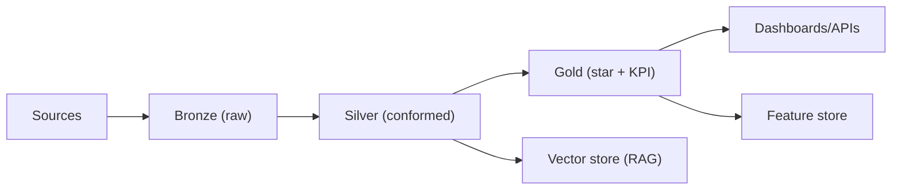

# 01 - Data Modeling Strategy

> **Phase 6 - Data Modeling & Lakehouse Design**
> Document 01 of 18

## Purpose

Define the end-to-end modeling strategy for the Space Mission Data & AI Platform: how medallion layering, dimensional modeling, OLTP/OLAP separation, and batch/streaming alignment combine into one coherent design that is feasible on a 16 GB laptop.

## Modeling Principles

| Principle | Statement |
| --- | --- |
| Medallion first | All data flows Bronze → Silver → Gold; no layer is skipped |
| Conform on Silver | Standardized entities and keys are created once in Silver and reused |
| Dimensional Gold | Gold is star-schema optimized for analytics and AI feature sourcing |
| Laptop feasibility | Wide, pre-aggregated marts over deep distributed joins |
| AI-ready by design | Silver/Gold feed feature store and vector store without re-modeling |

## Medallion Architecture

| Layer | Model style | Format | Mutability | Consumers |
| --- | --- | --- | --- | --- |
| Bronze | Schema-on-read, source-shaped | Parquet / Iceberg | Append-only, immutable | Reprocessing, audit |
| Silver | Normalized 3NF-ish entities, conformed keys | Iceberg | Upsert/merge | Analytics eng, features |
| Gold | Star schema + KPI marts | Iceberg / PostgreSQL | Recomputed | Dashboards, APIs, ML, RAG |

## Star vs Snowflake vs Data Vault

| Option | Where used | Why |
| --- | --- | --- |
| Star schema | Gold analytics marts | Simple joins, fast on DuckDB, interview-standard |
| Light snowflake | Geography/satellite dims with hierarchies | Avoids duplicate hierarchy maintenance |
| Data Vault | Not used in MVP | Over-engineered for single-team, laptop scale |

Decision: **Star schema for Gold**, controlled snowflaking only where dimension hierarchies are reused. Data Vault is rejected (see [17-adr.md](17-adr.md)).

## OLTP vs OLAP Separation

| Concern | Store | Notes |
| --- | --- | --- |
| Operational metadata, catalog, run state | PostgreSQL (OLTP) | Small, transactional |
| Analytical facts/dims | Iceberg + DuckDB (OLAP) | Columnar, scan-optimized |
| KPI serving | PostgreSQL Gold marts | Low-latency dashboard reads |

## Batch vs Streaming Alignment

| Path | Datasets | Model impact |
| --- | --- | --- |
| Streaming | FIRMS/VIIRS NRT alerts, future telemetry/AIS | Event-grain Bronze, micro-batch to Silver |
| Batch | Sentinel-1/2, Landsat, NASA POWER, GFW | Partition-load Bronze, scheduled Silver/Gold |

Both converge on identical Silver entities, preserving a single source of truth.

## Assumptions

- MVP scope is Earth Observation Operations Intelligence; telemetry/orbit/launch/space-weather models are designed for expansion but lightly populated.
- Engine: Spark for transforms, DuckDB for ad-hoc, PostgreSQL for serving.

## Cross References

- [02-bronze-layer.md](02-bronze-layer.md) · [04-gold-layer.md](04-gold-layer.md) · [17-adr.md](17-adr.md)
