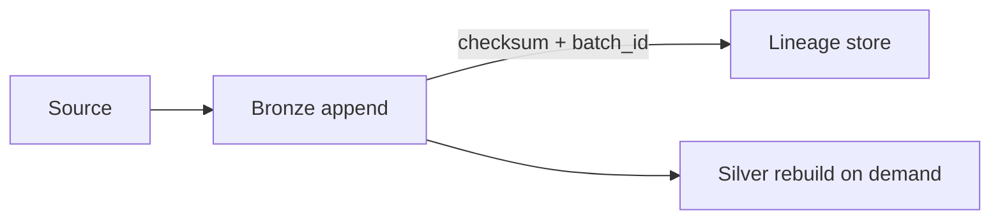

# 02 - Bronze Layer (Raw Data Model)

> **Phase 6 - Data Modeling** · Document 02 of 18

## Purpose

Model the raw landing zone: immutable, append-only, source-shaped storage that guarantees traceability and reprocessing.

## Design Principles

| Principle | Detail |
| --- | --- |
| Append-only | No updates/deletes; corrections arrive as new records |
| Schema-on-read | Payload kept as-is; structure interpreted downstream |
| Full provenance | Every record carries ingest metadata |
| Replayable | Silver/Gold can be fully rebuilt from Bronze |

## Standard Bronze Envelope

| Column | Type | Description |
| --- | --- | --- |
| `_ingest_id` | UUID | Unique ingest record id |
| `_source` | string | Dataset code (e.g. FIRMS, S2) |
| `_ingest_ts` | timestamp | Arrival time |
| `_event_ts` | timestamp | Source event time (if parseable) |
| `_batch_id` | string | Ingestion run id |
| `_format` | string | json/csv/cog/grib |
| `_checksum` | string | Payload hash |
| `payload` | string/binary | Raw record or object reference |

## Storage Format

- Structured/semi-structured: **Parquet under Iceberg** tables.
- Large rasters (Sentinel, Landsat): stored on MinIO object store; Bronze holds metadata + object key, not pixels.

## Partitioning

| Source class | Partition keys |
| --- | --- |
| NRT alerts (FIRMS/VIIRS) | `_event_ts` day, region |
| Imagery metadata | acquisition_date, mission |
| Weather (POWER) | date, grid_cell |
| Future telemetry | mission_id, hour |

## Immutability & Traceability

Immutability ensures audit, reproducibility, and safe reprocessing; `_checksum` + `_batch_id` make every Gold figure traceable to a raw record.

## Cross References

- [03-silver-layer.md](03-silver-layer.md) · [12-partitioning.md](12-partitioning.md) · [15-governance.md](15-governance.md)
