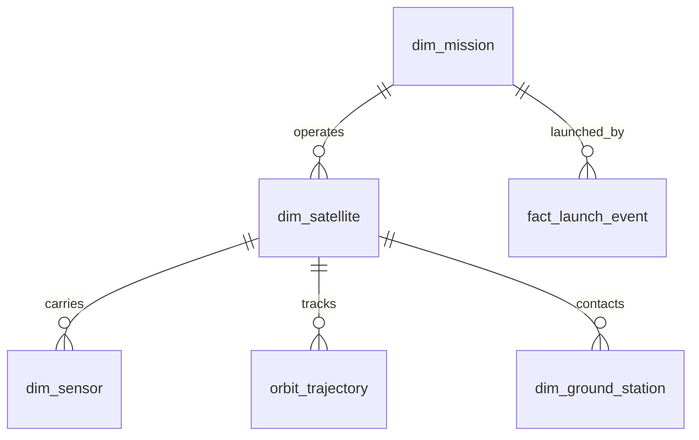

# 03 - Silver Layer (Cleaned Data Model)

> **Phase 6 - Data Modeling** · Document 03 of 18

## Purpose

Define conformed, validated entities. Silver is the single source of truth for clean data and the basis for Gold, features, and vectors.

## Cleaning Rules

| Rule | Action |
| --- | --- |
| Type coercion | Cast to canonical types |
| Range checks | Drop/flag out-of-bound lat/lon, FRP, confidence |
| Null policy | Reject records missing keys/timestamps |
| Dedup | Keep latest by natural key + event time |
| Time alignment | Normalize to UTC ISO-8601 |
| Geo normalize | Reproject to EPSG:4326; round to grid |

## Deduplication (Conceptual)

Window by natural key, order by `_event_ts` desc, keep rank 1; conflicts logged to quality table.

## Core Entities

| Entity | Grain | Key |
| --- | --- | --- |
| `dim_satellite` | 1 row/satellite | `sat_key` |
| `dim_sensor` | 1 row/sensor | `sensor_key` |
| `dim_mission` | 1 row/mission | `mission_key` |
| `fact_launch_event` | 1 row/launch | `launch_key` |
| `orbit_trajectory` | 1 row/sat/timestamp | `sat_key`+`ts` |
| `dim_ground_station` | 1 row/station | `station_key` |
| `obs_fire` | 1 row/detection | `fire_key` |
| `obs_flood` | 1 row/scene/aoi | `flood_key` |

## Standardization

- Telemetry: canonical units, sensor naming registry.
- Geospatial: WGS84, AOI tile ids.
- Imagery: harmonized band/index naming (NDVI, NDWI, dNBR).

## Cross References

- [04-gold-layer.md](04-gold-layer.md) · [07-geospatial-model.md](07-geospatial-model.md) · [10-data-relationships.md](10-data-relationships.md)
