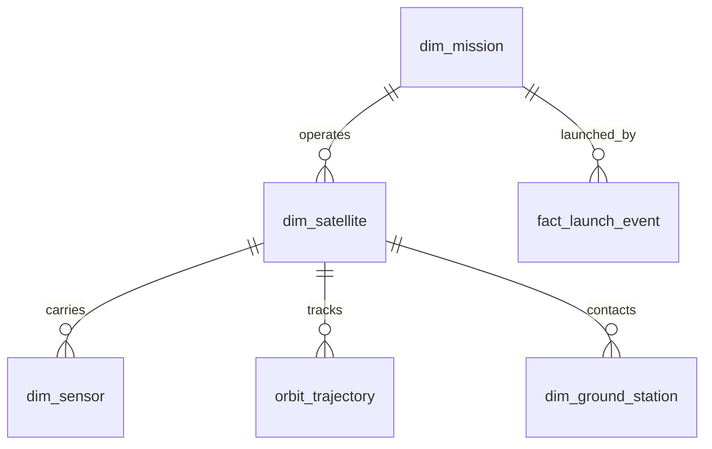

# 03 - Silver Layer (Cleaned Data Model)

> **Phase 6 - Data Modeling** · Document 03 of 18

## Purpose

Define conformed, validated entities. Silver is the single source of truth for clean data and the basis for Gold, features, and vectors.

## Cleaning Rules

| Rule | Action |
| --- | --- |
| Type coercion | Cast to canonical types |
| Range checks | Drop/flag out-of-bound lat/lon, FRP, confidence |
| Null policy | Reject records missing keys/timestamps |
| Dedup | Keep latest by natural key + event time |
| Time alignment | Normalize to UTC ISO-8601 |
| Geo normalize | Reproject to EPSG:4326; round to grid |

## Deduplication (Conceptual)

Window by natural key, order by `_event_ts` desc, keep rank 1; conflicts logged to quality table.

## Core Entities

Entities are tagged by delivery **track**: **MVP** = the six Earth-observation /
maritime use cases on real open data; **Sim** = the spacecraft operations track,
retained as a technical demonstrator on *synthetic* data and excluded from the
MVP (see [05-mvp-definition.md](../business/05-mvp-definition.md) and ADR-09).

| Entity | Grain | Key | Track |
| --- | --- | --- | --- |
| `dim_satellite` | 1 row/satellite | `sat_key` | Sim |
| `dim_sensor` | 1 row/sensor | `sensor_key` | Sim |
| `dim_mission` | 1 row/mission | `mission_key` | Sim |
| `fact_launch_event` | 1 row/launch | `launch_key` | Sim |
| `orbit_trajectory` | 1 row/sat/timestamp | `sat_key`+`ts` | Sim |
| `dim_ground_station` | 1 row/station | `station_key` | Sim |
| `obs_fire` | 1 row/detection | `fire_key` | MVP |
| `obs_flood` | 1 row/scene/aoi | `flood_key` | MVP |
| `obs_vessel` | 1 row/vessel identity | `vessel_key` | MVP |
| `obs_scene` | 1 row/scene granule | `scene_key` | MVP |
| `obs_index` | 1 row/AOI/index/date | `index_key` | MVP |
| `ref_aoi` | 1 row/EMS footprint | `aoi_key` | MVP |

## Standardization

- Telemetry: canonical units, sensor naming registry.
- Geospatial: WGS84, AOI tile ids.
- Imagery: harmonized band/index naming (NDVI, NDWI, dNBR).
- Maritime: ISO-3166 flag codes, canonical vessel-type vocabulary, MMSI as identity key.

## Field-Level Schemas (MVP EO Entities)

The cleaners that promote Bronze to these Silver entities target the contracts
below. All timestamps are UTC ISO-8601; all coordinates are EPSG:4326; every row
carries the Bronze provenance columns (`_ingest_id`, `_batch_id`, `_source`,
`_event_ts`).

### `obs_fire` (source: FIRMS / VIIRS)

| Field | Type | Rule |
| --- | --- | --- |
| `fire_key` | string | Natural key = hash(latitude, longitude, event_ts, satellite) |
| `event_ts` | timestamp | From `acq_date` + `acq_time`, normalized to UTC |
| `latitude` | double | Range [-90, 90] |
| `longitude` | double | Range [-180, 180] |
| `geo_key` | string | Grid-snapped cell for spatial joins |
| `brightness` | double | Kelvin; nullable |
| `frp` | double | Fire Radiative Power (MW); >= 0 |
| `confidence` | int | Normalized to 0-100 (nominal/low/high mapped) |
| `satellite` | string | Platform code (e.g. N, Aqua, Terra) |
| `daynight` | string | `D` or `N`; nullable |
| `source` | string | `VIIRS` or `MODIS` |

### `obs_vessel` (source: Global Fishing Watch)

| Field | Type | Rule |
| --- | --- | --- |
| `vessel_key` | string | Natural key = MMSI (fallback vessel id) |
| `mmsi` | string | Required maritime identity |
| `imo` | string | Nullable |
| `shipname` | string | Trimmed, upper-cased; nullable |
| `flag` | string | ISO-3166 alpha-3; nullable |
| `vessel_type` | string | Canonical vocabulary; nullable |
| `first_transmission_ts` | timestamp | Earliest registry transmission; nullable |
| `last_transmission_ts` | timestamp | Latest registry transmission |
| `event_ts` | timestamp | = `last_transmission_ts` |
| `source` | string | `GFW` |

### `obs_scene` (source: Sentinel Hub / NASA Earthdata)

| Field | Type | Rule |
| --- | --- | --- |
| `scene_key` | string | STAC feature / granule id |
| `event_ts` | timestamp | Acquisition datetime, UTC |
| `collection` | string | e.g. `sentinel-2-l2a` |
| `platform` | string | Sensor platform; nullable |
| `bbox` | string | `minx,miny,maxx,maxy`; nullable |
| `geo_key` | string | Centroid grid cell |
| `cloud_cover` | double | Percentage [0, 100]; nullable |
| `provider` | string | Data provider; nullable |
| `source` | string | `SENTINELHUB`, `LANDSAT`, or `EARTHDATA` |

### `obs_index` (source: Sentinel Hub Statistical API)

Aggregated spectral-index statistics per AOI per time bucket. Feeds the EO
feature store (NDVI change UC-14, NBR burn severity UC-15, NDWI water UC-16).

| Field | Type | Rule |
| --- | --- | --- |
| `index_key` | string | Natural key = hash(geo_key, index_name, stat_date) |
| `index_name` | string | `NDVI`, `NDWI`, or `NBR` |
| `stat_date` | date | Bucket date (from interval start) |
| `event_ts` | timestamp | Interval start, UTC |
| `geo_key` | string | AOI centroid grid cell |
| `bbox` | string | `minx,miny,maxx,maxy` |
| `mean` | double | Mean index value over valid pixels |
| `min` | double | Minimum; nullable |
| `max` | double | Maximum; nullable |
| `stddev` | double | Std deviation; nullable |
| `valid_pixel_fraction` | double | sampleCount / (sampleCount + noDataCount) |
| `collection` | string | e.g. `sentinel-2-l2a` |
| `source` | string | `SENTINELHUB_STATS` |

### `ref_aoi` (source: Copernicus EMS)

Rapid-mapping activation footprints. Dual role: monitored Areas of Interest for
per-AOI KPIs, and independent validation ground truth for wildfire/flood
detections. Refreshed manually (portal download → file ingest), not polled.

| Field | Type | Rule |
| --- | --- | --- |
| `aoi_key` | string | EMS activation / AOI id |
| `aoi_name` | string | Human-readable AOI name |
| `event_type` | string | `flood`, `fire`, or `other` (classified from properties) |
| `event_date` | timestamp | Activation event date; nullable |
| `bbox` | array | `[min_lon, min_lat, max_lon, max_lat]` |
| `geo_key` | string | Centroid grid cell |
| `polygons` | array | GeoJSON MultiPolygon rings (point-in-polygon joins) |
| `area_km2` | double | Planar shoelace footprint area |
| `source` | string | `EMS` |

## Cross References

- [04-gold-layer.md](04-gold-layer.md) · [07-geospatial-model.md](07-geospatial-model.md) · [10-data-relationships.md](10-data-relationships.md)
