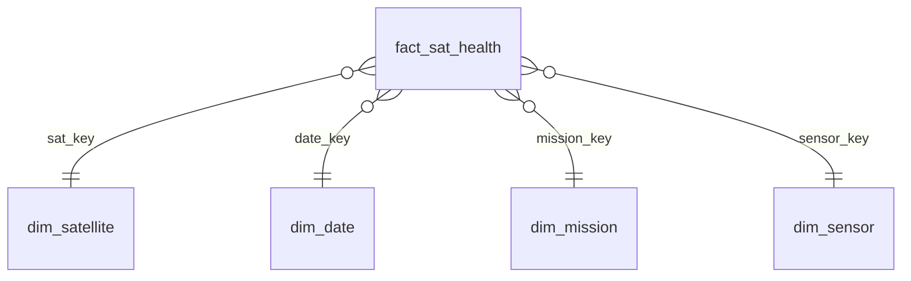
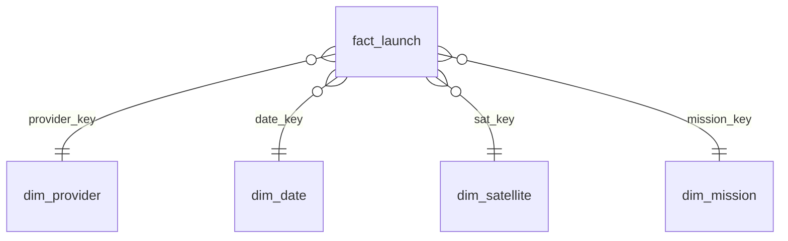
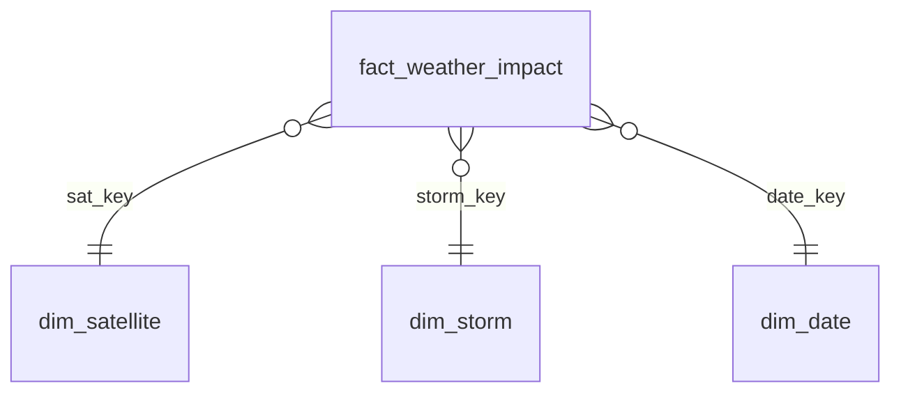
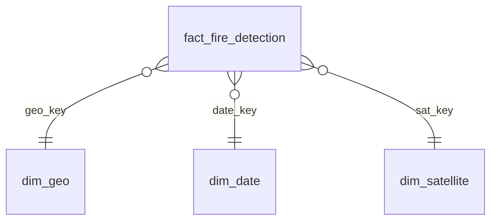

# 05 - Star Schema Design

> **Phase 6 - Data Modeling** · Document 05 of 18

## 1. Satellite Operations Analytics

Fact `fact_sat_health` — grain: 1 row per satellite per day. Keys: `sat_key`, `date_key`, `mission_key`. Measures: health_score, anomaly_count, uptime_pct.

## 2. Launch Analytics

Fact `fact_launch` — grain: 1 row per launch. Keys: `launch_key`, `date_key`, `provider_key`, `sat_key`. Measures: success_flag, delay_min, payload_mass.

## 3. Space Weather Impact

Fact `fact_weather_impact` — grain: 1 row per satellite per storm window. Keys: `sat_key`, `storm_key`, `date_key`. Measures: kp_max, anomaly_delta, exposure_hr.

## 4. Earth Observation Insights

Fact `fact_fire_detection` — grain: 1 detection/AOI/day. Keys: `fire_key`, `geo_key`, `date_key`, `sat_key`. Measures: frp, confidence, burned_area.

## Cross References

- [04-gold-layer.md](04-gold-layer.md) · [10-data-relationships.md](10-data-relationships.md)
