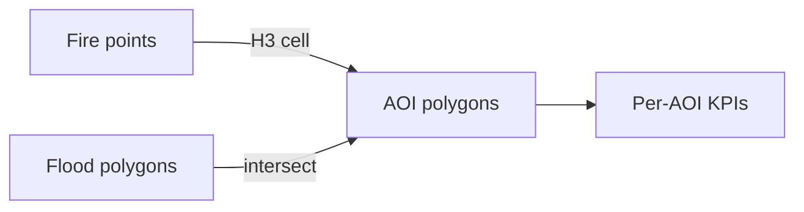

# 07 - Geospatial Data Model

> **Phase 6 - Data Modeling** · Document 07 of 18

## Scope

Satellite position, Earth observation coordinates, AOIs, and orbit paths.

## Coordinate Handling

- Canonical CRS: **EPSG:4326 (WGS84)** for storage; reproject to EPSG:3857 for tiling.
- Geometry stored as WKT/GeoParquet; orbit paths as LINESTRING.

## Spatial Indexing (Concept)

| Element | Index |
| --- | --- |
| Point detections (fire) | H3 hex / geohash cell |
| AOI polygons | bounding box + R-tree |
| Tiles | MGRS / Sentinel tile id |

## Geospatial Joins (Conceptual)

Point-in-polygon and tile-overlap joins driven by precomputed H3 cells avoid runtime spatial scans.

## Cross References

- [03-silver-layer.md](03-silver-layer.md) · [05-star-schemas.md](05-star-schemas.md)
