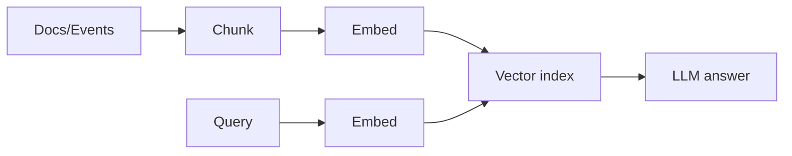

# 09 - Vector Data Model (LLM / RAG)

> **Phase 6 - Data Modeling** · Document 09 of 18

## Scope

Vector store (Qdrant-style) for mission knowledge base and telemetry semantics.

## Embedding Types

| Type | Source | Use |
| --- | --- | --- |
| Document | mission docs, ADRs, reports | knowledge RAG |
| Telemetry | anomaly summaries | semantic search |
| Geo-event | fire/flood event cards | situational Q&A |

## Document Structure

| Field | Description |
| --- | --- |
| `chunk_id` | unique chunk |
| `embedding` | float vector |
| `source_ref` | mission/sat/AOI key |
| `text` | chunk content |
| `metadata` | date, domain, classification |

## RAG Indexing

Metadata filters tie vectors back to `sat_key`/`geo_key` for grounded, traceable answers.

## Cross References

- [08-feature-store.md](08-feature-store.md) · [15-governance.md](15-governance.md)
