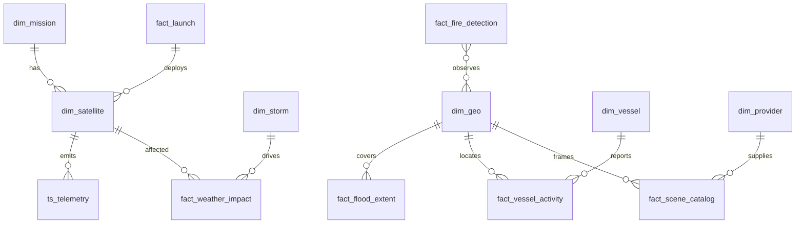

# 10 - Data Relationships

> **Phase 6 - Data Modeling** · Document 10 of 18

## Core Relationships

| Relationship | Cardinality |
| --- | --- |
| Satellite ↔ Mission | many-to-one |
| Satellite ↔ Telemetry | one-to-many |
| Launch ↔ Satellite | one-to-many |
| Space weather ↔ Telemetry anomalies | one-to-many |
| Earth observation ↔ Climate events | many-to-many |
| Vessel ↔ AOI (geo) | many-to-many |
| Scene ↔ Provider | many-to-one |

## ER Diagram

## Cross References

- [03-silver-layer.md](03-silver-layer.md) · [05-star-schemas.md](05-star-schemas.md)
