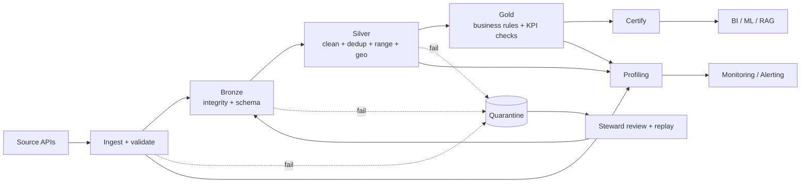

# 01 — Data Quality Strategy

> **Phase 10 — Data Quality, Validation & Governance Foundation**
> Enterprise Space Mission Data & AI Platform

This document set defines the platform-wide data quality framework. It is aligned
to the MVP business scope — six Earth-observation use cases (UC-14 change, UC-15
wildfire, UC-16 flood, UC-18 illegal fishing, UC-25 catalog, UC-27 damage) — and
to the medallion architecture (Bronze → Silver → Gold). Detailed, executable
rules and operational artifacts live under [quality/](../../quality/).

---

## 1. Why data quality matters

The platform turns raw satellite and geospatial feeds into decisions —
"where is the fire", "which AOI is flooded", "which vessel is suspicious". Every
downstream product (BI dashboards, AI/ML pipelines, LLM/RAG) inherits the quality
of the data beneath it. Poor quality translates directly into business harm:

| Failure | Business consequence | KPI hit |
|---------|----------------------|---------|
| Dropped fire detections | Missed/late wildfire response | MTTD, false negative rate |
| Low valid-pixel coverage | Wrong flood extent | inundation accuracy |
| Missing vessel identity | Bad fishing triage | suspicious detection rate |
| Incomplete scene metadata | Analysts can't find imagery | search success rate |
| Stale data | Decisions on old reality | freshness SLA |

Data quality is therefore a **first-class engineering concern**, not a
post-hoc report.

---

## 2. Quality principles

1. **Never drop data** — invalid records are quarantined for replay, not deleted.
2. **Bronze is immutable truth** — recovery reprocesses from raw landing.
3. **Shift-left validation** — validate as early as possible (prevention).
4. **Gate every promotion** — Bronze, Silver and Gold each have quality gates.
5. **Measure, don't guess** — thresholds come from profiling, not intuition.
6. **Make it observable** — every gate emits metrics to Prometheus/Grafana.
7. **Certify before consume** — only certified datasets feed BI/ML.

---

## 3. Data quality lifecycle

---

## 4. Validation checkpoints

| Checkpoint | Layer | Focus | Failure action |
|------------|-------|-------|----------------|
| Ingestion validators | pre-Bronze | schema, timestamp, geo, dedup | quarantine record |
| Bronze gate | Bronze | file/envelope integrity, schema | quarantine batch |
| Silver checkpoint | Silver | clean, dedup, range, UTC, geo | fail task (hold) |
| Gold checkpoint | Gold | business rules, KPI, aggregates | fail task (hold) |
| Reconciliation | cross-layer | counts, checksums, freshness | alert |
| Profiling | all | drift, nulls, outliers | alert |

Checkpoints are implemented as small, dependency-free expectation suites
(a laptop-friendly analogue of Great Expectations) in
[transformation/cleaning/validation_framework.py](../../transformation/cleaning/validation_framework.py)
and, for EO entities/marts, in
[transformation/quality/eo_suites.py](../../transformation/quality/eo_suites.py).

---

## 5. Prevention vs correction

| Approach | Mechanism | When |
|----------|-----------|------|
| **Prevention** | schema contracts, range gates, watermarks, idempotent dedup | before data lands / promotes |
| **Correction** | quarantine + replay, backfill from Bronze, threshold retune | after a failure is detected |

The platform biases toward **prevention** (cheaper, earlier) but always retains a
**correction** path because upstream feeds are outside our control.

---

## 6. Continuous quality monitoring

Every gate emits metrics; profiling establishes baselines; Prometheus alerts on
deviation; Grafana visualizes; Alertmanager routes by severity. This closes the
loop so quality is *continuously* verified, not sampled. Details:
[08-monitoring.md](08-monitoring.md).

---

## 7. Scope note (MVP vs Simulation)

MVP-critical datasets are the six EO entities/marts. Satellite telemetry, orbit,
launch and space-weather are the **Simulation track** (post-MVP, synthetic,
retained as the streaming/anomaly-ML demonstrator — ADR-09). Their quality rules
are documented for completeness but are not on the MVP critical path.
