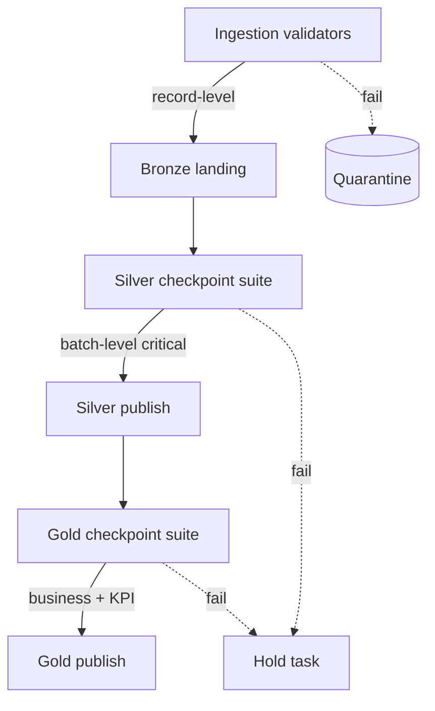

# 03 — Validation Rules

> This document is the index and narrative for the dataset validation rules. The
> full per-dataset rule tables (mandatory/optional fields, ranges, referential
> integrity, duplicate/timestamp/geospatial rules) live under
> [quality/rules/](../../quality/rules/) and are executable via
> [transformation/quality/eo_suites.py](../../transformation/quality/eo_suites.py).

---

## 1. Rule catalog

| Dataset category | Entity | Rules doc | Track |
|------------------|--------|-----------|-------|
| Earth observation (wildfire) | `silver_fire` | [earth-observation-quality-rules.md](../../quality/rules/earth-observation-quality-rules.md) | MVP |
| Earth observation (flood/change) | `silver_index` | ↑ same | MVP |
| Maritime (fishing) | `silver_vessel` | ↑ same | MVP |
| Imagery catalog | `silver_scene` | ↑ same | MVP |
| Reference AOI | `ref_aoi` | ↑ same | MVP |
| Satellite telemetry | `silver_telemetry` | [satellite-quality-rules.md](../../quality/rules/satellite-quality-rules.md) | Sim |
| Orbit | `silver_orbit` | [orbit-quality-rules.md](../../quality/rules/orbit-quality-rules.md) | Sim |
| Launch events | `silver_launch` | [launch-quality-rules.md](../../quality/rules/launch-quality-rules.md) | Sim |
| Space weather | `silver_space_weather` | [weather-quality-rules.md](../../quality/rules/weather-quality-rules.md) | Sim |

---

## 2. Rule families

Every dataset is validated against a common set of rule families, parameterized
per entity:

| Family | What it checks | Implementation |
|--------|----------------|----------------|
| **Schema** | required fields, types | `Schema.validate()` ([ingestion/common/schemas.py](../../ingestion/common/schemas.py)) |
| **Not-null** | mandatory fields populated | `expect_not_null` |
| **Range/validity** | numeric bounds | `expect_value_in_range` |
| **Uniqueness** | natural-key dedup | `expect_unique` |
| **Timestamp** | ISO-8601, plausible window, monotonic | `_check_timestamp` |
| **Geospatial** | lat/lon bounds, `geo_key` consistency | `_check_geo` |
| **Duplicate window** | checksum-based near-dup | `DuplicateTracker` |
| **Referential integrity** | FK to `ref_aoi`, natural keys | Gold checkpoints |
| **Business rules** | domain invariants | [06-business-rules.md](06-business-rules.md) |

---

## 3. Validation matrix (mandatory rules by entity)

| Entity | not-null keys | range checks | unique key | timestamp | geo |
|--------|---------------|--------------|------------|-----------|-----|
| `silver_fire` | `fire_key`, `event_ts`, `latitude`, `longitude`, `geo_key` | `frp≥0`, `confidence∈[0,100]` | `fire_key` | ✅ | ✅ |
| `silver_index` | `event_ts`, `index`, `mean`, `bbox`, `geo_key` | `mean∈[-1,1]`, `valid_pixel_fraction∈[0,1]` | (aoi,index,ts) | ✅ | ✅ |
| `silver_vessel` | `vessel_key`, `last_transmission_ts` | span `≥0` | `vessel_key` | ✅ | — |
| `silver_scene` | `scene_key`, `event_ts`, `source` | `cloud_cover∈[0,100]`, `completeness∈[0,1]` | `scene_key` | bbox parse | 
| `ref_aoi` | `aoi_key`, `geometry`, `event_ts` | `area_km2>0` | `aoi_key` | polygon bounds |

---

## 4. Severity model

| Severity | Behaviour | Example |
|----------|-----------|---------|
| **critical** | fails the batch/task; nothing promotes | missing natural key, out-of-range coordinate |
| **warn** | logged, promotion allowed | low `valid_pixel_fraction`, coarse velocity jump |

Severity is set per expectation in the suites, mirroring
`Expectation.severity` in the validation framework.

---

## 5. Where rules execute

Executable EO suites and their unit tests:
[transformation/quality/eo_suites.py](../../transformation/quality/eo_suites.py),
[transformation/tests/test_eo_quality_suites.py](../../transformation/tests/test_eo_quality_suites.py).
