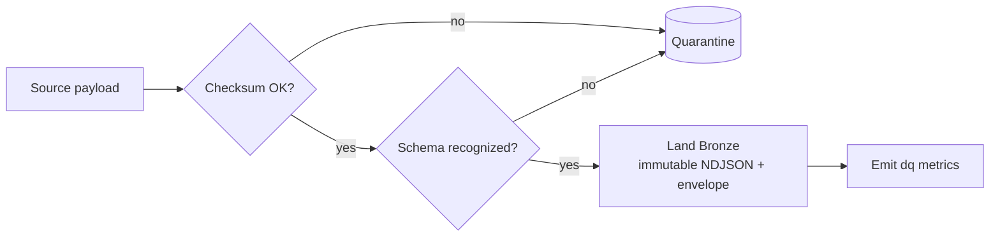
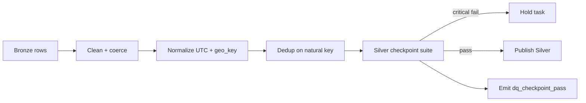
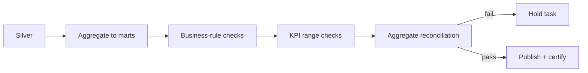
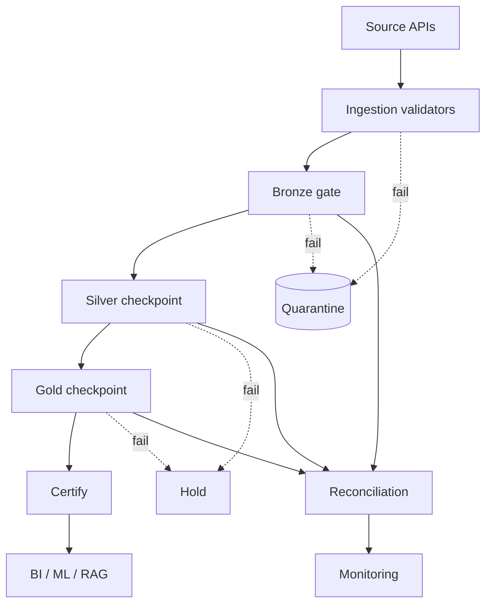

# 04 — Medallion Validation Strategy

> Validation performed at each medallion layer. Bronze protects raw integrity,
> Silver enforces cleanliness and conformance, Gold verifies business meaning.

---

## 1. Layer responsibilities

| Layer | Guarantee | Failure mode |
|-------|-----------|--------------|
| **Bronze** | raw landed intact, schema-recognized | quarantine batch |
| **Silver** | clean, deduped, UTC, valid, geo-correct | hold task (critical) |
| **Gold** | business-rule-correct, KPI-verified | hold task (critical) |

---

## 2. Bronze — integrity & landing

- **File integrity:** recompute checksum, compare to envelope `_checksum`.
- **Schema validation:** payload recognized by a registered `Schema`
  (required fields present, types plausible).
- **Landing verification:** envelope complete (`_ingest_id`, `_source`,
  `_batch_id`, `_ingest_ts`); object durably written before promotion.

## 3. Silver — clean, standardize, dedup

- **Cleaning:** trim/normalize strings, map enums, coerce types.
- **Standardization:** timestamps → ISO-8601 UTC; longitude normalized;
  `geo_key` derived.
- **Deduplication:** collapse on natural key (`fire_key`, `vessel_key`,
  `scene_key`, …).
- **Null handling:** mandatory fields enforced (`expect_not_null`); optional
  nulls allowed.
- **Range/geo validation:** `expect_value_in_range`, lat/lon bounds.

## 4. Gold — business rules, KPI & aggregate verification

- **Business rule validation:** domain invariants (see
  [06-business-rules.md](06-business-rules.md)).
- **KPI validation:** ratios in `[0,1]`, non-negative counts, plausible
  intensity stats.
- **Aggregate verification:** Gold counts reconcile to Silver
  (see [07-reconciliation.md](07-reconciliation.md)).
- **Referential integrity:** every `aoi_key`/`geo_key`/natural key resolves.

---

## 5. End-to-end gate flow

---

## 6. Gate summary

| Gate | Granularity | Blocks on | Emits |
|------|-------------|-----------|-------|
| Ingestion | record | schema/geo/timestamp/dup | `dq_validation_failures_total` |
| Bronze | batch/file | integrity, schema | `dq_schema_change_total` |
| Silver | batch | critical expectations | `dq_checkpoint_pass{layer=silver}` |
| Gold | batch | business + KPI + recon | `dq_checkpoint_pass{layer=gold}` |
