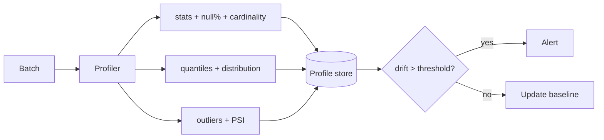

# 05 — Data Profiling

> Summary of the profiling discipline. Full strategy and metric definitions:
> [quality/profiling/profiling-strategy.md](../../quality/profiling/profiling-strategy.md)
> and [quality/profiling/statistics-framework.md](../../quality/profiling/statistics-framework.md).

---

## 1. Purpose

Profiling measures the *actual* shape of every dataset so that validation
thresholds, drift baselines and outlier bounds are data-driven. It runs at
ingestion and at each medallion promotion.

## 2. Profiled dimensions

| Dimension | Statistic |
|-----------|-----------|
| Column statistics | count, min, max, mean, median, stddev |
| Null percentage | `1 − count/total` per column |
| Cardinality | distinct count + ratio |
| Distribution | quantiles p05/p25/p50/p75/p95, histogram |
| Outlier detection | IQR fence, z-score `|z|>3` |
| Drift indicators | PSI, categorical share shift |

## 3. Per-dataset focus

| Entity | Watched columns | Signal |
|--------|-----------------|--------|
| `silver_fire` | `frp`, `confidence`, `geo_key` | intensity + coverage |
| `silver_index` | `mean`, `valid_pixel_fraction` | index range + cloud coverage |
| `silver_vessel` | `flag`, `imo`, `vessel_type` | identity completeness |
| `silver_scene` | `cloud_cover`, `completeness_score` | catalog completeness |
| `ref_aoi` | `area_km2`, `event_type` | geometry sanity |

## 4. How profiling supports engineering

- **Validation authoring** — ranges derived from observed quantiles.
- **Monitoring** — null/duplicate/drift alerts compare live vs baseline.
- **ML readiness** — feature ranges, null rates, cardinality gate training data.
- **Incident triage** — a profile diff is the first artifact a steward inspects.

## 5. Flow

## 6. Cadence & storage

| When | Scope | Retention |
|------|-------|-----------|
| Every batch | counts, null%, min/max | 90 days |
| Daily | full quantiles + PSI + outliers | 1 year |
| On schema change | full + schema diff | until certified |

Profiles are Parquet on MinIO (`staging/profiles/`), sampled for large
partitions to stay within 16 GB RAM, and surfaced in Grafana.
