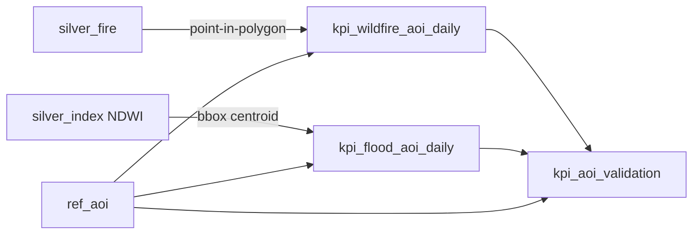

# 06 — Business Rule Validation

> Domain invariants that go beyond field-level validity. These encode how the
> aerospace / EO domain *must* behave and are enforced at Silver (row/entity) and
> Gold (cross-entity) checkpoints.

---

## 1. MVP (Earth-observation) business rules

| ID | Rule | Rationale | Layer | Severity |
|----|------|-----------|-------|----------|
| BR-01 | A fire detection has valid, in-bounds coordinates and a derived `geo_key` matching them | Mislocated fires misdirect response (UC-15) | Silver | critical |
| BR-02 | `frp ≥ 0` and `confidence ∈ [0,100]` | Negative intensity / invalid confidence are impossible | Silver | critical |
| BR-03 | Flood classification only trusts index rows with `valid_pixel_fraction ≥ 0.5` | Cloud/no-data pixels fake water signal (UC-16) | Gold | warn |
| BR-04 | NDWI/NDVI/NBR `mean ∈ [-1, 1]` | Spectral indices are physically bounded | Silver | critical |
| BR-05 | A vessel missing `flag` **or** `imo` sets `suspicious_flag = true` | Identity obfuscation is the UC-18 signal | Gold | critical |
| BR-06 | `first_transmission_ts ≤ last_transmission_ts` | Time cannot run backwards | Silver | critical |
| BR-07 | A scene is `is_searchable` only with `geo_key` + `event_ts` + `collection` | Discoverability requires location, time, collection (UC-25) | Gold | critical |
| BR-08 | Every AOI-mart `aoi_key` must exist in `ref_aoi` | Validation needs real ground truth | Gold | critical |
| BR-09 | A detection may map to multiple overlapping AOIs but each mapping must be point-in-polygon true | Correct AOI attribution for recall metrics | Gold | critical |
| BR-10 | `completeness_score` and all KPI ratios ∈ `[0, 1]`; counts `≥ 0` | Aggregate sanity | Gold | critical |

---

## 2. Simulation-track business rules

| ID | Rule | Rationale | Layer |
|----|------|-----------|-------|
| BR-S1 | A satellite belongs to exactly one mission | Prevent double-counting health | Gold |
| BR-S2 | Orbit timestamps per satellite increase chronologically | Detect clock skew / out-of-order | Silver |
| BR-S3 | Launch date cannot occur after mission completion | Temporal impossibility | Silver |
| BR-S4 | Sensor values stay within engineering limits (e.g. battery voltage) | Physical plausibility | Silver |
| BR-S5 | Every space-weather event has a valid timestamp; `geomagnetic_storm ⇔ kp ≥ 5` | Consistency of derived flag | Silver |

---

## 3. Cross-entity integrity rules

- Every `kpi_wildfire_aoi_daily` / `kpi_flood_aoi_daily` row references a
  `ref_aoi.aoi_key` (BR-08).
- `kpi_aoi_validation.corroborated` is the cross-source recall signal: an EMS fire
  AOI is corroborated iff FIRMS detections fall inside it; a flood AOI iff NDWI
  water clears threshold (BR-09).

---

## 4. Enforcement

Business rules are expressed as expectations in
[transformation/quality/eo_suites.py](../../transformation/quality/eo_suites.py)
(Silver/Gold suites) and, for Sim-track marts, as dbt tests in
`transformation/dbt/models/gold/_gold.yml` (`accepted_range`,
`unique_combination_of_columns`). A critical business-rule failure holds the
Airflow task and prevents publication/certification.
