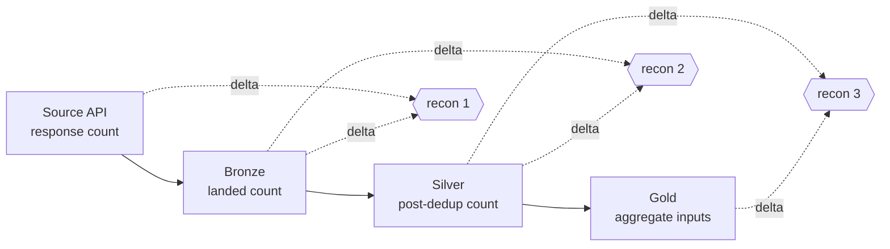

# 07 — Data Reconciliation Strategy

> Reconciliation proves that no data is silently lost or duplicated as it moves
> from source APIs through Bronze, Silver and Gold. It is the consistency and
> completeness safety net across the medallion.

---

## 1. Reconciliation points

| Recon | Compares | Expected relationship |
|-------|----------|-----------------------|
| Source ↔ Bronze | API record count vs landed | equal (± in-flight) |
| Bronze ↔ Silver | landed vs post-dedup | Silver ≤ Bronze (dedup only) |
| Silver ↔ Gold | Silver rows vs aggregate inputs | counts sum-consistent |

---

## 2. What we reconcile

| Check | Method | Alert on |
|-------|--------|----------|
| **Record counts** | count per source/batch/partition | mismatch > tolerance |
| **Checksums** | envelope `_checksum` vs recomputed | any mismatch |
| **Missing records** | expected-partition manifest vs actual | any gap |
| **Duplicate detection** | natural-key uniqueness post-dedup | duplicate % > 0.1% |
| **Data freshness** | `now − max(event_ts)` vs SLA | lag > SLA |

---

## 3. Count reconciliation rules

- **Source ↔ Bronze:** landed count equals the source-reported count for the
  fetch window; any drop is quarantined and alerted (INC-02/INC-06).
- **Bronze ↔ Silver:** the only permitted shrinkage is deduplication; the drop
  must equal the counted duplicates. Any *other* loss is a defect.
- **Silver ↔ Gold:** every Silver row must be attributable to at least one Gold
  aggregate input (a fire detection may contribute to multiple overlapping AOIs;
  a scene contributes to exactly one catalog row).

---

## 4. Freshness verification

| Entity | Freshness SLA | Recon signal |
|--------|---------------|--------------|
| `silver_fire` | ≤ 6 h | `dq_freshness_lag_seconds` |
| `silver_index` | ≤ 48 h | ↑ |
| `silver_vessel` | ≤ 24 h | ↑ |
| `silver_scene` | ≤ 12 h | ↑ |

---

## 5. Partition-completeness manifest

For each day the reconciliation job compares an **expected-partition manifest**
(which `geo_key`/date/source partitions *should* exist, given schedules) to the
**actual** partitions written. Gaps trigger backfill (RB-06).

---

## 6. Outputs

Reconciliation emits:

- `dq_reconciliation_delta{stage, entity}` — count difference per stage.
- `dq_duplicate_ratio{entity}` — duplicates / total.
- `dq_freshness_lag_seconds{entity}` — staleness.
- A daily reconciliation report (Parquet + Grafana panel) used by the steward in
  the weekly quality review.
