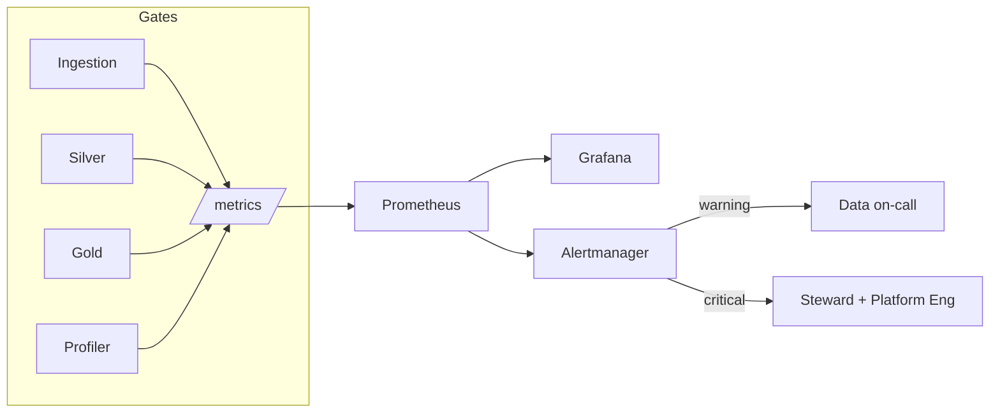

# 08 — Data Quality Monitoring

> Summary of the monitoring approach. Full metric catalog, alert rules and
> dashboards: [quality/monitoring/monitoring-strategy.md](../../quality/monitoring/monitoring-strategy.md).
> KPIs and SLAs: [quality/monitoring/quality-kpis.md](../../quality/monitoring/quality-kpis.md).

---

## 1. Stack

Per [architecture/08-observability-architecture.md](../../architecture/08-observability-architecture.md):

| Concern | Tool |
|---------|------|
| Metrics | Prometheus |
| Dashboards | Grafana |
| Alerting | Alertmanager |
| Logs | structured JSON |
| Traces | OpenTelemetry Collector |

## 2. Monitored signals → metrics

| Signal | Prometheus metric |
|--------|-------------------|
| Failed validations | `dq_validation_failures_total{entity,layer,rule}` |
| Quarantined records | `dq_invalid_records_total{entity,layer}` |
| Schema changes | `dq_schema_change_total{entity}` |
| Null spikes | `dq_null_pct{entity,column}` |
| Duplicate spikes | `dq_duplicate_ratio{entity}` |
| Late-arriving data | `dq_late_arrival_pct{entity}` |
| Pipeline failures | Airflow/Spark task metrics + `dq_checkpoint_pass` |
| Freshness SLA | `dq_freshness_lag_seconds{entity}` |
| Drift | `dq_psi{entity,column}` |

## 3. Alerts

| Alert | Condition | Severity |
|-------|-----------|----------|
| FreshnessBreach | `dq_freshness_lag_seconds > SLA` | critical |
| CheckpointFailed | `dq_checkpoint_pass == 0` | critical |
| SchemaChanged | `increase(dq_schema_change_total[1h]) > 0` | critical |
| QuarantineFlood | invalid rate > 10% of validated | critical |
| ValidationFailureSpike | failure rate > 3× baseline | warning |
| DuplicateSpike | `dq_duplicate_ratio > 0.05` | warning |
| NullSpike | `dq_null_pct > baseline + 0.2` | warning |
| DriftDetected | `dq_psi > 0.25` | warning |

## 4. Flow

## 5. Dashboards

| Dashboard | Focus |
|-----------|-------|
| Quality Overview | pass rate, quarantine rate, freshness |
| Medallion Health | checkpoint pass, reconciliation deltas |
| EO Use Cases | UC-15/16/18/25 quality KPIs |
| Drift | PSI, categorical shift, null trends |
| Freshness & SLA | lag vs SLA, late arrivals, volume delta |

## 6. Closing the loop

A failed checkpoint sets `dq_checkpoint_pass = 0`, fails the Airflow task, and
correlates (on the `entity` label) with the existing pipeline-failure alert — so
a single incident surfaces one coherent signal, not two disconnected ones. MTTD
and MTTR are computed from alert and resolution timestamps.
