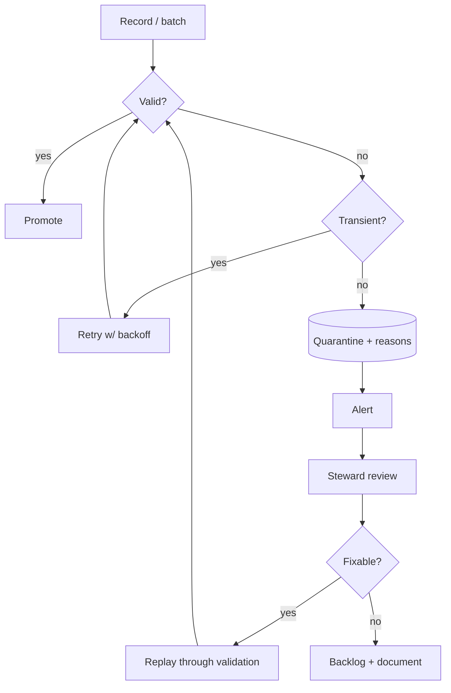

# 09 — Exception Handling

> How the platform handles the inevitable: corrupt inputs, invalid values, source
> outages and partial loads. The governing principle is **never drop data** —
> failures are contained, quarantined and replayed.

---

## 1. Exception classes

| Exception | Where detected | Primary handling |
|-----------|----------------|------------------|
| Corrupt files | Bronze integrity | quarantine + re-fetch |
| Invalid records (schema/range/geo/timestamp) | ingestion / Silver | quarantine record |
| API failures | connector | retry + backoff + hold |
| Missing partitions | reconciliation | backfill |
| Schema evolution | Bronze schema diff | quarantine + remap + re-certify |
| Partial loads | Bronze/Silver | reprocess from Bronze |

---

## 2. Handling strategies

### Retry
Transient connector/storage errors retry with exponential backoff and jitter. A
capped retry budget avoids hammering a downed provider; exhaustion escalates to
the API-outage path.

### Quarantine
Invalid records are written to `staging/quarantine/<source>/ingest_date=<date>/`
with `_quarantine_reasons`, and (for streaming) to the Kafka DLQ. Records are
**never** discarded. Implementation:
[ingestion/quality/quarantine.py](../../ingestion/quality/quarantine.py).

### Alerting
Every exception increments a Prometheus metric and, above threshold, raises an
Alertmanager alert routed by severity (see [08-monitoring.md](08-monitoring.md)).

### Manual review
The steward inspects quarantined payloads, applies a fix (mapping, parse,
threshold), and triggers replay (runbook RB-09).

### Recovery
Recovery reprocesses from **immutable Bronze** wherever the raw landing is
intact; only when Bronze itself is corrupt do we re-fetch from source.

---

## 3. Exception flow

---

## 4. Handling matrix by incident

| Incident | Retry | Quarantine | Alert | Recovery |
|----------|:-----:|:----------:|:-----:|----------|
| Corrupt file (INC-05) | — | ✅ | ✅ | re-fetch / reprocess |
| Invalid telemetry/record | — | ✅ | ✅ | replay after fix |
| API failure (INC-02) | ✅ | — | ✅ | resume + backfill |
| Missing partition (INC-06) | — | — | ✅ | backfill from Bronze |
| Schema evolution (INC-03) | — | ✅ | ✅ | remap + re-certify |
| Partial load (INC-09) | ✅ | — | ✅ | reprocess from Bronze |

---

## 5. Idempotency & safety

- Reprocessing is **idempotent** — dedup on natural keys means replays never
  double-count.
- Bronze immutability guarantees a clean recovery source.
- Quarantine replay re-runs the *same* validation, so nothing bypasses the gates.
