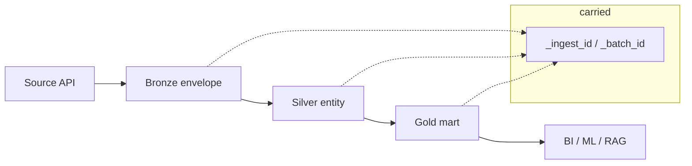

# 10 — Metadata & Lineage

> Data quality is only trustworthy if it is traceable. This document defines the
> metadata, lineage, validation history, audit trail and certification status the
> platform maintains for every dataset.

---

## 1. Dataset metadata

Each entity carries technical and governance metadata:

| Metadata | Example | Source |
|----------|---------|--------|
| Ownership | EO Ops Lead / Analytics Eng | [quality/governance/ownership-matrix.md](../../quality/governance/ownership-matrix.md) |
| Source connector | `nasa_firms` | ingestion config |
| Schema + version | `FIRMS_FIRE` v1 | [ingestion/common/schemas.py](../../ingestion/common/schemas.py) |
| Freshness SLA | ≤ 6 h | KPI doc |
| Certification status | CERTIFIED | governance |
| Natural key | `fire_key` | data model |

---

## 2. Provenance (record-level)

Every Bronze record is wrapped in an envelope that carries provenance forward
into Silver/Gold via `_ingest_id` / `_batch_id`:

| Field | Meaning |
|-------|---------|
| `_ingest_id` | UUID unique per record |
| `_source` | connector name |
| `_ingest_ts` | landing timestamp |
| `_batch_id` | `source-YYYYMMDDThhmmssZ-<uuid8>` |
| `_checksum` | SHA256 of payload |
| `_source_uri` | API URL / file path |
| `_event_ts` | source event time |

This makes every Gold number traceable back to the exact raw record and fetch.

---

## 3. Lineage

Lineage answers: *which source, fetch and transform produced this KPI?* — needed
for audits, incident root-cause and reproducibility.

---

## 4. Validation history

Each checkpoint run records: entity, layer, timestamp, expectations evaluated,
failures/warnings, row count, and outcome (`CheckpointResult`). History is
retained so trends (e.g. a slowly rising null rate) are visible and so a
certification decision is backed by evidence.

---

## 5. Audit trail

| Event | Recorded |
|-------|----------|
| Ingestion | batch id, source, count, checksum |
| Quarantine | record, reasons, timestamp |
| Checkpoint | pass/fail, failures, stats |
| Schema change | diff, old/new version, approver |
| Quarantine release | who, when, fix, incident id |
| Certification | status change, approver, evidence |

The audit trail is append-only and supports both governance review and incident
retros.

---

## 6. Certification status

`DRAFT → VALIDATED → CERTIFIED → (DEPRECATED)`.

Only `CERTIFIED` datasets are consumable by BI/ML/RAG. Status transitions are
recorded in the audit trail and gated by the certification workflow in
[11-governance.md](11-governance.md).
