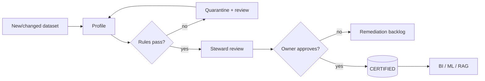

# 11 — Data Governance

> Summary of the governance operating model. Full model, RACI and certification
> workflow: [quality/governance/governance-model.md](../../quality/governance/governance-model.md).
> Dataset ownership: [quality/governance/ownership-matrix.md](../../quality/governance/ownership-matrix.md).

---

## 1. Roles

| Role | Accountable for |
|------|-----------------|
| **Data Owner** | business fitness; approves certification |
| **Data Steward** | quality rules, profiling review, incident triage |
| **Platform Engineer** | pipelines, gates, observability |
| **Data Consumer** | correct use; reports issues |

## 2. RACI (key activities)

| Activity | Owner | Steward | Platform Eng | Consumer |
|----------|:-----:|:-------:|:------------:|:--------:|
| Define quality rules | A | R | C | I |
| Implement gates | C | C | R/A | I |
| Review profiles/drift | I | R/A | C | I |
| Approve certification | R/A | R | C | I |
| Triage incidents | I | R | R/A | C |
| Request schema change | C | C | R | R/A |

## 3. Certification workflow

## 4. Approval gates

| Change | Approver | Evidence |
|--------|----------|----------|
| New dataset | Owner | profile + passing checkpoint |
| Schema change | Owner + Platform Eng | diff + migration + re-profile |
| Threshold change | Steward | profile justification |
| Quarantine release | Steward | incident record + root cause |

## 5. Cadence

| Ceremony | Frequency |
|----------|-----------|
| Quality review | weekly |
| Certification board | on demand |
| Incident retro | per critical incident |
| Governance review | monthly |

## 6. Approval workflow narrative

A change request (new dataset, schema change, threshold adjustment) is raised by
a consumer or platform engineer. The steward validates it against profiles and
rules; the owner approves certification. Emergency changes (e.g. quarantine
release during an incident) follow an expedited path but still produce an audit
record. No dataset reaches `CERTIFIED` — and therefore BI/ML/RAG — without owner
sign-off backed by evidence.
