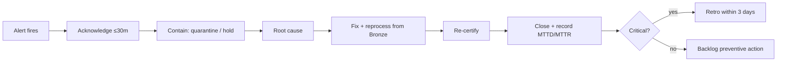

# 13 — Production Incident Scenarios

> Summary index. The full incident catalog (symptoms, root cause, detection,
> resolution, preventive action) is in
> [quality/incidents/production-incidents.md](../../quality/incidents/production-incidents.md);
> operational runbooks are in
> [quality/incidents/runbooks.md](../../quality/incidents/runbooks.md).

---

## Incident catalog

| ID | Title | Severity | Detector | Runbook |
|----|-------|:--------:|----------|---------|
| INC-01 | EO feed delayed (freshness breach) | 🔴 | FreshnessBreach | RB-01 |
| INC-02 | NASA / provider API unavailable | 🔴 | error-rate / volume | RB-02 |
| INC-03 | Schema unexpectedly changes | 🔴 | SchemaChanged | RB-03 |
| INC-04 | Duplicate launch / detection events | 🟠 | DuplicateSpike | RB-04 |
| INC-05 | Corrupted Earth-observation files | 🟠 | file integrity | RB-05 |
| INC-06 | Missing partitions | 🟠 | reconciliation | RB-06 |
| INC-07 | Space-weather feed outage | 🟠 | freshness | RB-01 |
| INC-08 | Time-synchronization issues | 🟠 | timestamp / late-arrival | RB-07 |
| INC-09 | Storage corruption | 🔴 | integrity / checkpoint | RB-05 |
| INC-10 | Invalid coordinate system | 🟠 | geospatial rule | RB-08 |

---

## Incident anatomy

Every catalog entry documents:

1. **Symptoms** — observable signals (metric spikes, dashboard gaps).
2. **Root cause** — the underlying failure.
3. **Detection** — which alert/monitor fires.
4. **Resolution** — the steps that restore correctness.
5. **Preventive action** — the change that stops recurrence.

---

## Response lifecycle

---

## Coverage vs dimensions

| Incident | Dimension stressed |
|----------|--------------------|
| INC-01/07 | Timeliness |
| INC-02 | Availability |
| INC-03 | Validity / Consistency |
| INC-04 | Uniqueness |
| INC-05/09 | Availability / Integrity |
| INC-06 | Completeness |
| INC-08 | Timeliness / Accuracy |
| INC-10 | Accuracy / Validity |

Every quality dimension in [02-quality-dimensions.md](02-quality-dimensions.md)
is exercised by at least one documented incident.
