# 01 Space Data Ecosystem Overview

## Executive Summary

This document maps the end-to-end space data ecosystem that underpins the Space Mission Data & AI Platform. It explains where space-relevant data originates, how it is transmitted, stored, and consumed, and how each segment connects to the Earth Observation Operations Intelligence scope defined in Phase 1. The objective of this phase is research only: we study the ecosystem so a data engineering team can later design ingestion pipelines with full awareness of how upstream space systems produce data.

The ecosystem is organized into seven interacting subsystems: satellite platforms, ground station networks, mission operations, Earth observation processing, space weather monitoring, orbit determination, and launch systems. For our MVP, the most relevant subsystems are Earth observation and the supporting orbital, environmental, and maritime data feeds that enable disaster and maritime monitoring.

## Scope Alignment with Phase 1

| Phase 1 MVP Use Case | Primary Ecosystem Segment | Supporting Segments |
| --- | --- | --- |
| Wildfire detection and progression monitoring | Earth observation processing | Climate/environmental, orbit determination |
| Flood monitoring and impact assessment | Earth observation processing | Climate/environmental |
| Illegal fishing detection | Real-time telemetry (AIS) and EO | Orbit determination |
| Disaster damage assessment prioritization | Earth observation processing | Mission operations products |
| Earth observation change detection | Earth observation processing | Orbit determination |
| Image metadata quality and catalog management | Mission operations data products | All EO sources |

## The Seven Subsystems

### 1. Satellite Platforms

Satellites are the primary generators of space-derived data. For Earth observation they carry payloads such as optical imagers, multispectral and hyperspectral sensors, synthetic aperture radar (SAR), and atmospheric sounders.

- **Data generated:** raw sensor measurements (radiances, backscatter), housekeeping telemetry, and position and attitude data.
- **Examples relevant to MVP:** Sentinel-2 (optical multispectral), Sentinel-1 (SAR), Landsat 8/9 (optical), Terra/Aqua (MODIS), Suomi NPP and NOAA-20 (VIIRS).

### 2. Ground Station Networks

Ground stations receive downlinked data when a satellite passes overhead and uplink commands to the spacecraft.

- **Data generated:** received raw data streams (Level 0), pass schedules, signal quality metrics.
- **Function:** convert radio-frequency downlink into stored digital data products and forward them to processing centers.

### 3. Mission Operations

Mission operations centers manage spacecraft health, plan acquisitions, and orchestrate the conversion of raw data into usable products.

- **Data generated:** acquisition plans, processing catalogs, product metadata, quality flags.
- **Relevance to MVP:** the metadata and cataloging discipline practiced here directly maps to the image metadata quality use case.

### 4. Earth Observation Processing

This is the core subsystem for our MVP. Raw sensor data is processed through standardized levels into analysis-ready products.

| Processing Level | Description | Example |
| --- | --- | --- |
| Level 0 | Raw, reconstructed instrument data | Downlinked Sentinel-2 packets |
| Level 1 | Radiometrically and geometrically corrected | Sentinel-2 L1C top-of-atmosphere reflectance |
| Level 2 | Geophysical variables, atmospherically corrected | Sentinel-2 L2A surface reflectance |
| Level 3 | Gridded, composited, time-aggregated | MODIS monthly burned area |
| Level 4 | Model output / derived analytics | Active fire detections, flood masks |

### 5. Space Weather Monitoring

Space weather systems observe solar activity and its effects on the near-Earth environment.

- **Data generated:** solar X-ray flux, geomagnetic indices, solar wind parameters, coronal mass ejection alerts.
- **Relevance to MVP:** secondary; space weather is a Phase 1 Tier 3 expansion candidate but is documented for completeness and future roadmap value.

### 6. Orbit Determination

Orbit determination systems compute and predict where satellites are at any moment.

- **Data generated:** Two-Line Element sets (TLEs), General Perturbations (GP) catalogs, ephemerides.
- **Relevance to MVP:** enables linking imagery to acquisition geometry, computing revisit timing, and supporting future tracking features.

### 7. Launch Systems

Launch systems produce data about rocket launches and payload deployment.

- **Data generated:** launch schedules, vehicle telemetry, payload manifests, outcome records.
- **Relevance to MVP:** minimal; launch analytics was excluded from the MVP due to sparse open data. Documented for ecosystem completeness.

## Data Lifecycle

```mermaid
flowchart LR
    A[Satellite Sensor] -->|Acquire| B[Onboard Storage]
    B -->|Downlink Pass| C[Ground Station]
    C -->|Forward| D[Mission Operations]
    D -->|Process L0 to L2| E[EO Processing Center]
    E -->|Publish| F[Open Data Archive]
    F -->|API / Bulk Download| G[Our Platform Ingestion]
    G -->|Bronze / Silver / Gold| H[Analytics and AI]
    H -->|Alerts and Reports| I[Analysts and Decision Makers]
```

## Where Data Is Generated, Transmitted, Stored, and Consumed

| Stage | Generated By | Transmission | Storage | Consumed By |
| --- | --- | --- | --- | --- |
| Acquisition | Satellite payloads | RF downlink | Onboard then ground | Processing centers |
| Processing | EO processing centers | Internal networks | Mission archives | Data product catalogs |
| Distribution | Open data archives | HTTPS APIs, S3, bulk | Cloud object stores | Our platform |
| Analytics | Our platform | Internal pipelines | Lakehouse layers | Analysts, models |
| Decision | Our platform | Dashboards, alerts | Warehouse, reports | Operational users |

## Key Assumptions

1. We will consume only published, open, analysis-adjacent data products (Level 1 and above), not raw downlink streams.
2. Real-time spacecraft telemetry is out of scope; our "real-time" feeds are public APIs such as AIS, ISS position, and space weather alerts.
3. All processing happens on a single 16 GB laptop with Docker, so we favor pre-processed products over raw scene processing where possible.

## Cross References

- Dataset inventory is documented in [02-dataset-catalog.md](./02-dataset-catalog.md).
- Detailed data movement diagrams are in [03-data-flow-analysis.md](./03-data-flow-analysis.md).
- Phase 1 MVP scope is defined in [../business/05-mvp-definition.md](../business/05-mvp-definition.md).
