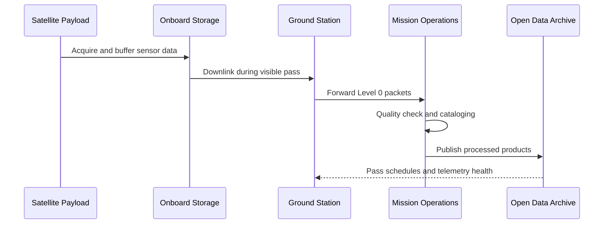
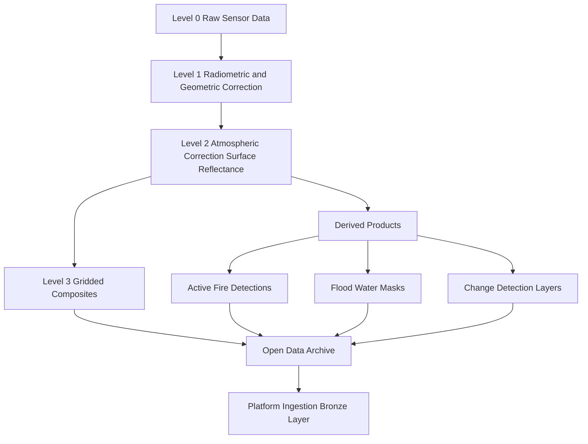
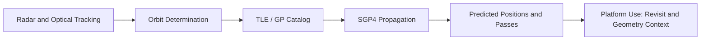
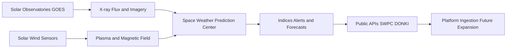
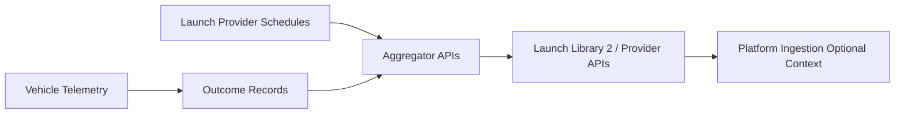
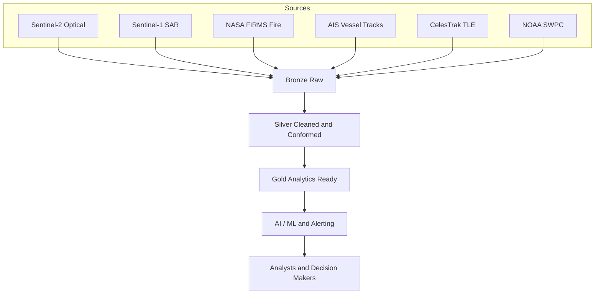

# 03 Data Flow Analysis

## Executive Summary

This document explains how data physically and logically flows through the space data ecosystem, from spacecraft acquisition to operational decision-making on our platform. It uses Mermaid diagrams to make each flow explicit so that a data engineering team can later identify ingestion boundaries, latency expectations, and integration points. The analysis covers five flows: satellite telemetry to ground, Earth observation imagery processing, orbit prediction computation, space weather generation, and launch data recording.

## Flow 1 - Satellite Telemetry from Space to Ground

Satellites store acquired data onboard until they pass over a ground station within line of sight. During the pass, the satellite downlinks data over a radio-frequency channel. The ground station forwards raw Level 0 data to a mission operations center, which routes it to processing centers and ultimately to open archives.

**Key engineering implications:** data is not continuous; it arrives in bursts tied to orbital passes. Latency from acquisition to public availability ranges from hours to a few days depending on the mission.

## Flow 2 - Earth Observation Imagery Processing

Raw optical or radar measurements are corrected, calibrated, and converted into analysis-ready products. Derived products such as active fire detections or flood masks are then generated from the corrected imagery.

**Key engineering implications:** we prefer to ingest Level 2 and derived Level 4 products to avoid heavy on-laptop scene processing. Optical products are cloud-affected; SAR products (Sentinel-1) are weather-independent and valuable for flood detection.

## Flow 3 - Orbit Prediction Computation

Orbit prediction uses tracking observations to fit an orbital model. The model is published as Two-Line Element sets (TLEs) or General Perturbations (GP) data and propagated forward to predict future positions.

**Key engineering implications:** TLEs are small text records updated multiple times per day. They are cheap to ingest and enable revisit-timing and acquisition-geometry context for imagery.

## Flow 4 - Space Weather Data Generation

Space weather data originates from solar observatories and in-situ sensors. Observations are converted into indices and alerts distributed through public services.

**Key engineering implications:** lightweight JSON feeds, easy to ingest, but secondary to the EO-centric MVP. Reserved for roadmap expansion.

## Flow 5 - Launch Data Recording

Launch data is compiled from agency announcements, vehicle telemetry, and post-launch outcome records, then aggregated by community and commercial APIs.

**Key engineering implications:** event-driven and sparse. Useful only as contextual reference, consistent with the Phase 1 decision to exclude launch analytics from the MVP.

## Consolidated Platform Ingestion View

## Cross References

- Source inventory is documented in [02-dataset-catalog.md](./02-dataset-catalog.md).
- Classification of these flows is in [04-data-classification.md](./04-data-classification.md).
- Quality risks per flow are in [05-data-quality-assessment.md](./05-data-quality-assessment.md).
