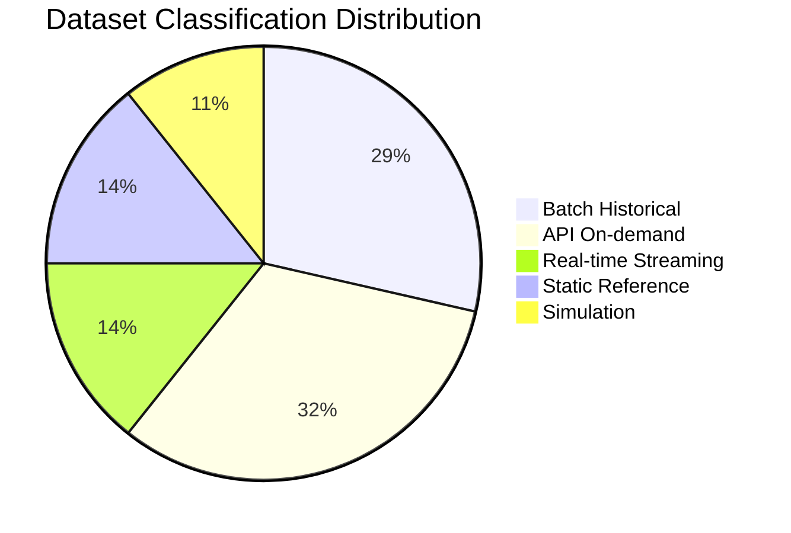

# 04 Data Classification Model

## Executive Summary

This document classifies all 30 cataloged datasets into five operational categories: real-time streaming, batch historical, API-based on-demand, static reference, and machine-generated simulation data. Classification matters because each category implies a different ingestion pattern, latency expectation, storage strategy, and reliability profile. Correct classification at the research stage prevents downstream architecture mistakes such as treating a burst-mode archive as a continuous stream or polling a static reference dataset unnecessarily.

## Classification Definitions and Why They Matter

| Classification | Definition | Why It Matters |
| --- | --- | --- |
| Real-time streaming | Continuous or sub-hourly feeds consumed as events arrive | Requires stream ingestion, buffering, and windowed processing |
| Batch historical | Periodically published bulk products | Requires scheduled batch jobs and incremental loading |
| API-based on-demand | Data fetched by request for a specific area/time | Requires query orchestration and rate-limit handling |
| Static reference | Slowly changing lookup or context data | Cached and refreshed infrequently, joined as dimensions |
| Machine-generated simulation | Synthetic data we produce to fill gaps | Requires generators, clear labeling, and provenance tracking |

## 1. Real-time Streaming Data

| Dataset | Notes |
| --- | --- |
| AIS Streams (AISHub/AISStream) | Continuous vessel position stream for maritime monitoring |
| Open Notify ISS API | Live position, useful as a streaming validation feed |
| NOAA SWPC / GOES X-ray | Minute-level space weather feeds (future expansion) |
| N2YO | Real-time satellite position queries |

**Engineering implication:** these feeds need a streaming ingestion path (message buffer plus micro-batch). For the MVP, AIS is the only operationally important stream; ISS is a low-cost feed for validating streaming patterns before scaling.

## 2. Batch Historical Data

| Dataset | Notes |
| --- | --- |
| Sentinel-2 / Sentinel-1 | Scene archives published per acquisition |
| Landsat 8/9 | 16-day cycle archives |
| MODIS | Daily products |
| ERA5 | Reanalysis published with lag |
| NOAA CDO | Daily climate records |
| CAMS | Daily atmospheric composition |
| Global Fishing Watch | Daily aggregated fishing effort |
| Global Forest Watch | Daily to weekly alerts |

**Engineering implication:** scheduled, incremental batch ingestion with watermarking by acquisition date or product version.

## 3. API-based On-demand Data

| Dataset | Notes |
| --- | --- |
| Sentinel Hub Statistical API | Index extraction for an AOI and time range |
| NASA Earthdata Search | Granule discovery and retrieval |
| NASA POWER | Point meteorology by lat/lon |
| Copernicus EMS | Activation-specific rapid mapping products |
| NASA FIRMS | Area/time fire detection queries |
| JPL Horizons | On-demand ephemeris computation |
| Launch Library 2 / SpaceX | Query-based launch records |
| NASA APOD/NeoWs | Date-based queries |
| OpenAQ | Location-based queries |

**Engineering implication:** request orchestration with rate-limit awareness, caching of responses, and pagination handling.

## 4. Static Reference Datasets

| Dataset | Notes |
| --- | --- |
| CelesTrak TLE/GP | Updated multiple times daily but used as reference for geometry |
| Space-Track catalog | Authoritative satellite reference |
| Minor Planet Center | Slowly changing orbital reference |
| Administrative boundaries (derived) | Country/region context for joins |

**Engineering implication:** cached as dimension tables, refreshed on a schedule, joined to events for enrichment. Although TLEs update frequently, in our usage they function as reference context rather than a primary event stream.

## 5. Machine-generated Simulation Data

| Synthetic Dataset | Purpose |
| --- | --- |
| Simulated satellite telemetry | Fill gaps where public telemetry is unavailable (future) |
| Synthetic alert labels | Augment training where ground truth is sparse |
| Generated revisit schedules | Derived from TLE propagation for planning context |

**Engineering implication:** must be clearly labeled and provenance-tracked so synthetic data is never confused with observed data. Used to compensate for the Phase 1 finding that real telemetry is not openly available.

## Classification Distribution

## Classification to MVP Mapping

| Classification | MVP Importance | Primary Use Cases |
| --- | --- | --- |
| Batch historical | Critical | UC-14, UC-15, UC-16, UC-27 |
| API on-demand | Critical | UC-14, UC-15, UC-25 |
| Real-time streaming | High | UC-18 |
| Static reference | Medium | Enrichment across all |
| Simulation | Low (MVP) | Future telemetry use cases |

## Cross References

- Source details are in [02-dataset-catalog.md](./02-dataset-catalog.md).
- Flow context is in [03-data-flow-analysis.md](./03-data-flow-analysis.md).
- Quality assessment per category is in [05-data-quality-assessment.md](./05-data-quality-assessment.md).
