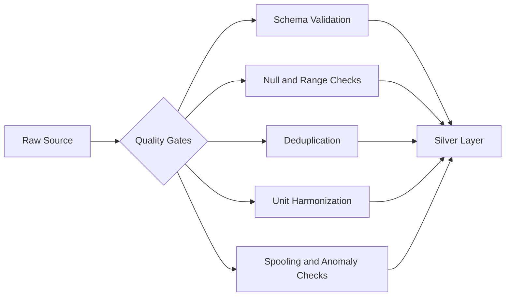

# 05 Data Quality Assessment

## Executive Summary

This document assesses data quality risks across the eight dataset categories. For each category we evaluate missing values, latency, inconsistency, schema variability, reliability, and rate limiting. The goal is to give a data engineering team a realistic view of the validation and resilience controls required before these sources can be trusted in operational pipelines. Earth observation and maritime feeds carry the highest combined value and risk for the MVP, so they receive the most detailed treatment.

## Assessment Dimensions

| Dimension | Question Answered |
| --- | --- |
| Missing values | How often are fields null, partial, or absent? |
| Latency | How delayed is data from real-world event to availability? |
| Inconsistency | Do values conflict across sources or over time? |
| Schema variability | Do field names, formats, or units change? |
| Reliability | How dependable is the source endpoint and content? |
| Rate limiting | What request constraints apply? |

## Category Assessments

### 1. Satellite Data (Sentinel, Landsat, GIBS)

| Dimension | Risk | Notes |
| --- | --- | --- |
| Missing values | Medium | Cloud cover removes usable optical pixels; SAR mitigates |
| Latency | Medium | Hours to a few days from acquisition to publication |
| Inconsistency | Low | Standardized processing levels |
| Schema variability | Low-Medium | Band naming differs across missions |
| Reliability | High | Mature, well-supported archives |
| Rate limiting | Medium | Download quotas and concurrency limits |

**Controls:** cloud-cover filtering, SAR fallback for floods, band-name harmonization in Silver layer.

### 2. Earth Observation (FIRMS, MODIS, VIIRS, EMS)

| Dimension | Risk | Notes |
| --- | --- | --- |
| Missing values | Medium | Gaps during sensor outages or orbit gaps |
| Latency | Low-Medium | FIRMS near real-time (~3h); products daily |
| Inconsistency | Medium | MODIS vs VIIRS detections differ in resolution/confidence |
| Schema variability | Medium | Confidence encodings differ between instruments |
| Reliability | High | NASA-operated, stable |
| Rate limiting | Medium | API keys and query-size limits |

**Controls:** instrument-aware confidence normalization, deduplication of overlapping detections, spatial-temporal binning.

### 3. Space Weather (SWPC, DONKI, GOES)

| Dimension | Risk | Notes |
| --- | --- | --- |
| Missing values | Low-Medium | Occasional sensor dropouts |
| Latency | Low | Real-time feeds |
| Inconsistency | Medium | Index revisions and preliminary vs final values |
| Schema variability | Low | Stable JSON structures |
| Reliability | High | NOAA/NASA-operated |
| Rate limiting | Low | Generous |

**Controls:** version-aware ingestion (preliminary vs final), idempotent upserts.

### 4. Orbital / Trajectory (CelesTrak, Space-Track, N2YO)

| Dimension | Risk | Notes |
| --- | --- | --- |
| Missing values | Low | Complete for active objects |
| Latency | Low | Updated multiple times daily |
| Inconsistency | Medium | TLE epoch drift; propagation error grows over time |
| Schema variability | Low | Fixed TLE format |
| Reliability | High | Authoritative sources |
| Rate limiting | Medium | Space-Track enforces query throttling |

**Controls:** use latest epoch, bound propagation horizon, respect Space-Track throttle guidance.

### 5. Launch Data (Launch Library 2, SpaceX)

| Dimension | Risk | Notes |
| --- | --- | --- |
| Missing values | Medium | Upcoming launches have provisional fields |
| Latency | Low | Updated continuously |
| Inconsistency | Medium | Schedule slips change times frequently |
| Schema variability | Medium | SpaceX community API in maintenance mode |
| Reliability | Medium | Community-maintained risk |
| Rate limiting | Medium | Throttled free tiers |

**Controls:** treat as reference only, snapshot with retrieval timestamps, avoid hard dependencies.

### 6. Astronomical Data (APOD, NeoWs, Horizons, MPC)

| Dimension | Risk | Notes |
| --- | --- | --- |
| Missing values | Low | Well-curated |
| Latency | Low | Daily or on-demand |
| Inconsistency | Low | Authoritative |
| Schema variability | Low | Stable |
| Reliability | High | NASA/IAU |
| Rate limiting | Medium | NASA API key hourly limits |

**Controls:** API-key rotation and response caching.

### 7. Climate / Environmental (NOAA CDO, ERA5, POWER, GFW, OpenAQ, CAMS)

| Dimension | Risk | Notes |
| --- | --- | --- |
| Missing values | Medium-High | Station gaps, sensor outages in OpenAQ |
| Latency | Medium | ERA5 ~5 day lag; reanalysis not real-time |
| Inconsistency | Medium | Units and grids differ across products |
| Schema variability | Medium | Variable naming differs (ERA5 vs POWER) |
| Reliability | High | Major agencies |
| Rate limiting | Medium-High | CDS queue waits; CDO token limits |

**Controls:** unit standardization, grid resampling, queue-aware async retrieval, gap interpolation flags.

### 8. Real-time Telemetry APIs (GFW, AIS, ISS)

| Dimension | Risk | Notes |
| --- | --- | --- |
| Missing values | High | AIS gaps from coverage and intentional signal-off |
| Latency | Low | Near real-time |
| Inconsistency | High | Spoofed MMSI, duplicate or conflicting positions |
| Schema variability | Medium | Provider-specific message formats |
| Reliability | Medium | Free-tier coverage gaps |
| Rate limiting | High | Strict free-tier quotas |

**Controls:** MMSI validation, spoofing heuristics, gap-aware trajectory reconstruction, deduplication, backpressure handling.

## Cross-cutting Quality Risk Summary

## Quality Risk Heatmap

| Category | Overall Quality Risk | MVP Criticality |
| --- | --- | --- |
| Satellite Data | Medium | High |
| Earth Observation | Medium | High |
| Real-time Telemetry (AIS) | High | High |
| Climate/Environmental | Medium | Medium |
| Orbital/Trajectory | Low-Medium | Medium |
| Space Weather | Low-Medium | Low |
| Launch | Medium | Low |
| Astronomical | Low | Low |

## Cross References

- Classifications are in [04-data-classification.md](./04-data-classification.md).
- Risks and constraints are expanded in [08-data-risks.md](./08-data-risks.md).
- MVP selection accounting for quality is in [07-mvp-datasets.md](./07-mvp-datasets.md).
