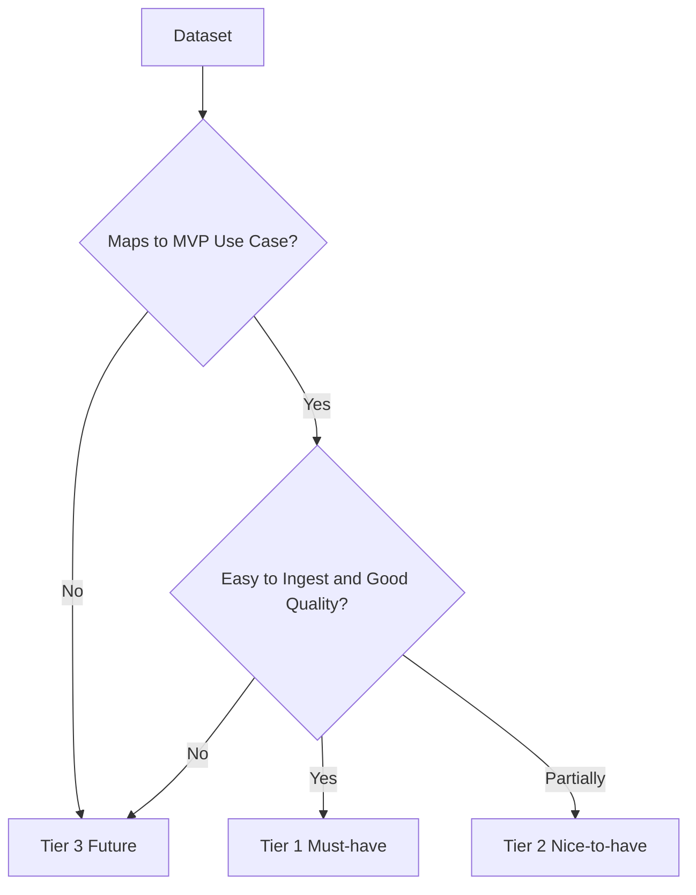

# 06 Data Prioritization Strategy

## Executive Summary

This document ranks the cataloged datasets into three tiers based on relevance to Phase 1 use cases, ease of ingestion, data quality, portfolio value, AI/ML potential, and real-world industry relevance. Tier 1 datasets are mandatory for the MVP and form the backbone of the Earth Observation Operations Intelligence platform. Tier 2 datasets strengthen the platform and are scheduled for early expansion. Tier 3 datasets are reserved for future versions where aerospace breadth becomes valuable. The tiering directly informs the MVP dataset selection in the next document.

## Scoring Model

Each dataset is scored 1-5 on six criteria; higher is better, including Ease of Ingestion where 5 means easiest.

| Criterion | Weight |
| --- | --- |
| Relevance to Phase 1 Use Cases | 30% |
| Ease of Ingestion | 15% |
| Data Quality | 15% |
| Portfolio Value | 15% |
| AI/ML Potential | 15% |
| Industry Relevance | 10% |

## Scored Ranking

| Dataset | Relevance | Ease | Quality | Portfolio | AI/ML | Industry | Weighted |
| --- | --- | --- | --- | --- | --- | --- | --- |
| NASA FIRMS | 5 | 5 | 4 | 5 | 5 | 5 | 4.80 |
| Sentinel-2 | 5 | 3 | 4 | 5 | 5 | 5 | 4.45 |
| Sentinel-1 SAR | 5 | 3 | 4 | 5 | 5 | 5 | 4.45 |
| Global Fishing Watch | 5 | 4 | 3 | 5 | 5 | 5 | 4.50 |
| Sentinel Hub Stats API | 5 | 4 | 4 | 4 | 4 | 4 | 4.35 |
| Copernicus EMS | 4 | 4 | 4 | 5 | 4 | 5 | 4.25 |
| NASA POWER | 4 | 5 | 4 | 3 | 4 | 4 | 4.10 |
| VIIRS Fire | 5 | 4 | 4 | 4 | 4 | 4 | 4.30 |
| AIS Streams | 5 | 3 | 3 | 5 | 4 | 5 | 4.10 |
| Landsat 8/9 | 4 | 3 | 4 | 4 | 4 | 5 | 3.95 |
| NASA Earthdata | 4 | 3 | 4 | 4 | 4 | 5 | 3.95 |
| MODIS | 4 | 3 | 4 | 4 | 4 | 4 | 3.85 |
| NASA GIBS/Worldview | 4 | 5 | 4 | 3 | 2 | 4 | 3.75 |
| CelesTrak | 3 | 5 | 4 | 3 | 3 | 4 | 3.55 |
| NOAA CDO | 3 | 4 | 4 | 3 | 4 | 4 | 3.55 |
| ERA5 | 3 | 2 | 4 | 4 | 5 | 5 | 3.55 |
| Global Forest Watch | 3 | 4 | 4 | 3 | 4 | 4 | 3.55 |
| OpenAQ | 3 | 4 | 3 | 3 | 3 | 3 | 3.15 |
| Space-Track | 3 | 3 | 4 | 3 | 3 | 5 | 3.35 |
| CAMS | 2 | 2 | 4 | 4 | 4 | 4 | 3.10 |
| NOAA SWPC | 2 | 5 | 4 | 3 | 4 | 5 | 3.45 |
| NASA DONKI | 2 | 5 | 4 | 3 | 4 | 5 | 3.45 |
| GOES X-ray | 2 | 5 | 4 | 3 | 3 | 4 | 3.20 |
| N2YO | 2 | 4 | 3 | 2 | 2 | 3 | 2.55 |
| Launch Library 2 | 2 | 5 | 3 | 3 | 2 | 4 | 2.95 |
| NASA APOD/NeoWs | 2 | 5 | 4 | 3 | 3 | 3 | 3.05 |
| JPL Horizons | 2 | 3 | 5 | 2 | 2 | 4 | 2.70 |
| Minor Planet Center | 1 | 3 | 4 | 2 | 2 | 3 | 2.20 |
| SpaceX API | 1 | 5 | 3 | 2 | 2 | 4 | 2.45 |
| Open Notify ISS | 2 | 5 | 4 | 2 | 1 | 2 | 2.65 |

## Tier 1 (Must-have Datasets)

These are required to deliver the MVP use cases.

| Dataset | Primary Use Cases | Justification |
| --- | --- | --- |
| NASA FIRMS | UC-15 | Near real-time fire detections, easy ingestion, highest value-to-effort |
| Sentinel-2 | UC-14, UC-15, UC-16, UC-27 | Core optical imagery for detection, change, and damage |
| Sentinel-1 SAR | UC-16, UC-27 | Cloud-independent flood mapping |
| Sentinel Hub Statistical API | UC-14, UC-15, UC-17 | Laptop-friendly index extraction without full scenes |
| Global Fishing Watch | UC-18 | Primary maritime feed for illegal fishing |
| Copernicus EMS | UC-16, UC-27 | Authoritative disaster reference and labels |
| NASA POWER | UC-15, UC-16 | Lightweight weather context |
| VIIRS Fire | UC-15 | Higher-resolution fire complement to FIRMS |

## Tier 2 (Nice-to-have)

| Dataset | Use Cases | Justification |
| --- | --- | --- |
| Landsat 8/9 | UC-14 | Long historical baseline for change detection |
| NASA Earthdata | UC-14, UC-25 | Discovery and metadata enrichment |
| MODIS | UC-15, UC-17 | Burned area and drought products |
| AIS Streams | UC-18, UC-19 | Live vessel context once batch GFW is stable |
| NASA GIBS/Worldview | Visualization | Fast dashboard imagery layers |
| CelesTrak | Enrichment | Revisit and acquisition geometry context |
| NOAA CDO | UC-15, UC-17 | Historical weather records |
| Global Forest Watch | UC-15, UC-14 | Forest loss and fire alerts |

## Tier 3 (Future Expansion)

| Dataset | Future Use Cases | Justification |
| --- | --- | --- |
| ERA5 | UC-16, UC-17, UC-28 | Rich reanalysis for advanced forecasting |
| CAMS | UC-15, UC-28 | Emissions and methane monitoring |
| OpenAQ | UC-15 | Smoke and air-quality impact |
| Space-Track | Tracking | Authoritative orbital catalog |
| NOAA SWPC / DONKI / GOES | UC-21 | Space weather expansion |
| Launch Library 2 / SpaceX | Context | Launch reference |
| NASA APOD/NeoWs, JPL Horizons, MPC | Enrichment | Astronomical breadth |
| N2YO, Open Notify ISS | Live demos | Streaming pattern validation |

## Prioritization Logic

## Cross References

- Source details are in [02-dataset-catalog.md](./02-dataset-catalog.md).
- The MVP subset derived from Tier 1 is in [07-mvp-datasets.md](./07-mvp-datasets.md).
- Phase 1 ranking alignment is in [../business/04-use-case-ranking.md](../business/04-use-case-ranking.md).
