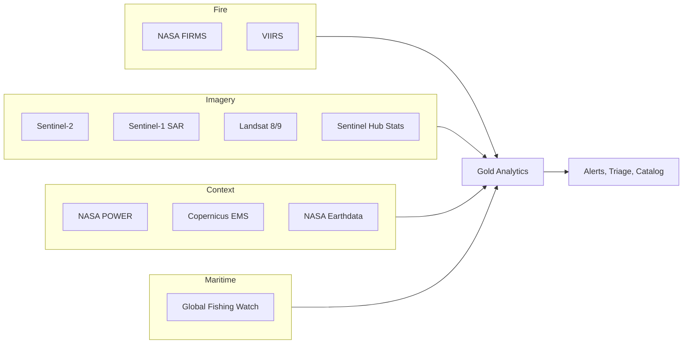

# 07 MVP Dataset Selection

## Executive Summary

This document defines the minimum dataset set required to implement the Phase 1 MVP: an Earth Observation Operations Intelligence platform for disaster and maritime monitoring. The selection draws exclusively from Tier 1 datasets, plus two early Tier 2 additions that materially strengthen change detection and cataloging. Every inclusion is justified against a specific MVP use case, and excluded datasets are explained. The set is deliberately constrained to remain feasible on a 16 GB RAM laptop with Docker and open-source tools.

## Selected MVP Datasets

| Dataset | Use Cases Served | Why It Is Required |
| --- | --- | --- |
| NASA FIRMS | UC-15 wildfire | Near real-time fire detections; the backbone alerting feed with minimal ingestion cost |
| VIIRS Fire | UC-15 wildfire | 375 m detections improve precision and progression tracking |
| Sentinel-2 | UC-14, UC-15, UC-16, UC-27 | Primary optical imagery for change detection, burn severity, and damage |
| Sentinel-1 SAR | UC-16 flood, UC-27 damage | Cloud-penetrating radar essential for reliable flood mapping |
| Sentinel Hub Statistical API | UC-14, UC-15 | Extracts NDVI/NDWI/NBR indices for AOIs without downloading full scenes, critical for laptop feasibility |
| Copernicus EMS | UC-16, UC-27 | Authoritative rapid-mapping products used as reference and evaluation labels |
| Global Fishing Watch | UC-18 illegal fishing | Primary maritime fishing-effort dataset derived from AIS |
| NASA POWER | UC-15, UC-16 | Lightweight per-location weather context for fire and flood risk |
| NASA Earthdata (Tier 2 early add) | UC-14, UC-25 | Granule discovery and rich metadata to seed the catalog and quality use case |
| Landsat 8/9 (Tier 2 early add) | UC-14 change detection | Provides the long historical baseline Sentinel-2 alone cannot |

## Use Case Coverage Matrix

| Use Case | Covered By |
| --- | --- |
| UC-15 Wildfire detection and progression | FIRMS, VIIRS, Sentinel-2, NASA POWER |
| UC-16 Flood monitoring and impact | Sentinel-1 SAR, Sentinel-2, Copernicus EMS, NASA POWER |
| UC-18 Illegal fishing detection | Global Fishing Watch |
| UC-27 Disaster damage prioritization | Sentinel-2, Sentinel-1 SAR, Copernicus EMS |
| UC-14 EO change detection | Sentinel-2, Landsat 8/9, Sentinel Hub Stats |
| UC-25 Metadata quality and catalog | NASA Earthdata, all imagery metadata |

## Justification Strategy

1. **Coverage over volume.** The set covers all six MVP use cases with the fewest sources, reducing ingestion and maintenance load.
2. **Laptop feasibility first.** Where full-scene processing would exceed 16 GB practicality, the Sentinel Hub Statistical API provides aggregated index values instead.
3. **Weather independence.** Sentinel-1 SAR is included so flood and damage workflows are not blocked by cloud cover.
4. **Validation built in.** Copernicus EMS supplies authoritative reference products for evaluating detection quality.

## Intentional Exclusions

| Excluded Dataset | Reason |
| --- | --- |
| ERA5, CAMS | High volume and queue latency; richer than the MVP needs. Deferred to forecasting expansion |
| Space weather (SWPC, DONKI, GOES) | Out of MVP scope; reserved for UC-21 expansion |
| Launch data (Launch Library 2, SpaceX) | MVP excludes launch analytics; only contextual value |
| Astronomical (APOD, NeoWs, Horizons, MPC) | No direct MVP use case |
| AIS live streams | GFW batch effort covers UC-18 initially; live AIS adds streaming complexity better introduced after the batch path is stable |
| Space-Track, N2YO | Orbital enrichment not required for the first release |
| OpenAQ, NOAA CDO, Global Forest Watch | Useful context but not essential to the core six use cases at MVP |

## Feasibility Confirmation

| Constraint | How the Selection Complies |
| --- | --- |
| 16 GB RAM laptop | Favors API-based index extraction and point queries over bulk scene processing |
| Docker-based architecture | All sources are HTTPS APIs or file downloads compatible with containerized ingestion |
| Open-source tools only | No proprietary SDKs required; standard HTTP and geospatial libraries suffice |
| Free datasets only | All selected sources are free (some require free registration) |

## MVP Data Footprint

## Definition of Done for Data Selection

A data engineering team can begin designing ingestion for wildfire, flood, illegal fishing, damage assessment, change detection, and metadata quality using only the ten datasets above, with no open questions about which sources to use.

## Cross References

- Tier rationale is in [06-data-prioritization.md](./06-data-prioritization.md).
- Risks affecting these datasets are in [08-data-risks.md](./08-data-risks.md).
- Phase 1 MVP definition is in [../business/05-mvp-definition.md](../business/05-mvp-definition.md).
