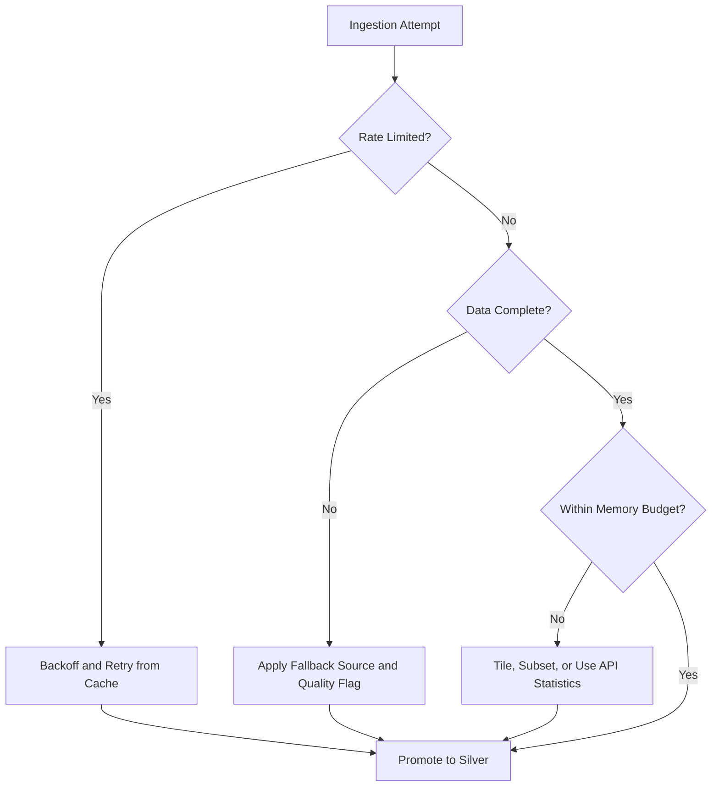

# 08 Data Risks and Constraints

## Executive Summary

This document identifies the technical risks and constraints that affect ingestion and processing of the selected datasets on a constrained, single-laptop, Docker-based environment. Risks are grouped into API rate limits, data incompleteness, missing real-time feeds, geospatial complexity, storage constraints, and processing bottlenecks. Each risk includes its impact, the use cases affected, and a mitigation suitable for the project constraints. The goal is to surface these issues during research so the architecture phase can design defensively.

## Risk Register

| ID | Risk | Category | Likelihood | Impact | Affected Use Cases |
| --- | --- | --- | --- | --- | --- |
| R-01 | Sentinel/Copernicus download quotas and throttling | API rate limits | High | Medium | UC-14, UC-15, UC-16, UC-27 |
| R-02 | NASA API hourly key limits (FIRMS, Earthdata, POWER) | API rate limits | Medium | Medium | UC-15, UC-25 |
| R-03 | Global Fishing Watch free-tier quota | API rate limits | Medium | High | UC-18 |
| R-04 | Cloud cover removes usable optical pixels | Data incompleteness | High | High | UC-15, UC-27 |
| R-05 | AIS gaps and spoofing (signal-off, fake MMSI) | Data incompleteness | High | High | UC-18 |
| R-06 | No open real-time spacecraft telemetry | Missing real-time feeds | High | Low (MVP) | Future telemetry UCs |
| R-07 | Coordinate systems, projections, tiling complexity | Geospatial complexity | High | Medium | All EO UCs |
| R-08 | Large scene sizes exceed laptop memory | Storage constraints | High | High | UC-14, UC-16, UC-27 |
| R-09 | Reprocessing imagery is CPU/RAM intensive | Processing bottlenecks | High | High | UC-14, UC-15 |
| R-10 | ERA5/CDS queue latency | Processing bottlenecks | Medium | Low (MVP) | Future forecasting |
| R-11 | Schema drift across instruments/providers | Data incompleteness | Medium | Medium | UC-15, UC-18 |
| R-12 | Endpoint availability and community-API decay | Reliability | Medium | Low | Launch context |

## Detailed Risk Analysis

### API Rate Limits (R-01, R-02, R-03)

- **Impact:** ingestion jobs fail or slow down; backfills become lengthy.
- **Mitigation:** schedule off-peak pulls, cache responses, request only required AOIs and time windows, use the Sentinel Hub Statistical API to avoid full-scene downloads, and implement exponential backoff with retry.

### Data Incompleteness (R-04, R-05, R-11)

- **Impact:** missed detections (clouds), false or missing vessel tracks (AIS), inconsistent fields.
- **Mitigation:** SAR fallback for floods, multi-instrument fire fusion (FIRMS plus VIIRS), MMSI validation and spoofing heuristics, schema harmonization in the Silver layer with explicit quality flags.

### Missing Real-time Feeds (R-06)

- **Impact:** no genuine spacecraft telemetry available openly.
- **Mitigation:** clearly scope the MVP to public EO and maritime feeds; use clearly labeled simulated telemetry only for future telemetry-oriented use cases.

### Geospatial Complexity (R-07)

- **Impact:** incorrect joins, misaligned overlays, projection errors.
- **Mitigation:** standardize on a common CRS (for example WGS84/EPSG:4326) in Silver, use established geospatial libraries, and validate footprints against known AOIs.

### Storage Constraints (R-08)

- **Impact:** full-scene archives quickly exhaust local disk and memory.
- **Mitigation:** prefer aggregated index extraction, subset by AOI and bands, use cloud-optimized formats where possible, and retain only required time windows with lifecycle cleanup.

### Processing Bottlenecks (R-09, R-10)

- **Impact:** scene processing and reanalysis retrieval are slow on a laptop.
- **Mitigation:** push computation to API-side statistics where available, process in small tiles, use incremental and windowed processing, and defer heavy reanalysis (ERA5/CAMS) to the expansion phase.

## Constraint Summary

| Constraint | Implication for Design |
| --- | --- |
| 16 GB RAM | Avoid loading full scenes; tile and stream processing |
| Single machine | No distributed cluster; favor lightweight, incremental jobs |
| Docker only | All ingestion must be containerizable HTTP/file workflows |
| Open data only | Accept registration steps and free-tier quotas as design factors |
| Free-tier quotas | Build caching and backoff as first-class concerns |

## Risk Mitigation Flow

## Cross References

- Quality detail per category is in [05-data-quality-assessment.md](./05-data-quality-assessment.md).
- MVP selection that accounts for these risks is in [07-mvp-datasets.md](./07-mvp-datasets.md).
- Phase 1 risk register is in [../business/09-risks.md](../business/09-risks.md).
