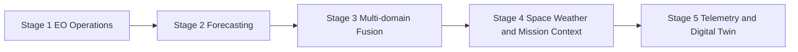

# 09 Roadmap and Dataset Ecosystem Expansion

## Executive Summary

This document describes how the dataset ecosystem can evolve beyond the MVP into progressively more advanced space operations capabilities. The expansion path mirrors the Phase 1 business roadmap: prove value with Earth observation operations first, then add forecasting, multi-domain fusion, space weather, and eventually telemetry-driven and digital-twin capabilities. Each stage adds specific datasets and explains the new engineering capabilities required, keeping every step consistent with open-data and constrained-hardware principles until cloud scale becomes justified.

## Expansion Stages

### Stage 1 - EO Operations Intelligence (MVP)

- **Datasets:** FIRMS, VIIRS, Sentinel-2, Sentinel-1 SAR, Sentinel Hub Stats, Copernicus EMS, Global Fishing Watch, NASA POWER, Landsat 8/9, NASA Earthdata.
- **Capability:** event detection, prioritization, change detection, searchable catalog.

### Stage 2 - Forecasting and Broader EO

- **New datasets:** ERA5, NOAA CDO, MODIS products, Global Forest Watch.
- **Capability:** spatiotemporal forecasting for fire risk, drought, and flood likelihood; richer historical baselines.
- **New engineering needs:** larger storage tiers, async queue-aware retrieval, time-series feature pipelines.

### Stage 3 - Multi-domain Fusion and Maritime Expansion

- **New datasets:** live AIS streams, CAMS emissions, OpenAQ.
- **Capability:** vessel behavior modeling, emissions hotspot detection, smoke-impact analysis.
- **New engineering needs:** streaming ingestion at scale, entity resolution, cross-domain correlation.

### Stage 4 - Space Weather and Mission Context

- **New datasets:** NOAA SWPC, NASA DONKI, GOES, Space-Track, CelesTrak history.
- **Capability:** space weather forecasting support and acquisition planning context.
- **New engineering needs:** real-time index ingestion, orbital propagation services.

### Stage 5 - Telemetry-driven Operations and Digital Twin

- **New datasets:** simulated and (where available) real telemetry, N2YO live tracking, JPL Horizons.
- **Capability:** health scoring, anomaly detection, and a digital twin of a satellite fleet.
- **New engineering needs:** high-rate time-series stores, simulation generators, model monitoring and drift detection.

## Expansion Map

## Target End-state Capabilities

| Vision | Enabling Datasets | Key Shift |
| --- | --- | --- |
| Real-time satellite telemetry platform | Live tracking, simulated/real telemetry | From batch EO to high-rate streaming |
| AI-powered space operations system | All EO + space weather + orbital | From detection to decision optimization |
| Digital twin of satellite fleet | Telemetry, TLE history, ephemerides | From observation to predictive simulation |
| Autonomous mission analytics | Fused multi-domain + forecasts | From human-in-loop to assisted autonomy |

## Dataset Growth Trajectory

| Stage | Approx. Active Datasets | Dominant Classification |
| --- | --- | --- |
| Stage 1 | 10 | Batch + API on-demand |
| Stage 2 | 14 | Batch historical |
| Stage 3 | 17 | Streaming + batch |
| Stage 4 | 22 | Real-time + reference |
| Stage 5 | 28+ | Streaming + simulation |

## Guardrails for Expansion

1. Add a dataset only when a concrete use case requires it.
2. Validate laptop feasibility before adopting high-volume sources; move to cloud only when justified.
3. Maintain metadata and quality discipline as the catalog grows.
4. Keep synthetic data clearly labeled and separated from observed data.

## Cross References

- Phase 1 business roadmap is in [../business/06-roadmap.md](../business/06-roadmap.md).
- Prioritization tiers feeding this roadmap are in [06-data-prioritization.md](./06-data-prioritization.md).
- MVP baseline is in [07-mvp-datasets.md](./07-mvp-datasets.md).
