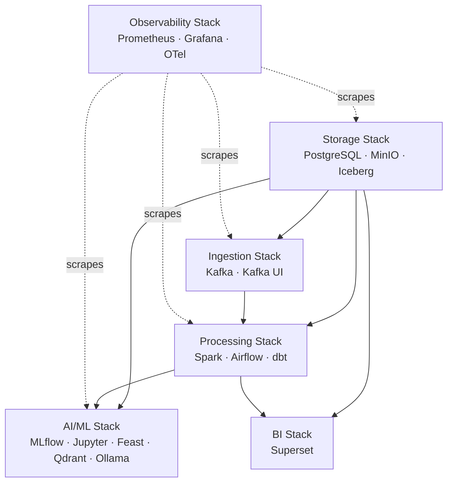

# 01 Infrastructure Overview

> **Phase 4 - Infrastructure Design (Docker Local Platform)**
> Document 01 of 14

## Purpose

This document defines the infrastructure philosophy for deploying the Space Mission Data & AI Platform entirely on a single developer laptop using Docker Desktop. It establishes the design philosophy, the Docker-first rationale, the resource-constraint strategy, and the service-grouping model that the remaining infrastructure documents build upon.

This is an **infrastructure blueprint**, not an implementation. It is detailed enough that a DevOps engineer can stand up the full platform without architectural clarification.

## Local Platform Architecture Philosophy

The platform is built around four guiding principles:

| Principle | Meaning |
| --- | --- |
| **Local-first** | The entire enterprise stack runs on one 16 GB laptop with no cloud dependency. |
| **Production-realistic** | Tooling and topology mirror real aerospace data platforms (Kafka, Spark, lakehouse, MLflow, observability). |
| **Modular & composable** | Each capability is an isolated Docker Compose module that can be started or stopped independently. |
| **Resource-aware** | Heavy engines are bounded with explicit CPU/memory limits and activated via profiles, never all at peak simultaneously. |

The platform is intentionally designed so that a single engineer can run a **representative slice** of the system at any moment, rather than the entire fleet at full load.

## Why a Docker-First Approach

| Driver | Rationale |
| --- | --- |
| **Reproducibility** | A declarative Compose definition reproduces the exact stack on any machine. |
| **Isolation** | Each service runs in its own container with controlled networking and resource caps. |
| **Portability** | The same blueprint can later be lifted to Kubernetes or a cloud runtime with minimal change. |
| **Low operational overhead** | No VM sprawl, no manual installs; one `docker compose` workflow governs everything. |
| **Realistic separation of concerns** | Containers map cleanly to the logical containers defined in Phase 3 architecture. |

Docker Compose is selected over Kubernetes deliberately. Kubernetes adds a control-plane memory tax (etcd, API server, kubelet, scheduler) that is unjustifiable on a 16 GB laptop and irrelevant to demonstrating data and AI engineering skills. See [13-adr.md](./13-adr.md) ADR-001.

## Resource Constraints Strategy (CPU / RAM Optimization)

The platform is engineered to fit within a **16 GB RAM** envelope. The strategy has five pillars:

1. **Explicit limits** — every container declares `mem_limit` and `cpus`, preventing any single service from starving the host.
2. **Profile-based activation** — Compose profiles (`core`, `ingestion`, `processing`, `ai`, `observability`, `bi`) let the engineer run only the subset needed for a task.
3. **Staged heavy workloads** — Spark batch jobs and Ollama inference are not run simultaneously; only one heavy engine peaks at a time.
4. **Lightweight substitutes** — DuckDB handles small analytical tasks instead of Spark; KRaft-mode Kafka removes the ZooKeeper footprint; quantized LLMs keep inference in budget.
5. **Persistent volumes over re-computation** — curated data and model artifacts persist in volumes so restarts are cheap and reprocessing is avoided.

Detailed allocation tables appear in [04-resource-management.md](./04-resource-management.md).

## Service Grouping Strategy

Services are grouped into six functional stacks, each backed by its own Compose override file. This grouping aligns one-to-one with the Phase 3 container architecture planes.

| Stack | Compose file | Services | Primary role |
| --- | --- | --- | --- |
| **Core / Storage** | `docker-compose.storage.yml` | PostgreSQL, MinIO, Iceberg REST catalog | System of record, object storage, table metadata |
| **Ingestion** | `docker-compose.ingestion.yml` | Kafka (KRaft), Kafka UI, REST ingestion service | Streaming + batch landing |
| **Processing** | `docker-compose.processing.yml` | Spark Master, Spark Worker, Airflow, dbt | Transformation and orchestration |
| **AI / ML** | `docker-compose.ai.yml` | MLflow, Jupyter, Feast, Qdrant, Ollama, Open WebUI | Training, registry, features, vectors, LLM |
| **Observability** | `docker-compose.observability.yml` | Prometheus, Grafana, OpenTelemetry Collector | Metrics, dashboards, tracing |
| **BI** | `docker-compose.observability.yml` / base | Apache Superset | Business dashboards |

The **base** `docker-compose.yml` declares shared networks, shared volumes, and global defaults; the stack files extend it via `include`/overrides.

## Stack Dependency Map

The **Storage stack is the foundation**: every other stack depends on PostgreSQL and MinIO being healthy. The Observability stack is cross-cutting and depends on nothing functionally, but scrapes everything.

## Assumptions

- Host machine: 16 GB RAM, 4+ CPU cores, ~50 GB free SSD, Docker Desktop with WSL2 backend (Windows) or native (Linux/macOS).
- Single-user, single-node, non-production demonstration environment.
- All datasets are public/free and all tooling is open-source.
- Internet access is available for initial image pulls and dataset fetches.

## Cross References

- Docker system design: [02-docker-design.md](./02-docker-design.md)
- Service mapping: [03-service-mapping.md](./03-service-mapping.md)
- Phase 3 deployment architecture: [../../architecture/10-deployment-architecture.md](../../architecture/10-deployment-architecture.md)
- Phase 3 technology mapping: [../../architecture/05-technology-mapping.md](../../architecture/05-technology-mapping.md)
