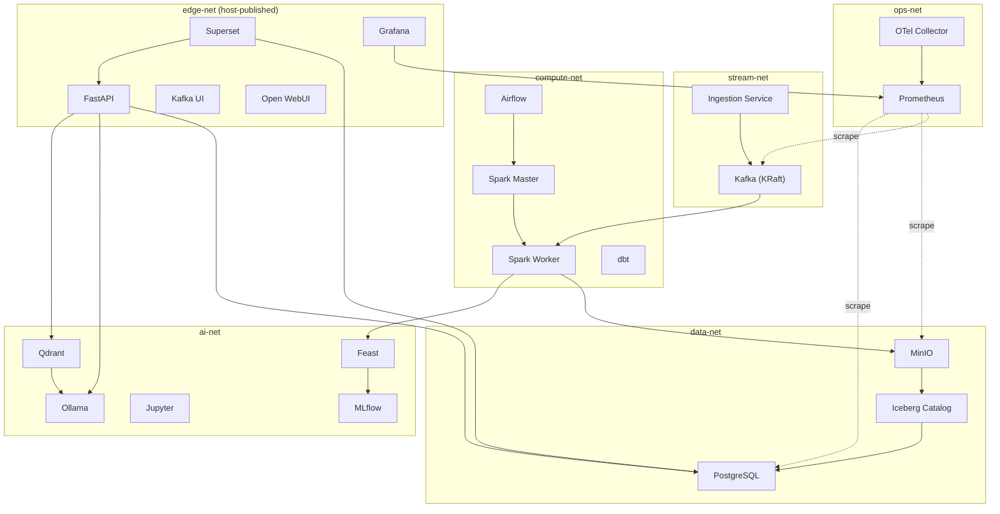

# 02 Docker System Design

> **Phase 4 - Infrastructure Design (Docker Local Platform)**
> Document 02 of 14

## Purpose

This document defines the complete Docker-based system: network architecture, container groups, communication patterns, and the multi-Compose structure that governs the platform.

## 1. Docker Network Architecture

The platform uses **segmented bridge networks** rather than a single flat network. Segmentation enforces least-privilege communication, mirrors enterprise network zoning, and limits blast radius if a container is compromised.

### Network Segments

| Network | Driver | Purpose | Members |
| --- | --- | --- | --- |
| `edge-net` | bridge | User-facing traffic; the only network with host-published UIs | Superset, Grafana, FastAPI, Kafka UI, Open WebUI |
| `data-net` | bridge | Object + relational storage plane | PostgreSQL, MinIO, Iceberg catalog, Spark, Airflow, MLflow, Feast, Superset, FastAPI |
| `stream-net` | bridge | Event streaming plane | Kafka, Kafka UI, ingestion service, Spark |
| `compute-net` | bridge | Batch processing + orchestration | Spark Master, Spark Worker, Airflow, dbt |
| `ai-net` | bridge | AI/ML + LLM plane | MLflow, Jupyter, Feast, Qdrant, Ollama, Open WebUI, FastAPI |
| `ops-net` | bridge | Observability scraping plane | Prometheus, Grafana, OTel Collector, all instrumented services |

A service may join multiple networks (e.g., FastAPI joins `edge-net`, `data-net`, and `ai-net`). Services address each other by **container name** via Docker's embedded DNS.

### Network Topology Diagram



### Communication Patterns

| Pattern | Where used | Protocol |
| --- | --- | --- |
| Event publish/subscribe | Ingestion → Kafka → consumers | Kafka wire protocol (TCP 9092) |
| S3 object I/O | Spark/Airflow/MLflow → MinIO | HTTP S3 API (9000) |
| Relational queries | Services → PostgreSQL | TCP 5432 |
| HTTP REST | API ↔ Ollama/Qdrant/MLflow/Iceberg | HTTP/JSON |
| Metrics scrape | Prometheus → service `/metrics` | HTTP pull |
| Trace export | Services → OTel Collector | OTLP (gRPC 4317 / HTTP 4318) |

## 2. Container Groups

Services are organized into six container groups. Each group is independently startable and aligns to a Compose override file.

### Ingestion Stack
| Container | Image basis | Role |
| --- | --- | --- |
| `kafka` | apache/kafka (KRaft) | Single-broker event backbone, no ZooKeeper |
| `kafka-ui` | provectuslabs/kafka-ui | Topic/consumer inspection UI |
| `ingestion-service` | python/FastAPI (blueprint) | REST + scheduled pull into Kafka/MinIO |

### Processing Stack
| Container | Image basis | Role |
| --- | --- | --- |
| `spark-master` | apache/spark | Cluster coordinator (local-mode capable) |
| `spark-worker` | apache/spark | Executor for batch transforms |
| `airflow` | apache/airflow (standalone/LocalExecutor) | Batch orchestration |
| `dbt` | ghcr.io/dbt-labs/dbt | Ephemeral SQL transformation runner |

### Storage Stack
| Container | Image basis | Role |
| --- | --- | --- |
| `postgres` | postgres | Metadata catalog + Gold serving + Airflow/MLflow/Superset backends |
| `minio` | minio/minio | S3-compatible object storage (Bronze/Silver/Gold) |
| `iceberg-rest` | tabulario/iceberg-rest | Iceberg REST catalog backed by PostgreSQL + MinIO |

### AI/ML Stack
| Container | Image basis | Role |
| --- | --- | --- |
| `mlflow` | mlflow (community image) | Experiment tracking + model registry |
| `jupyter` | jupyter/pyspark-notebook | Interactive training / exploration |
| `feast` | feast (blueprint container) | Feature store serving |
| `qdrant` | qdrant/qdrant | Vector database for RAG |
| `ollama` | ollama/ollama | Local quantized LLM runtime |
| `open-webui` | ghcr.io/open-webui/open-webui | LLM chat front-end |

### Observability Stack
| Container | Image basis | Role |
| --- | --- | --- |
| `prometheus` | prom/prometheus | Metrics collection |
| `grafana` | grafana/grafana | Metrics + health dashboards |
| `otel-collector` | otel/opentelemetry-collector | Trace + metric pipeline |

### BI Stack
| Container | Image basis | Role |
| --- | --- | --- |
| `superset` | apache/superset | Business dashboards over Gold/API |

## 3. Multi-Compose Structure

The platform uses a **base + overrides** Compose strategy:

```text
infrastructure/docker/
├── docker-compose.yml              # base: networks, volumes, x-defaults
├── docker-compose.storage.yml      # PostgreSQL, MinIO, Iceberg
├── docker-compose.ingestion.yml    # Kafka, Kafka UI
├── docker-compose.processing.yml   # Spark, Airflow, dbt
├── docker-compose.ai.yml           # MLflow, Jupyter, Feast, Qdrant, Ollama
└── docker-compose.observability.yml# Prometheus, Grafana, OTel, Superset
```

The base file declares the six shared networks, the named volumes, and reusable YAML anchors (`x-defaults`, `x-resource-small`, `x-resource-medium`, `x-resource-large`) for resource limits, logging, and restart policy. Stack files reference these anchors to stay DRY.

Engineers compose subsets via the `-f` flag or Compose **profiles**:

```bash
# Minimal foundation
docker compose -f docker-compose.yml -f docker-compose.storage.yml up -d

# Full platform
docker compose \
  -f docker-compose.yml \
  -f docker-compose.storage.yml \
  -f docker-compose.ingestion.yml \
  -f docker-compose.processing.yml \
  -f docker-compose.ai.yml \
  -f docker-compose.observability.yml up -d
```

The helper scripts in [10-deployment-runbook.md](./10-deployment-runbook.md) wrap these commands.

## Cross References

- Service mapping: [03-service-mapping.md](./03-service-mapping.md)
- Networking design: [05-networking.md](./05-networking.md)
- Resource management: [04-resource-management.md](./04-resource-management.md)
