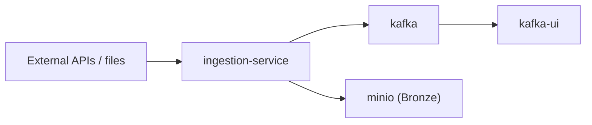
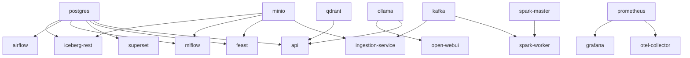

# 03 Service Mapping

> **Phase 4 - Infrastructure Design (Docker Local Platform)**
> Document 03 of 14

## Purpose

This document maps every Phase 3 architecture component to a concrete container, declaring its image, exposed ports, networks, dependencies, and persistent volumes. This is the authoritative service inventory for the platform.

## Master Service Inventory

| Service | Container name | Stack | Host port → container | Networks | Depends on | Volume |
| --- | --- | --- | --- | --- | --- | --- |
| PostgreSQL | `postgres` | Storage | — (internal 5432) | data-net, ops-net | — | `postgres-data` |
| MinIO | `minio` | Storage | 9000, 9001 (console) | data-net, ops-net, edge-net | — | `minio-data` |
| Iceberg REST catalog | `iceberg-rest` | Storage | — (internal 8181) | data-net | postgres, minio | — |
| Kafka (KRaft) | `kafka` | Ingestion | — (internal 9092) | stream-net, ops-net | — | `kafka-data` |
| Kafka UI | `kafka-ui` | Ingestion | 8088 → 8080 | stream-net, edge-net | kafka | — |
| Ingestion service | `ingestion-service` | Ingestion | — (internal 8000) | stream-net, data-net, ops-net | kafka, minio | — |
| Spark Master | `spark-master` | Processing | 8080 → 8080 (UI) | compute-net, data-net | — | — |
| Spark Worker | `spark-worker` | Processing | 8081 → 8081 (UI) | compute-net, data-net, stream-net | spark-master | `spark-work` |
| Airflow | `airflow` | Processing | 8082 → 8080 | compute-net, data-net, ops-net | postgres | `airflow-dags`, `airflow-logs` |
| dbt | `dbt` | Processing | — (ephemeral) | compute-net, data-net | postgres, iceberg-rest | `dbt-project` |
| MLflow | `mlflow` | AI/ML | 5000 → 5000 | ai-net, data-net, ops-net | postgres, minio | — (artifacts in MinIO) |
| Jupyter | `jupyter` | AI/ML | 8888 → 8888 | ai-net, data-net, compute-net | — | `jupyter-work` |
| Feast | `feast` | AI/ML | — (internal 6566) | ai-net, data-net | postgres, minio | — |
| Qdrant | `qdrant` | AI/ML | 6333, 6334 | ai-net, ops-net | — | `qdrant-data` |
| Ollama | `ollama` | AI/ML | 11434 → 11434 | ai-net | — | `ollama-models` |
| Open WebUI | `open-webui` | AI/ML | 3000 → 8080 | ai-net, edge-net | ollama | `openwebui-data` |
| Prometheus | `prometheus` | Observability | 9090 → 9090 | ops-net | — | `prometheus-data` |
| Grafana | `grafana` | Observability | 3001 → 3000 | ops-net, edge-net | prometheus | `grafana-data` |
| OTel Collector | `otel-collector` | Observability | 4317, 4318 | ops-net | prometheus | — |
| Superset | `superset` | BI | 8089 → 8088 | edge-net, data-net | postgres | `superset-home` |
| FastAPI | `api` | Core | 8000 → 8000 | edge-net, data-net, ai-net, ops-net | postgres, qdrant, ollama | — |

> Host ports are the **strategy**; exact numbers are defined in [05-networking.md](./05-networking.md) and the `.env` file. Only user-facing UIs and the API are published to the host.

## Architecture Component → Container Mapping

### Data Ingestion Layer

| Architecture component | Container |
| --- | --- |
| Streaming ingestion backbone | `kafka` |
| Stream inspection | `kafka-ui` |
| REST + scheduled ingestion | `ingestion-service` |

### Processing Layer
| Architecture component | Container |
| --- | --- |
| Distributed batch engine (coordinator) | `spark-master` |
| Distributed batch engine (executor) | `spark-worker` |
| Workflow orchestration | `airflow` |
| SQL transformation framework | `dbt` |

### Storage Layer
| Architecture component | Container |
| --- | --- |
| Object storage (Bronze/Silver/Gold) | `minio` |
| Relational metadata + Gold serving | `postgres` |
| Iceberg table metadata catalog | `iceberg-rest` |

### AI/ML Layer
| Architecture component | Container |
| --- | --- |
| Experiment tracking + model registry | `mlflow` |
| Interactive training / notebooks | `jupyter` |
| Feature store serving | `feast` |
| Vector database | `qdrant` |
| Local LLM runtime | `ollama` |
| LLM chat front-end | `open-webui` |

### Observability Layer
| Architecture component | Container |
| --- | --- |
| Metrics collection | `prometheus` |
| Metrics/health visualization | `grafana` |
| Trace + metric pipeline | `otel-collector` |

### BI Layer
| Architecture component | Container |
| --- | --- |
| Business dashboards | `superset` |

### LLM Layer
| Architecture component | Container |
| --- | --- |
| LLM inference runtime | `ollama` |
| Conversational UI | `open-webui` |
| Retrieval store for RAG | `qdrant` |

## Service Dependency Graph

## Cross References

- Docker design: [02-docker-design.md](./02-docker-design.md)
- Networking: [05-networking.md](./05-networking.md)
- Phase 3 container architecture: [../../architecture/04-container-architecture.md](../../architecture/04-container-architecture.md)
