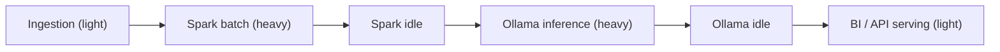

# 04 Resource Management

> **Phase 4 - Infrastructure Design (Docker Local Platform)**
> Document 04 of 14

## Purpose

This document defines how the entire platform fits within a **16 GB RAM** laptop. It specifies per-container memory and CPU limits, the staged-workload strategy, and the scale-down design that keeps the system runnable on constrained hardware.

## Host Budget

| Resource | Total | Reserved for host/Docker | Available to containers |
| --- | --- | --- | --- |
| RAM | 16 GB | ~4 GB (OS + Docker Desktop + WSL2) | ~12 GB |
| CPU | 4–8 cores | ~1 core | 3–7 cores |
| Disk | 50 GB free | ~10 GB images | ~40 GB volumes |

The platform is **never expected to run all stacks at peak simultaneously**. The 12 GB working budget is managed through profiles and staged workloads.

## Per-Container Resource Allocation

Resource classes are defined as reusable Compose anchors (`x-resource-small`, `-medium`, `-large`).

| Service | Class | `mem_limit` | `mem_reservation` | `cpus` | Notes |
| --- | --- | --- | --- | --- | --- |
| postgres | medium | 1g | 512m | 1.0 | Shared backend for many services |
| minio | small | 512m | 256m | 0.5 | Lightweight single-node |
| iceberg-rest | small | 384m | 128m | 0.5 | Metadata only |
| kafka | medium | 1g | 512m | 1.0 | KRaft, bounded heap, few partitions |
| kafka-ui | small | 256m | 128m | 0.25 | Inspection UI |
| ingestion-service | small | 384m | 128m | 0.5 | I/O bound |
| spark-master | small | 512m | 256m | 0.5 | Coordinator only |
| spark-worker | large | 2g | 1g | 2.0 | Heavy; one job at a time |
| airflow | medium | 1.5g | 768m | 1.0 | Standalone/LocalExecutor |
| dbt | small | 384m | 128m | 0.5 | Ephemeral |
| mlflow | small | 512m | 256m | 0.5 | Tracking server |
| jupyter | medium | 1g | 512m | 1.0 | Notebook kernels |
| feast | small | 512m | 256m | 0.5 | Feature serving |
| qdrant | small | 512m | 256m | 0.5 | Vector search |
| ollama | large | 4g | 2g | 2.0 | Quantized model only |
| open-webui | small | 512m | 256m | 0.5 | Chat UI |
| prometheus | small | 512m | 256m | 0.5 | Short retention |
| grafana | small | 256m | 128m | 0.25 | Dashboards |
| otel-collector | small | 256m | 128m | 0.25 | Pipeline |
| superset | medium | 1g | 512m | 1.0 | BI app |
| api | small | 512m | 256m | 0.5 | Async FastAPI |

### Profile Memory Envelopes

| Profile combination | Approx. peak RAM | Fits 12 GB? |
| --- | --- | --- |
| Storage only | ~2 GB | Yes |
| Storage + Ingestion | ~3.5 GB | Yes |
| Storage + Ingestion + Processing (Spark batch) | ~7 GB | Yes |
| Storage + AI/ML (Ollama inference) | ~7 GB | Yes |
| Storage + Processing + AI (no Ollama, no Spark peak) | ~8 GB | Yes |
| **Everything at peak (Spark + Ollama together)** | ~13–14 GB | **No — avoid** |
| Full platform, idle/light | ~9–10 GB | Tight but OK |

## Staged Workload Strategy

The golden rule: **only one heavy engine peaks at a time.**



- **Spark batch** and **Ollama inference** are never scheduled concurrently.
- Airflow DAGs serialize heavy tasks; Spark jobs run one at a time.
- The LLM model is **quantized** (e.g., 7B Q4) to stay within the 4 GB Ollama envelope.

## Scale-Down Design (Local Optimization)

| Technique | Effect |
| --- | --- |
| **Profiles** | Start only the stack a task needs (`storage`, `ai`, etc.). |
| **Single replicas** | One Spark worker, one Kafka broker, one of everything. |
| **KRaft Kafka** | Eliminates the separate ZooKeeper container (~300 MB saved). |
| **DuckDB fallback** | Small analytics run in-process via Jupyter/DuckDB instead of Spark. |
| **Short metric retention** | Prometheus retains ~3 days, capping disk and memory. |
| **Quantized LLM** | Small Q4 model instead of full-precision weights. |
| **Lazy AI stack** | Ollama/Jupyter started only during ML/LLM work. |

## Disabling Heavy Components

When RAM pressure is detected, the following can be stopped without breaking the foundation:

| Stop first (heaviest, optional) | Keep running (foundation) |
| --- | --- |
| `ollama`, `open-webui` | `postgres` |
| `spark-worker`, `spark-master` | `minio` |
| `jupyter` | `iceberg-rest` |
| `superset` | `prometheus` (light) |

```bash
# Free ~6 GB instantly
docker compose stop ollama open-webui spark-worker jupyter
```

## CPU Strategy

- CPU limits are soft caps; on an idle host containers may burst.
- Spark worker and Ollama receive the largest `cpus` allocations because they are compute-bound.
- I/O-bound services (ingestion, API, MinIO) receive fractional CPUs.

## Cross References

- Overview resource strategy: [01-overview.md](./01-overview.md)
- Failure handling under pressure: [11-failure-handling.md](./11-failure-handling.md)
- Phase 3 scalability design: [../../architecture/11-scalability-design.md](../../architecture/11-scalability-design.md)
