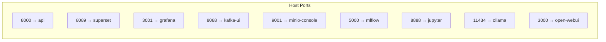

# 05 Networking Design

> **Phase 4 - Infrastructure Design (Docker Local Platform)**
> Document 05 of 14

## Purpose

This document defines the platform networking: Docker networks, exposed-port strategy, service discovery, gateway approach, and inter-service communication rules.

## Internal Docker Networks

Six segmented bridge networks isolate traffic by function (see [02-docker-design.md](./02-docker-design.md)).

| Network | CIDR (illustrative) | Zone | Host-exposed? |
| --- | --- | --- | --- |
| `edge-net` | 172.30.0.0/24 | User-facing | Yes (UIs/API only) |
| `data-net` | 172.31.0.0/24 | Storage plane | No |
| `stream-net` | 172.32.0.0/24 | Streaming plane | No |
| `compute-net` | 172.33.0.0/24 | Processing plane | No |
| `ai-net` | 172.34.0.0/24 | AI/ML plane | No |
| `ops-net` | 172.35.0.0/24 | Observability | No (Grafana via edge-net) |

> CIDRs are illustrative; Docker auto-assigns unless overridden. Explicit subnets may be set in the base Compose file to avoid conflicts with corporate VPNs.

## Exposed Ports Strategy

**Principle: publish only what a human or external client must reach.** Data-plane services stay internal and are reached by container name.

| Service | Host port | Container port | Exposure reason |
| --- | --- | --- | --- |
| FastAPI (`api`) | 8000 | 8000 | Primary external API + RAG endpoints |
| Superset | 8089 | 8088 | BI dashboards |
| Grafana | 3001 | 3000 | Observability dashboards |
| Kafka UI | 8088 | 8080 | Stream inspection (dev convenience) |
| MinIO Console | 9001 | 9001 | Object browsing (dev convenience) |
| MinIO S3 API | 9000 | 9000 | SDK/CLI access from host |
| Spark Master UI | 8080 | 8080 | Job monitoring |
| Spark Worker UI | 8081 | 8081 | Executor monitoring |
| Airflow | 8082 | 8080 | DAG monitoring |
| MLflow | 5000 | 5000 | Experiment UI / tracking API |
| Jupyter | 8888 | 8888 | Notebook access |
| Ollama | 11434 | 11434 | LLM API (local clients) |
| Open WebUI | 3000 | 8080 | LLM chat |
| Qdrant | 6333/6334 | 6333/6334 | Vector REST/gRPC (dev) |
| Prometheus | 9090 | 9090 | Metrics UI (dev) |
| OTel Collector | 4317/4318 | 4317/4318 | OTLP receivers |

**Internal-only (no host port):** `postgres`, `iceberg-rest`, `kafka` (broker), `feast`, `ingestion-service`.

> Port numbers are centralized in `infrastructure/env/.env.example` so they can be remapped if a host port is occupied.

## Port Allocation Map



## API Gateway Strategy

A heavyweight gateway (Kong, Traefik with full config) is **intentionally avoided** to conserve memory. Instead:

- **FastAPI acts as the single application gateway** for data, model, and RAG access. It centralizes authentication, request validation, and routing to internal services (`postgres`, `qdrant`, `ollama`, model serving).
- UIs (Superset, Grafana, Kafka UI, MLflow) are reached directly on their host ports for the local single-user scenario.
- A future multi-user deployment can introduce Traefik as a reverse proxy on `edge-net` without changing internal services. This is recorded as a forward-looking option, not a Phase 4 requirement.

## Service Discovery Approach

- **Docker embedded DNS**: every container is reachable by its **Compose service name** (the network alias) within shared networks (e.g., `postgres:5432`, `minio:9000`, `kafka:9092`). Container names are project-prefixed (`space-platform-<service>-1`) and are not used for service discovery.
- No external service registry (Consul/etcd) is used — unnecessary overhead for a single node.
- Connection strings reference container names, never IP addresses, ensuring portability.

## Inter-Service Communication Rules

| Rule | Rationale |
| --- | --- |
| Services communicate only over networks they both join. | Enforces least-privilege zoning. |
| Storage plane (`postgres`, `minio`) is never published except MinIO dev console. | Reduces attack surface. |
| All cross-service references use container DNS names. | Portability and reproducibility. |
| Only `edge-net` carries host-published traffic. | Single, auditable ingress zone. |
| Observability scraping rides `ops-net`, joined by all instrumented services. | Keeps metric traffic off functional networks. |
| Kafka advertises an internal listener (`kafka:9092`) and an optional host listener for local clients. | Correct client connectivity inside and outside Docker. |

### Kafka Listener Design

```text
KAFKA_LISTENERS:           INTERNAL://0.0.0.0:9092, CONTROLLER://0.0.0.0:9093
KAFKA_ADVERTISED_LISTENERS:INTERNAL://kafka:9092
KAFKA_PROCESS_ROLES:       broker,controller   # KRaft combined mode
```

Internal producers/consumers use `kafka:9092`. A host listener is added only if external tooling must connect directly.

## Cross References

- Docker design: [02-docker-design.md](./02-docker-design.md)
- Security design: [09-security.md](./09-security.md)
- Phase 3 deployment networking: [../../architecture/10-deployment-architecture.md](../../architecture/10-deployment-architecture.md)
