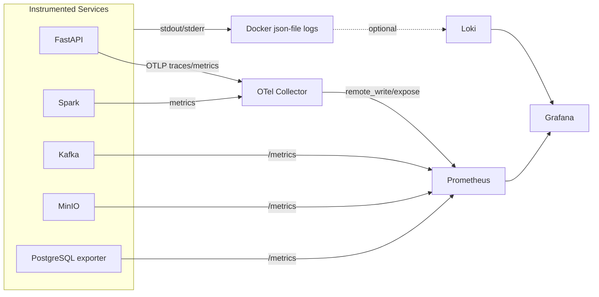
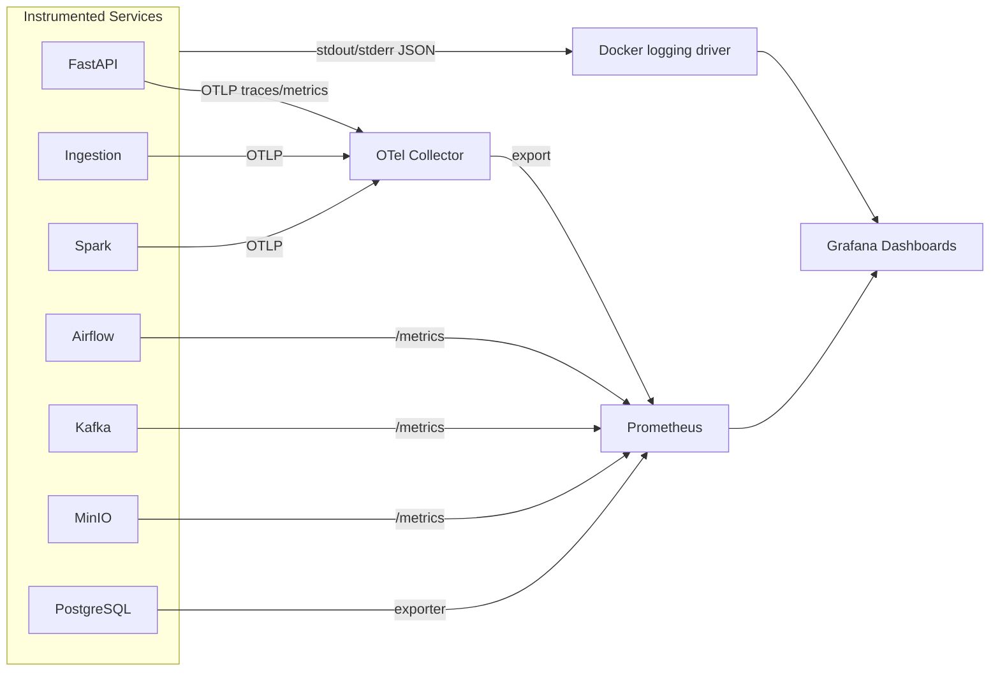

# 07 Observability Infrastructure

> **Phase 4 - Infrastructure Design (Docker Local Platform)**
> Document 07 of 14

## Purpose

This document defines the observability infrastructure: the metrics pipeline, logging pipeline, tracing pipeline, and how each service emits and how signals flow to dashboards.

## Observability Pillars

| Pillar | Tool | Role |
| --- | --- | --- |
| Metrics | Prometheus | Pull-based time-series collection |
| Visualization | Grafana | Dashboards + alert display |
| Tracing | OpenTelemetry Collector | Distributed trace + metric pipeline |
| Logs | Docker json-file driver + (optional) Grafana Loki | Centralized container logs |

> Loki is listed as an optional add-on. To preserve RAM, the default design relies on Docker's `json-file` logging driver with `docker logs` / `docker compose logs` for centralized viewing; Loki can be enabled when memory allows.

## Signal Flow



## Metrics Pipeline (Prometheus)

- **Model**: Prometheus pulls `/metrics` endpoints on a fixed interval.
- **Scrape targets** are declared in `infrastructure/configs/prometheus/prometheus.yml`.
- **Retention**: ~3 days (`--storage.tsdb.retention.time=72h`) to cap disk/memory.
- **Service discovery**: static config by container DNS name (single-node, no dynamic SD needed).

| Scrape target | Endpoint | Exporter |
| --- | --- | --- |
| prometheus (self) | `prometheus:9090/metrics` | built-in |
| otel-collector | `otel-collector:8889/metrics` | collector prometheus exporter |
| kafka | `kafka:9092` (JMX exporter sidecar/agent) | JMX → Prometheus |
| minio | `minio:9000/minio/v2/metrics/cluster` | built-in |
| postgres | `postgres-exporter:9187/metrics` | postgres_exporter (optional) |
| api (FastAPI) | `api:8000/metrics` | prometheus-fastapi-instrumentator |
| spark | `spark-master:8080` / metrics sink | Spark Prometheus servlet |
| qdrant | `qdrant:6333/metrics` | built-in |

## Logging Pipeline

| Aspect | Design |
| --- | --- |
| Capture | All containers write to stdout/stderr (12-factor). |
| Driver | Docker `json-file` with rotation (`max-size=10m`, `max-file=3`). |
| Centralized view | `docker compose logs -f [service]`; helper script aggregates. |
| Structured logs | Services emit JSON logs where supported (FastAPI, Airflow). |
| Optional aggregation | Loki + Promtail can ship logs to Grafana for unified querying. |

Log rotation is defined once via the `x-logging` anchor in the base Compose file and inherited by all services to prevent disk exhaustion.

## Tracing Pipeline (OpenTelemetry)

- Application services (FastAPI, ingestion service) export **OTLP** traces to the `otel-collector` on `4317` (gRPC) / `4318` (HTTP).
- The collector processes (batch, resource detection) and re-exports metrics to Prometheus and can forward traces to a backend (Jaeger/Tempo) if added later.
- Default config keeps tracing lightweight: traces are sampled and metrics are surfaced to Prometheus; a full trace backend is an optional add-on.

```text
configs/
└── otel/otel-collector-config.yaml   # receivers: otlp; exporters: prometheus, logging
```

## What Each Service Emits

| Service | Metrics | Logs | Traces |
| --- | --- | --- | --- |
| FastAPI (`api`) | request rate, latency, errors | structured JSON | OTLP spans |
| Kafka | broker/topic/consumer lag (JMX) | broker logs | — |
| Spark | job/stage/executor metrics | driver/executor logs | — |
| Airflow | DAG/task duration, success rate | task logs | — |
| MinIO | request count, bucket usage | access logs | — |
| PostgreSQL | connections, query stats (exporter) | server logs | — |
| Qdrant | search latency, collection size | service logs | — |
| Ollama | request count, token throughput | runtime logs | — |
| MLflow | (via API usage) | server logs | — |

## Grafana Dashboards (planned)

| Dashboard | Panels |
| --- | --- |
| Platform Health | container up/down, CPU, memory per service |
| Data Pipeline | Kafka lag, Airflow DAG success, ingestion throughput |
| Storage | MinIO bucket sizes, PostgreSQL connections |
| AI/ML | MLflow run counts, Ollama latency, Qdrant search latency |
| API | request rate, p95 latency, error ratio |

Grafana is provisioned with Prometheus as a datasource via `configs/grafana/provisioning/`.

## Alerting Strategy (lightweight)

- Prometheus alert rules (e.g., service down > 2m, Kafka consumer lag high, disk volume > 85%).
- Grafana visual alerts on dashboards.
- No external pager integration in the local environment; alerts surface in Grafana/Prometheus UIs.

## Cross References

- Phase 3 observability architecture: [../../architecture/08-observability-architecture.md](../../architecture/08-observability-architecture.md)
- Failure handling: [11-failure-handling.md](./11-failure-handling.md)
- Networking (ops-net): [05-networking.md](./05-networking.md)
# 07 Observability Infrastructure

> **Phase 4 - Infrastructure Design (Docker Local Platform)**
> Document 07 of 14

## Purpose

This document defines the observability infrastructure: the logging pipeline, the metrics pipeline, dashboards, and tracing. It specifies what each service emits, how logs are collected, and how metrics flow.

## Observability Pillars

| Pillar | Tool | Scope |
| --- | --- | --- |
| Metrics | Prometheus | Time-series for all instrumented services |
| Visualization | Grafana | Dashboards over Prometheus |
| Tracing | OpenTelemetry Collector | Distributed traces from API + pipelines |
| Logs | Docker JSON logging + Grafana (Loki optional) | Centralized container logs |

## Observability Data Flow



## Metrics Pipeline (Prometheus)

- **Model**: pull-based scraping. Prometheus scrapes each service's `/metrics` endpoint on `ops-net`.
- **Scrape targets** are declared in `infrastructure/configs/prometheus/prometheus.yml`.
- **Retention**: ~3 days (`--storage.tsdb.retention.time=72h`) to cap disk/memory on the laptop.
- **Exporters**: PostgreSQL uses `postgres_exporter`; services without native metrics expose via OTel Collector's Prometheus exporter.

### Scrape Target Inventory

| Target | Endpoint | Source |
| --- | --- | --- |
| OTel Collector | `otel-collector:8889/metrics` | Aggregated app metrics |
| Kafka | `kafka:9404/metrics` (JMX exporter) | Broker metrics |
| MinIO | `minio:9000/minio/v2/metrics/cluster` | Storage metrics |
| PostgreSQL | `postgres-exporter:9187/metrics` | DB metrics |
| Airflow | `airflow:8080/admin/metrics` | DAG/task metrics |
| Spark | `spark-master:8080/metrics/prometheus` | Job metrics |
| Qdrant | `qdrant:6333/metrics` | Vector DB metrics |
| Prometheus self | `localhost:9090/metrics` | Self-monitoring |

## Logging Pipeline (Centralized Logs)

- **Default**: all containers use the Docker `json-file` logging driver with rotation (`max-size=10m`, `max-file=3`) configured via the `x-logging` anchor in the base Compose file.
- **Centralization**: `docker compose logs -f <service>` aggregates logs; for richer search, an **optional Loki + Promtail** add-on can feed Grafana (kept optional to save memory).
- **Structured logging**: application services (ingestion, API) emit JSON logs with correlation IDs so traces and logs can be cross-referenced.

| Log source | Format | Collection |
| --- | --- | --- |
| FastAPI / ingestion | JSON (structured) | Docker driver → optional Loki |
| Spark / Airflow | Text + task logs | Docker driver + `airflow-logs` volume |
| Kafka / MinIO / PostgreSQL | Native text | Docker driver |

## Tracing (OpenTelemetry)

- Application services are instrumented with the OpenTelemetry SDK and export **OTLP** to `otel-collector:4317` (gRPC) / `4318` (HTTP).
- The Collector processes traces (batching, attribute enrichment) and exports trace-derived metrics to Prometheus; full trace backends (Jaeger/Tempo) are **optional** to conserve memory.
- Correlation IDs propagate across ingestion → processing → API to trace a record end-to-end.

### What Each Service Emits

| Service | Metrics | Traces | Logs |
| --- | --- | --- | --- |
| FastAPI | request latency, error rate, RAG latency | full request spans | structured JSON |
| Ingestion | records/sec, lag, failures | ingest spans | structured JSON |
| Kafka | throughput, partition lag, ISR | — | broker logs |
| Spark | job duration, stage failures, shuffle | optional job spans | task logs |
| Airflow | DAG success/fail, task duration | — | task logs |
| MinIO | request count, bucket usage | — | access logs |
| PostgreSQL | connections, query time, cache hit | — | query logs |
| Qdrant | query latency, collection size | — | service logs |
| MLflow | (via app) run counts | — | service logs |

## Grafana Dashboards

Provisioned via `infrastructure/configs/grafana/` (datasources + dashboard JSON).

| Dashboard | Purpose |
| --- | --- |
| **Platform Health** | Up/down status, container memory/CPU, restart counts |
| **Ingestion** | Kafka throughput, consumer lag, ingestion error rate |
| **Processing** | Spark job durations, Airflow DAG success rate |
| **Storage** | MinIO bucket usage, PostgreSQL connections/latency |
| **AI/ML** | MLflow run activity, Qdrant query latency, Ollama availability |
| **Data Quality** | Quality scores and freshness emitted from pipelines |

## Alerting Strategy

- Lightweight alerting via **Grafana alert rules** (no separate Alertmanager required for local use).
- Example rules: service down > 2 min; Kafka consumer lag > threshold; PostgreSQL connections near limit; disk volume > 85%.

## Cross References

- Phase 3 observability architecture: [../../architecture/08-observability-architecture.md](../../architecture/08-observability-architecture.md)
- Resource management (retention limits): [04-resource-management.md](./04-resource-management.md)
- Failure handling (alert-driven recovery): [11-failure-handling.md](./11-failure-handling.md)
