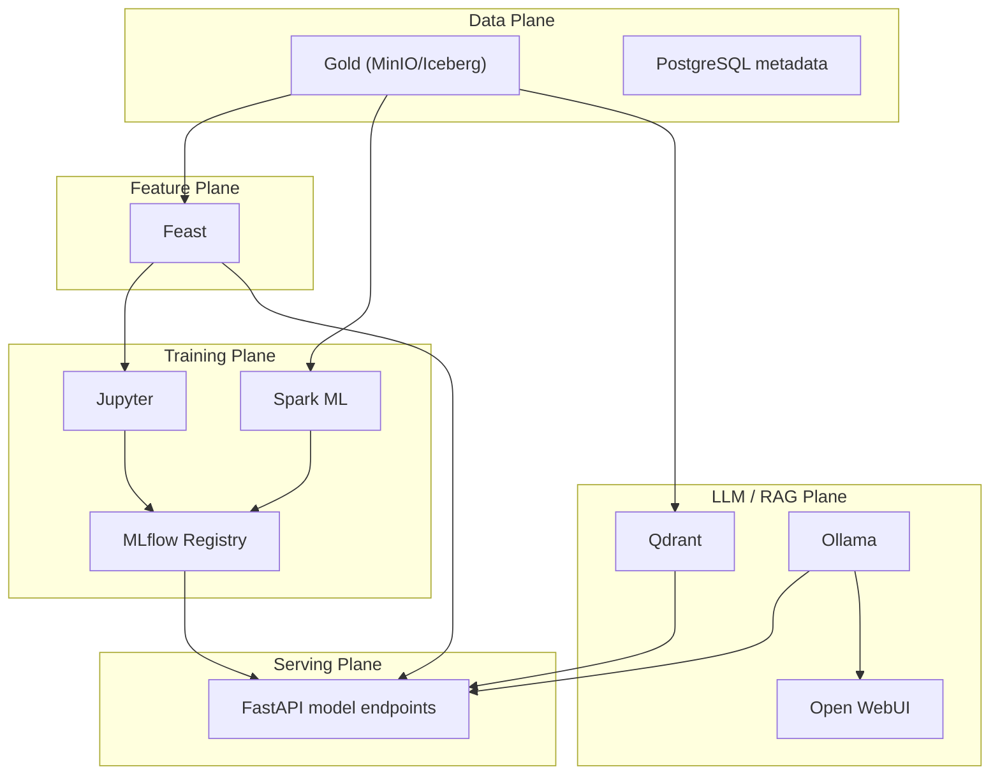
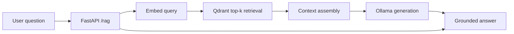

# 08 AI Infrastructure

> **Phase 4 - Infrastructure Design (Docker Local Platform)**
> Document 08 of 14

## Purpose

This document defines the AI/ML and LLM infrastructure: model training, model registry, feature store, vector database, LLM runtime, and the supporting infrastructure for the RAG pipeline. It also covers the data-infrastructure readiness required to feed these components.

## AI/ML Topology



## Model Training Infrastructure

| Component | Container | Role |
| --- | --- | --- |
| Interactive training | `jupyter` (pyspark-notebook) | Notebook-driven experimentation, small models, DuckDB analytics |
| Distributed training | `spark-worker` (Spark ML) | Larger feature/model jobs run one at a time |
| Experiment logging | `mlflow` | Params, metrics, and artifacts captured per run |

Training infrastructure reads curated **Gold** data and **Feast** features; outputs are logged to MLflow with artifacts persisted to the `mlflow-artifacts` MinIO bucket.

## Model Registry (MLflow)

- Backend store: PostgreSQL `mlflow` schema (runs, experiments, model versions).
- Artifact store: MinIO `mlflow-artifacts` bucket via S3 API.
- Lifecycle stages: `None → Staging → Production → Archived`.
- The API serving layer loads `Production`-stage models by name/version.

```text
MLFLOW_BACKEND_STORE_URI = postgresql://...@postgres/mlflow
MLFLOW_ARTIFACT_ROOT     = s3://mlflow-artifacts/
MLFLOW_S3_ENDPOINT_URL   = http://minio:9000
```

## Feature Store (Feast)

| Aspect | Design |
| --- | --- |
| Registry | PostgreSQL `feast` schema |
| Offline store | Iceberg/Parquet on MinIO (Gold) |
| Online store | PostgreSQL (or Redis if added) for low-latency serving |
| Consumers | Training (Jupyter/Spark) and inference (FastAPI) |

Feast provides point-in-time-correct features for training and consistent features for inference, preventing training/serving skew. A lightweight fallback to plain feature tables is acceptable if Feast overhead is too high (see [12-trade-offs.md](./12-trade-offs.md)).

## Vector Database (Qdrant)

| Aspect | Design |
| --- | --- |
| Storage | `qdrant-data` volume |
| Collections | per-domain document/imagery-metadata embeddings |
| Interfaces | REST `6333`, gRPC `6334` |
| Consumers | RAG retrieval via FastAPI |

Embeddings are generated from curated documents and dataset metadata, stored in Qdrant, and queried for top-k context during RAG.

## LLM Runtime (Ollama)

| Aspect | Design |
| --- | --- |
| Model | Quantized small model (e.g., 7B Q4) to fit ~4 GB |
| Storage | `ollama-models` volume (weights cached after first pull) |
| Interface | HTTP API `11434` |
| Consumers | FastAPI RAG endpoint + Open WebUI chat |

Ollama is the heaviest AI component and is **never run concurrently with a Spark batch peak** (see [04-resource-management.md](./04-resource-management.md)).

## RAG Pipeline Support



Infrastructure required for RAG:
- `qdrant` for retrieval, `ollama` for generation, `api` for orchestration, `postgres` for metadata, MinIO for source documents.
- Embedding generation runs in Jupyter/ingestion as a batch job; Qdrant holds the resulting vectors.

## Data Infrastructure Readiness for AI

| Capability | Infrastructure provided |
| --- | --- |
| Streaming ingestion | Kafka (KRaft) + ingestion-service |
| Batch ingestion | Airflow scheduled pulls |
| Transformations | Spark + dbt over Iceberg |
| Data validation | Great Expectations (ephemeral container/job) before promotion |
| ML tracking | MLflow + PostgreSQL + MinIO artifacts |
| Feature management | Feast + PostgreSQL + MinIO offline store |
| Vector retrieval | Qdrant |
| LLM inference | Ollama |

Great Expectations runs as an ephemeral validation step (invoked by Airflow), emitting quality metrics to the observability stack and gating Bronze→Silver→Gold promotion.

## Resource Posture for AI Stack

| Service | mem_limit | Activation |
| --- | --- | --- |
| ollama | 4g | On-demand (LLM/RAG work) |
| jupyter | 1g | On-demand (training) |
| mlflow | 512m | Always-on (lightweight) |
| feast | 512m | On-demand |
| qdrant | 512m | Always-on (lightweight) |
| open-webui | 512m | On-demand |

## Cross References

- Phase 3 AI/ML architecture: [../../architecture/07-ai-ml-architecture.md](../../architecture/07-ai-ml-architecture.md)
- Resource management: [04-resource-management.md](./04-resource-management.md)
- Storage design (artifacts/features): [06-storage-design.md](./06-storage-design.md)
