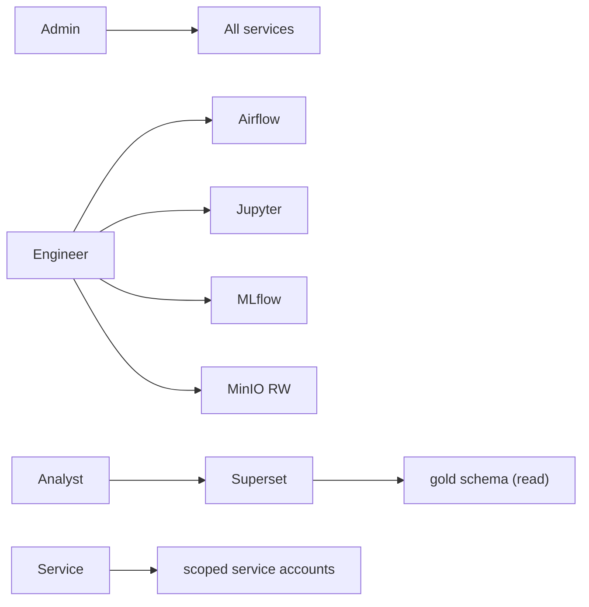

# 09 Security Design (Local Environment)

> **Phase 4 - Infrastructure Design (Docker Local Platform)**
> Document 09 of 14

## Purpose

This document defines security for the local environment: environment-variable strategy, local-safe secrets management, API-key handling, and a lightweight RBAC simulation. The threat model is a **single-user, single-node, non-internet-exposed** laptop deployment; the goal is good hygiene and production-realistic patterns, not enterprise-grade hardening.

## Security Principles

| Principle | Application |
| --- | --- |
| Least privilege | Network segmentation; only UIs/API published to host. |
| No secrets in images | All credentials injected via environment at runtime. |
| No secrets in git | `.env` is git-ignored; only `.env.example` is committed. |
| Default-deny ingress | Internal services (PostgreSQL, Kafka) are never host-published. |
| Reproducible identity | Service accounts and roles defined declaratively. |

## Environment Variable Strategy

- A single `infrastructure/env/.env.example` documents **every** configurable value (ports, credentials, model names, resource toggles).
- Engineers copy it to `.env` (git-ignored) and fill in local values.
- Compose loads `.env` automatically; services receive values via `environment:`/`env_file:`.
- No credential is hard-coded in any Compose or config file — all reference `${VAR}` placeholders.

```text
infrastructure/env/
├── .env.example   # committed, placeholder values
└── .env           # local only, git-ignored, real values
```

## Secrets Management (Local-Safe)

| Secret type | Storage | Notes |
| --- | --- | --- |
| DB credentials | `.env` | Strong local values; never defaults like `postgres/postgres` in shared demos |
| MinIO keys | `.env` | `MINIO_ROOT_USER` / `MINIO_ROOT_PASSWORD` |
| Service tokens | `.env` | MLflow/Superset secret keys |
| External API keys | `.env` | Space-Track, NOAA, Copernicus, etc. |

- For a local laptop, `.env` is the pragmatic secret store. The pattern maps cleanly to **Docker secrets** or a vault (HashiCorp Vault, cloud secret manager) in a later production phase — recorded as a forward path, not a Phase 4 requirement.
- `.gitignore` must include `infrastructure/env/.env` and `infrastructure/backups/`.

## API Key Handling

| Concern | Design |
| --- | --- |
| External dataset APIs | Keys stored in `.env`, read by ingestion-service at runtime only. |
| Internal API auth | FastAPI issues/validates a local API key or JWT; keys never logged. |
| Rotation | Keys are environment-driven, so rotation is an `.env` edit + restart. |
| Exposure prevention | Structured logging redacts credential fields; OTel attributes exclude secrets. |

## Access Control Design (Lightweight RBAC Simulation)

A simplified RBAC model demonstrates the pattern without heavyweight identity infrastructure.

| Role | Capabilities | Realized by |
| --- | --- | --- |
| **Admin** | Full platform control, infra ops | Host user + service admin accounts |
| **Engineer** | Read/write data, run pipelines, train models | Airflow/Jupyter/MLflow access |
| **Analyst** | Read Gold, build dashboards | Superset role |
| **Service** | Machine-to-machine access | Scoped service accounts/keys |

- **Superset**: native role-based access (Admin/Alpha/Gamma) gates dashboard and data access.
- **MinIO**: bucket policies scope service accounts to specific buckets (e.g., ingestion writes Bronze only).
- **PostgreSQL**: per-schema roles (e.g., `superset` role limited to `gold`/`superset` schemas).
- **FastAPI**: role claim in token gates endpoints (admin vs read-only).



## Network Security

- Six segmented networks enforce that services talk only within their zone (see [05-networking.md](./05-networking.md)).
- Storage plane (`postgres`, `kafka` broker) has no host port.
- MinIO console and dev UIs are exposed for convenience but bind to localhost on the developer machine only.

## Container Hardening Baseline

| Control | Application |
| --- | --- |
| Pinned image tags | Avoid `latest`; pin versions for reproducibility. |
| Read-only where possible | Config-only containers mount configs read-only. |
| No root where avoidable | Use image-provided non-root users when available. |
| Resource limits | Prevent denial-of-service via runaway containers. |
| Log redaction | No secrets in stdout/stderr. |

## Out of Scope (Local Phase)

- TLS between internal services (added in production phase).
- External identity provider / SSO.
- Network policies beyond Docker bridge isolation.
- Audit logging to an external SIEM.

These are intentionally deferred and recorded as production-phase concerns.

## Cross References

- Phase 3 security architecture: [../../architecture/09-security-architecture.md](../../architecture/09-security-architecture.md)
- Networking: [05-networking.md](./05-networking.md)
- Env reference: `../../infrastructure/env/.env.example`
