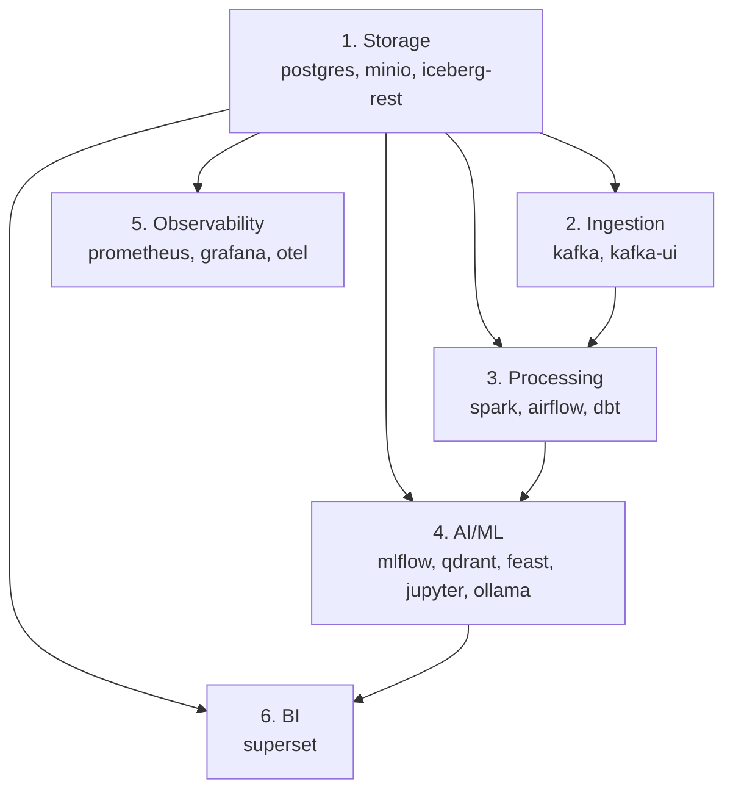

# 10 Deployment Runbook

> **Phase 4 - Infrastructure Design (Docker Local Platform)**
> Document 10 of 14

## Purpose

This document is the operational runbook: how the system is started locally, bootstrap order, dependency resolution, initialization scripts, and the environment setup process. A DevOps engineer follows this document to bring up the platform.

## Prerequisites

| Requirement | Minimum |
| --- | --- |
| OS | Windows 11 (WSL2), macOS, or Linux |
| Docker Desktop | Latest stable, WSL2 backend on Windows |
| RAM allocated to Docker | ≥ 10 GB (Settings → Resources) |
| CPU allocated | ≥ 4 cores |
| Disk free | ≥ 40 GB |
| Tools | `docker`, `docker compose`, `bash`, `make` (optional) |

## Environment Setup Process

```bash
# 1. Clone and enter infra dir
cd infrastructure

# 2. Create local env from template
cp env/.env.example env/.env
# edit env/.env: set credentials, ports, external API keys

# 3. Bootstrap (create networks, volumes, buckets, schemas)
bash scripts/bootstrap.sh

# 4. Start the platform (staged order)
bash scripts/start-platform.sh
```

## Bootstrap Order & Dependency Resolution

The platform must start in dependency order. The `start-platform.sh` script enforces this; `depends_on` + health checks enforce it at the Compose level.



### Startup Sequence Detail

| Step | Stack | Wait condition before next step |
| --- | --- | --- |
| 1 | Storage | `postgres` healthy, `minio` healthy, buckets created |
| 2 | Ingestion | `kafka` healthy (broker reachable) |
| 3 | Processing | `airflow` migrated + webserver up; `spark-master` up |
| 4 | AI/ML | `mlflow` reachable; `qdrant` healthy; `ollama` up (model optional) |
| 5 | Observability | `prometheus` scraping; `grafana` provisioned |
| 6 | BI | `superset` initialized (admin + metadata DB) |

## Initialization Scripts

| Script | Responsibility |
| --- | --- |
| `bootstrap.sh` | Create external networks/volumes; create MinIO buckets (`bronze/silver/gold/warehouse/mlflow-artifacts/staging`); create PostgreSQL schemas/roles; run Airflow/Superset DB migrations; pull base images. |
| `start-platform.sh` | Bring stacks up in dependency order with health gating; supports `--profile` to start a subset. |
| `stop-platform.sh` | Gracefully stop all containers, preserving volumes. |
| `reset-platform.sh` | Optional backup, then tear down containers **and volumes** for a clean slate (destructive — prompts for confirmation). |

> Scripts are POSIX `bash` (`.sh`) for portability and run under WSL2/Git Bash on Windows or natively on macOS/Linux.

## Common Operations

```bash
# Start only the foundation (low RAM)
bash scripts/start-platform.sh --profile storage

# Start data engineering core (storage + ingestion + processing)
bash scripts/start-platform.sh --profile core

# Start everything
bash scripts/start-platform.sh --profile all

# Stop everything (keep data)
bash scripts/stop-platform.sh

# Full reset (destroys volumes — confirm prompt)
bash scripts/reset-platform.sh

# Tail logs for a service
docker compose logs -f airflow

# Check resource usage
docker stats --no-stream
```

## Profiles

| Profile | Stacks started | Approx RAM |
| --- | --- | --- |
| `storage` | Storage | ~2 GB |
| `core` | Storage + Ingestion + Processing | ~7 GB |
| `ai` | Storage + AI/ML | ~7 GB |
| `obs` | Storage + Observability | ~3 GB |
| `all` | Everything (avoid Spark+Ollama peak together) | ~10 GB idle |

## Access URLs (default ports)

| Service | URL |
| --- | --- |
| FastAPI | http://localhost:8000 |
| Superset | http://localhost:8089 |
| Grafana | http://localhost:3001 |
| Airflow | http://localhost:8082 |
| MLflow | http://localhost:5000 |
| Jupyter | http://localhost:8888 |
| Kafka UI | http://localhost:8088 |
| MinIO Console | http://localhost:9001 |
| Spark Master UI | http://localhost:8080 |
| Open WebUI | http://localhost:3000 |
| Prometheus | http://localhost:9090 |
| Qdrant | http://localhost:6333 |

## Health Verification Checklist

- [ ] `docker compose ps` shows all targeted services `healthy`.
- [ ] MinIO console lists the six buckets.
- [ ] PostgreSQL has all schemas.
- [ ] Kafka UI lists the broker.
- [ ] Airflow webserver loads.
- [ ] MLflow UI loads.
- [ ] Grafana shows the Prometheus datasource and dashboards.
- [ ] Superset login works.

## Cross References

- Bootstrap/start/stop/reset scripts: `../../infrastructure/scripts/`
- Compose files: `../../infrastructure/docker/`
- Failure handling: [11-failure-handling.md](./11-failure-handling.md)
