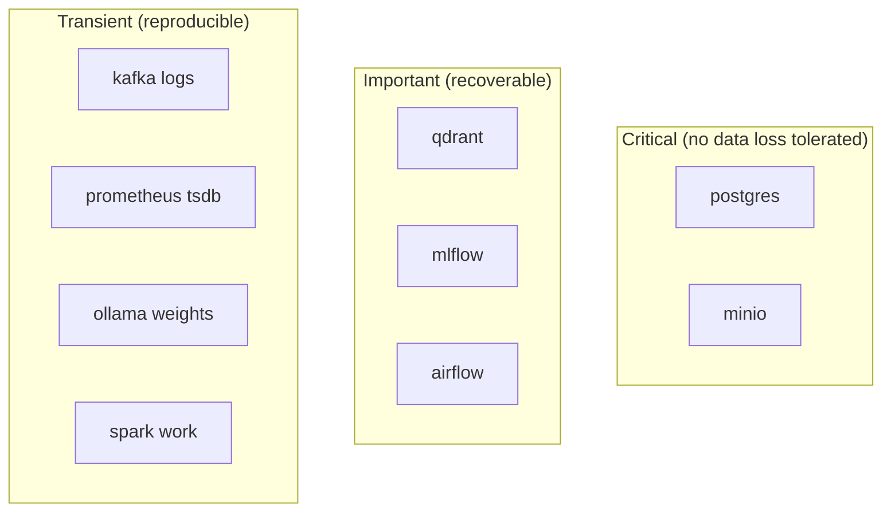
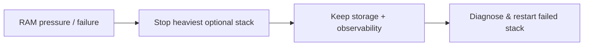

# 11 Failure Handling Strategy

> **Phase 4 - Infrastructure Design (Docker Local Platform)**
> Document 11 of 14

## Purpose

This document defines failure handling: container crash recovery, restart policies, data persistence, volume backup, and partial-system-failure handling. The goal is graceful degradation and zero data loss for critical stores on a single-node laptop.

## Failure Domains



## Restart Policies

Defined via the `x-defaults` anchor in the base Compose file.

| Service category | Policy | Rationale |
| --- | --- | --- |
| Stateful core (postgres, minio, qdrant) | `unless-stopped` | Always recover after crash/reboot unless intentionally stopped |
| Long-running services (kafka, airflow, mlflow, superset, grafana, prometheus) | `unless-stopped` | Auto-recover |
| Heavy on-demand (spark-worker, ollama) | `on-failure:3` | Recover from transient failure but don't loop forever |
| Ephemeral jobs (dbt, great-expectations) | `no` | One-shot tasks; orchestrated by Airflow |

## Container Crash Recovery

| Failure | Detection | Recovery |
| --- | --- | --- |
| Container exits unexpectedly | Docker health check + restart policy | Auto-restart per policy |
| Health check fails repeatedly | `depends_on: condition: service_healthy` blocks dependents | Operator inspects logs, restarts |
| OOM kill (memory pressure) | `docker stats`, exit code 137 | Reduce concurrent heavy stacks; lower `mem_limit` consumers |
| Deadlock/hang | Health check timeout | `docker compose restart <svc>` |

### Health Checks (per service)

| Service | Health check |
| --- | --- |
| postgres | `pg_isready` |
| minio | `curl /minio/health/live` |
| kafka | broker API version check / port probe |
| iceberg-rest | `curl /v1/config` |
| airflow | webserver `/health` |
| mlflow | `curl /health` |
| qdrant | `curl /healthz` |
| grafana | `/api/health` |
| prometheus | `/-/healthy` |
| superset | `/health` |
| api | `/healthz` |
| ollama | `/api/tags` |

Health checks gate startup order and feed the observability "Platform Health" dashboard.

## Data Persistence Strategy

| Store | Persistence | Guarantee |
| --- | --- | --- |
| PostgreSQL | `postgres-data` named volume | Survives restarts/reboots; backed up before resets |
| MinIO | `minio-data` named volume | Survives restarts; mirrored to backups |
| Qdrant | `qdrant-data` named volume | Survives restarts; snapshot before reindex |
| MLflow artifacts | MinIO bucket | Persisted with MinIO |
| Airflow metadata | PostgreSQL | Persisted with PostgreSQL |
| Kafka logs | `kafka-data` (transient) | Recoverable by re-ingestion |
| Prometheus TSDB | `prometheus-data` (short retention) | Acceptable loss |
| Ollama weights | `ollama-models` | Re-pullable |

**Principle:** containers are disposable; **volumes are the durable state**. Recreating a container never loses data held in its named volume.

## Volume Backup Strategy

| Asset | Backup method | When |
| --- | --- | --- |
| PostgreSQL | `pg_dump` → `infrastructure/backups/postgres/` | On-demand; auto before `reset-platform.sh` |
| MinIO | `mc mirror` critical buckets → `backups/minio/` | On-demand |
| Qdrant | snapshot API → `backups/qdrant/` | Before reindex |
| Grafana/Superset | volume tar → `backups/` | After dashboard changes |

```bash
# Pre-reset safety backup (invoked by reset-platform.sh, run from infrastructure/docker)
docker compose exec -T postgres pg_dump -U "$POSTGRES_USER" "$POSTGRES_DB" \
  > infrastructure/backups/postgres/pre-reset.sql
```

Backups live on the host, are git-ignored, and are excluded for transient stores.

## Partial System Failure Handling

The segmented-stack design means one stack can fail without taking down the platform.

| Failure scenario | Blast radius | Continued operation |
| --- | --- | --- |
| Ollama crashes | RAG/LLM features down | All data engineering + BI unaffected |
| Spark worker OOM | Batch transforms paused | Streaming, serving, dashboards continue |
| Kafka down | Streaming ingestion paused | Batch ingestion + existing data unaffected |
| Grafana/Prometheus down | Observability blind | Functional services keep running |
| Superset down | Dashboards unavailable | Underlying data + API unaffected |
| **PostgreSQL down** | Metadata, Airflow, MLflow, Superset affected | Critical — prioritize recovery |
| **MinIO down** | Lakehouse I/O blocked | Critical — prioritize recovery |

### Degradation Strategy



- Under memory pressure, stop `ollama` → `spark-worker` → `jupyter` → `superset` in that order.
- Critical stores (PostgreSQL, MinIO) are protected by `unless-stopped` and never auto-stopped.
- Airflow tasks are idempotent and re-runnable, so a processing failure is recovered by re-triggering the DAG.

## Recovery Runbook (quick reference)

| Symptom | Action |
| --- | --- |
| Service `unhealthy` | `docker compose logs <svc>`; `docker compose restart <svc>` |
| Exit 137 (OOM) | Stop a competing heavy stack; lower `mem_limit`; restart |
| Corrupt volume | Restore from `infrastructure/backups/` |
| Full reset needed | `bash scripts/reset-platform.sh` (auto-backs up first) |
| Port conflict | Remap host port in `.env`; restart stack |

## Cross References

- Phase 3 failure handling: [../../architecture/12-failure-handling.md](../../architecture/12-failure-handling.md)
- Resource management: [04-resource-management.md](./04-resource-management.md)
- Storage/backup design: [06-storage-design.md](./06-storage-design.md)
