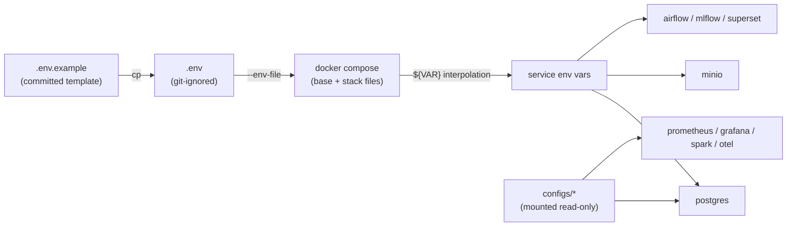

# 15 — Environment Configuration Strategy

> **Phase 7 — Infrastructure Implementation**
> How configuration and secrets are structured, separated, and parameterized
> across the local Docker platform.

This document specifies **Task 7** of Phase 7. It complements
[09-security](./09-security.md) (which covers the security posture) by detailing
the *mechanics* of configuration: the `.env` contract, secret handling, dev vs.
full-stack separation, and parameterization rules.

---

## 1. Configuration philosophy

| Principle | Implementation |
| --- | --- |
| Single source of truth | One git-ignored `infrastructure/env/.env`, loaded by every Compose invocation via `--env-file`. |
| Reproducible template | `infrastructure/env/.env.example` is committed and documents every variable with safe placeholders. |
| Twelve-factor config | All environment-specific values are injected via environment variables, never hard-coded in images or Compose files. |
| Fail fast | Scripts abort if `.env` is missing (`start-platform.sh`, `bootstrap.sh`). |
| Least exposure | Only ports and credentials that must reach the host are surfaced; internal services rely on Docker DNS. |

---

## 2. `.env` structure

The template is organized into clearly delimited sections, one per service
group, so an operator can scan and fill values without ambiguity.

```text
infrastructure/env/
├── .env.example   # committed template (placeholders only)
└── .env           # git-ignored real values (created via cp)
```

| Section | Representative keys | Consumed by |
| --- | --- | --- |
| PostgreSQL | `POSTGRES_USER`, `POSTGRES_PASSWORD`, `POSTGRES_DB` | postgres, airflow, mlflow, superset, iceberg-rest |
| MinIO | `MINIO_ROOT_USER`, `MINIO_ROOT_PASSWORD`, `MINIO_API_PORT` | minio, spark, mlflow, iceberg-rest |
| Kafka | `KAFKA_CLUSTER_ID`, `KAFKA_UI_PORT` | kafka, kafka-ui |
| Spark | `SPARK_MASTER_UI_PORT`, `SPARK_WORKER_UI_PORT` | spark-master, spark-worker |
| Airflow | `AIRFLOW_PORT` | airflow |
| MLflow / Jupyter | `MLFLOW_PORT`, `JUPYTER_PORT`, `JUPYTER_TOKEN` | mlflow, jupyter |
| Qdrant / Ollama | `QDRANT_REST_PORT`, `OLLAMA_PORT`, `OLLAMA_DEFAULT_MODEL` | qdrant, ollama, open-webui |
| Observability | `PROMETHEUS_PORT`, `GRAFANA_*`, `OTEL_*` | prometheus, grafana, otel-collector |
| BI | `SUPERSET_PORT`, `SUPERSET_SECRET_KEY`, `SUPERSET_ADMIN_*` | superset |
| API | `API_PORT`, `API_SECRET_KEY` | fastapi (later phase) |
| External dataset keys | `NASA_API_KEY`, `FIRMS_MAP_KEY`, `SENTINELHUB_*`, `GFW_API_TOKEN`, … | ingestion (later phase) |

### Variable categories

| Category | Examples | Rule |
| --- | --- | --- |
| Credentials | `*_PASSWORD`, `*_SECRET_KEY`, `*_TOKEN` | Must be replaced before any real run; never committed. |
| Ports | `*_PORT` | Centralized so host conflicts are resolved in one place. |
| Tuning | `OLLAMA_DEFAULT_MODEL`, replication factors | Safe defaults provided; override per host. |
| External API keys | dataset credentials | Optional; only required when the matching pipeline is enabled. |

---

## 3. Secret handling (local-safe model)

This is a **local simulation**, so secrets management is deliberately
lightweight but still safe-by-default:

- `.env`, `*.env` are git-ignored (`!.env.example` is the only exception). See the repository `.gitignore`.
- Compose interpolates `${VAR}` from `--env-file .env` at merge time; secrets are passed to containers as environment variables, not baked into images.
- `MINIO_PROMETHEUS_AUTH_TYPE: public` is intentionally relaxed for local scraping only.
- Placeholder values use the `CHANGE_ME_*` convention so an unedited `.env` is obvious.
- **Promotion path:** in a shared/production context, replace `.env` with Docker/Swarm secrets, SOPS-encrypted files, or a vault (HashiCorp Vault, AWS Secrets Manager). The variable contract stays identical.

> Operators must never paste real secrets into `.env.example`; they belong only in the git-ignored `.env`.

---

## 4. Configuration separation: dev vs. full stack

Configuration scope is controlled by **Compose profiles**, not by separate env
files — a single `.env` drives every profile.

| Mode | Profile | Services configured | Approx. idle RAM |
| --- | --- | --- | --- |
| Storage only | `storage` | postgres, minio, iceberg-rest | ~2 GB |
| Core (dev default) | `core` | storage + kafka + spark + airflow | ~7 GB |
| AI / ML | `ai` | storage + mlflow, jupyter, qdrant, ollama, open-webui | ~7 GB |
| Observability + BI | `obs` | storage + prometheus, grafana, otel, superset | ~3 GB |
| Full stack | `all` | everything (avoid Spark+Ollama peak together) | ~10 GB |

Because every service declares which profiles include it (e.g.
`profiles: ["storage","core","ai","all"]`), the same `.env` works unchanged from a
2 GB storage-only session up to the full stack. This avoids drift between
multiple environment files.

---

## 5. Parameterization strategy

| Layer | Technique | Example |
| --- | --- | --- |
| Ports | `${VAR:-default}` with host:container mapping | `"${MINIO_API_PORT:-9000}:9000"` |
| Credentials | required `${VAR}` (no default) so a missing value fails loudly | `POSTGRES_PASSWORD: ${POSTGRES_PASSWORD}` |
| Connection strings | composed from primitives at runtime | Airflow `SQL_ALCHEMY_CONN` built from `POSTGRES_*` |
| Schema routing | URL-encoded `search_path` per consumer | `?options=-csearch_path%3Dairflow` / `%3Dmlflow` |
| Tunables | defaulted in Compose, overridable in `.env` | `OLLAMA_DEFAULT_MODEL=llama3.2:3b` |

**Default rule:** infrastructure ports and tunables carry sensible `:-defaults`
so the stack boots on a fresh checkout; **credentials carry no default** so the
platform refuses to run with empty secrets.

---

## 6. Configuration flow



---

## 7. Operator checklist

1. `cp infrastructure/env/.env.example infrastructure/env/.env`
2. Replace every `CHANGE_ME_*` value with a strong local credential.
3. Fill any external dataset keys you intend to use (optional).
4. Resolve host port conflicts by editing the `*_PORT` block only.
5. Run `bash scripts/bootstrap.sh` then `bash scripts/start-platform.sh --profile <mode>`.

---

## Cross references

- [09-security](./09-security.md) — secrets posture, network segmentation, RBAC
- [16-service-dependency](./16-service-dependency.md) — startup order & health gating
- [10-deployment-runbook](./10-deployment-runbook.md) — end-to-end run procedure
- `infrastructure/env/.env.example` — the authoritative variable template
